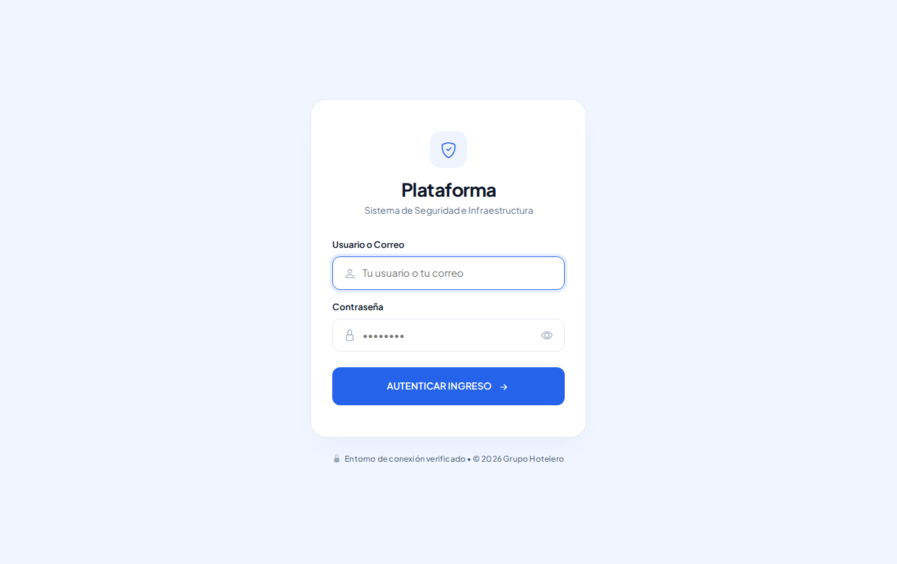
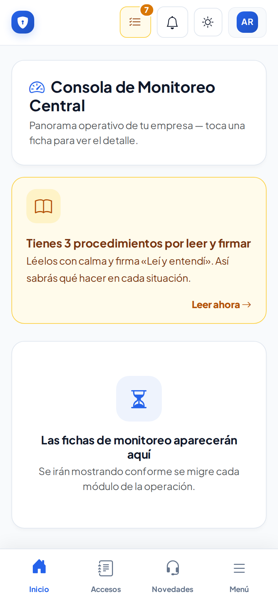
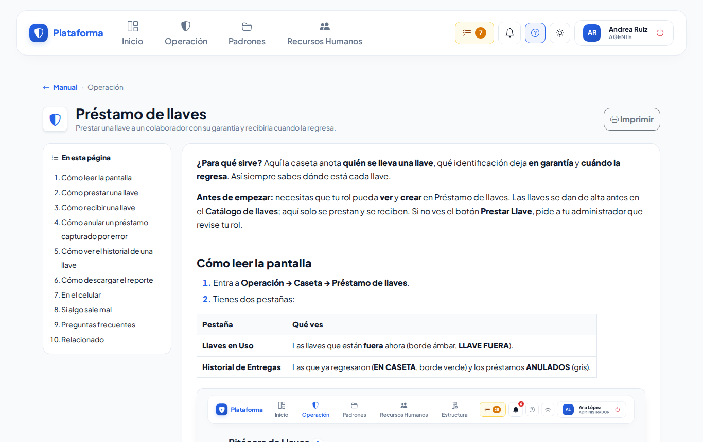

# Primeros pasos

**¿Para qué sirve?** La plataforma es el sistema de seguridad de tu empresa: ahí se registra quién entra y sale de cada sede, las llaves y equipos que se prestan, los incidentes, los recorridos y mucho más. Esta página te explica lo básico para empezar a usarla sin miedo.

**Antes de empezar:** necesitas un **usuario** y una **contraseña**. Te los da tu administrador de la plataforma. Si no los tienes, pídeselos antes de seguir.

## Cómo entrar

1. Abre en tu computadora o celular **la dirección de tu plataforma** (te la da tu administrador; guárdala en favoritos).
2. Escribe tu **usuario o tu correo** y tu **contraseña**.
3. Toca **Autenticar Ingreso**.

**Qué debes ver:** la pantalla de **Inicio** con tu nombre arriba a la derecha.

Si no puedes entrar, revisa la página [Entrar y salir de la plataforma](inicio-de-sesion.md).

## Cómo moverte

Arriba (en la computadora) o abajo en **Menú** (en el celular) están los menús. Solo ves lo que tu puesto tiene permitido:

| Menú | Qué hay ahí |
|---|---|
| **Operación** | Lo de todos los días en caseta: accesos, llaves, pases de salida, transporte, novedades, recorridos… |
| **Padrones** | Las listas que se consultan: empresas externas, personas, vehículos, llaves, gafetes, equipos… |
| **Recursos Humanos** | El personal, candidatos, departamentos, puestos y turnos. |
| **Estructura** | La empresa, sus sedes, usuarios, roles y configuración (para administradores). |

En el celular, abajo tienes **Inicio**, **Accesos**, **Novedades** y **Menú**. Toca **Menú** para ver todos los grupos.

**Qué debes ver:** al tocar un menú se abre la lista de pantallas; toca una para entrar. Para regresar, toca **Inicio** o la flecha **←** (en el celular).

Más detalle en [Menús, Mis pendientes y modos de pantalla](menus.md).

## Cómo usar este manual

1. Toca el botón **?** (signo de interrogación) que está arriba, junto a la campana. En el celular está en **Menú → Ayuda → Manual**.
2. Escribe en **Buscar** lo que quieres hacer, por ejemplo «prestar una llave». La lista se filtra mientras escribes.
3. Toca la página que necesitas.

Dentro de una página:

- **En esta página** te lleva directo a cada tarea.
- **Imprimir** saca la página en papel (en la computadora).
- **Anterior / Siguiente** pasa a otras páginas del mismo grupo.

**Ayuda de la pantalla donde estás:** en casi todas las pantallas, junto al título, hay un botón redondo **?**. Tócalo y se abre la página del manual de esa pantalla.

**Qué debes ver:** solo aparecen las páginas de lo que tú puedes usar. Si tu puesto cambia, el manual cambia contigo.

## Cómo capturar sin errores

Casi todas las pantallas funcionan igual:

1. Toca el botón de color de arriba (**Nuevo Ingreso**, **Prestar Llave**, **Nuevo Ticket**…). Se abre una ventana.
2. Llena los datos. Los que tienen **\*** son obligatorios.
3. Para buscar a una persona, llave, gafete o vehículo, **escanea** su código con el lector, la cámara del celular o la etiqueta NFC, o **escribe** parte del nombre y elígelo de la lista.
4. Toca el botón para guardar. Si falta algo, el aviso en rojo sale **dentro de la misma ventana** y no pierdes lo que escribiste.

Mientras escribes un nombre, debajo del campo puede salir un aviso:

| Aviso | Qué significa | Qué hacer |
|---|---|---|
| **Ya existe** (rojo) | Ese nombre ya está registrado. | No lo vuelvas a crear: búscalo en la lista. Si está dado de baja y te sale **Reactivar**, úsalo. |
| **Se parece** (amarillo) | Hay uno muy parecido. | Revisa que no sea el mismo antes de guardar. |
| **Disponible** (verde) | No hay otro igual. | Puedes guardar. |

## Cómo pedir ayuda

1. Busca primero en este manual (botón **?**).
2. Si no encuentras la respuesta, pregunta a tu **supervisor** o a tu **administrador de la plataforma**.
3. Cuando pidas ayuda, di **en qué pantalla estabas**, **qué tocaste** y **qué mensaje salió** (si puedes, toma una foto de la pantalla).

## Si algo sale mal

| Mensaje o síntoma | Qué significa | Qué hacer |
|---|---|---|
| No veo un menú o un botón que mi compañero sí ve | Tu puesto no tiene ese permiso. | Pide a tu administrador que revise tu rol. |
| «No tienes permiso para ver esto» | Tu rol no tiene acceso a esa pantalla o a ese registro. | Pide a tu supervisor que lo haga o a tu administrador que te dé el permiso. |
| «No encontramos lo que buscas» | La página o el registro no existe o es de otra sede. | Regresa a **Inicio** y entra desde el menú. |
| La pantalla te regresa a **Entrar** | Se cerró la sesión por no usarla. | Vuelve a entrar. |

## Preguntas frecuentes

- **¿Puedo usar la plataforma en mi celular?** Sí. Funciona en el navegador del celular, igual que en la computadora.
- **¿Se pierde lo que capturé si me sale un error?** No. La ventana se queda abierta con tus datos; solo corrige lo que está en rojo.
- **¿Por qué no veo todas las sedes?** Solo ves las sedes donde trabajas.
- **¿Puedo cambiar los colores de la pantalla?** Sí, con el botón del sol: modo **Sol** para exteriores y **Noche** para el turno nocturno.

## Relacionado

- [Cómo usar este manual](manual.md)
- [Entrar y salir de la plataforma](inicio-de-sesion.md)
- [Menús, Mis pendientes y modos de pantalla](menus.md)
- [Bitácora de accesos](accesos.md)
