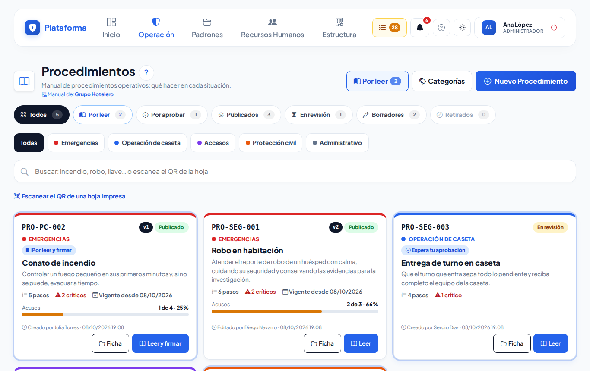
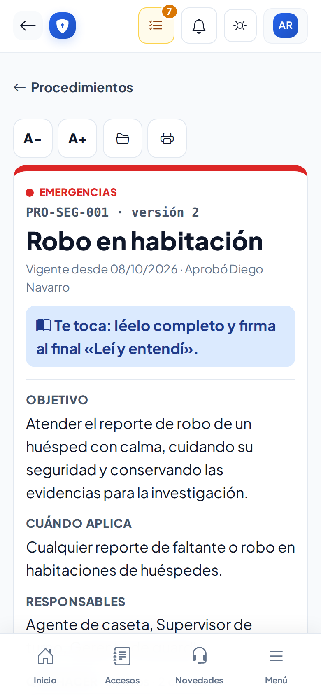
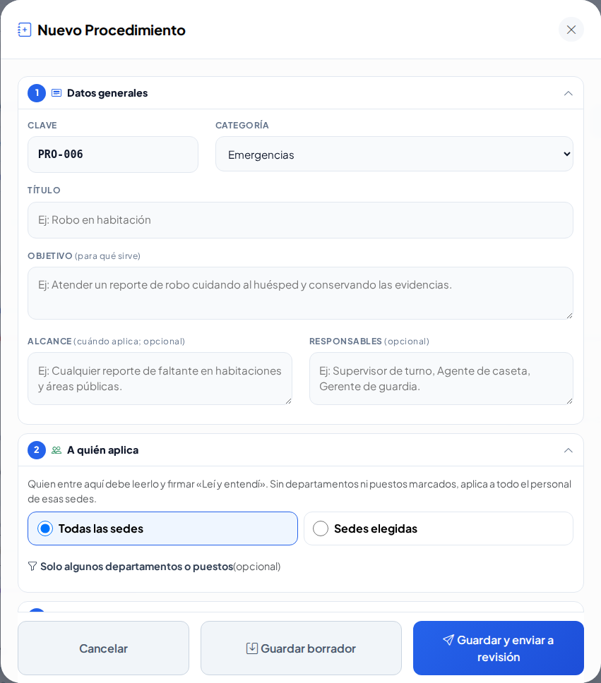
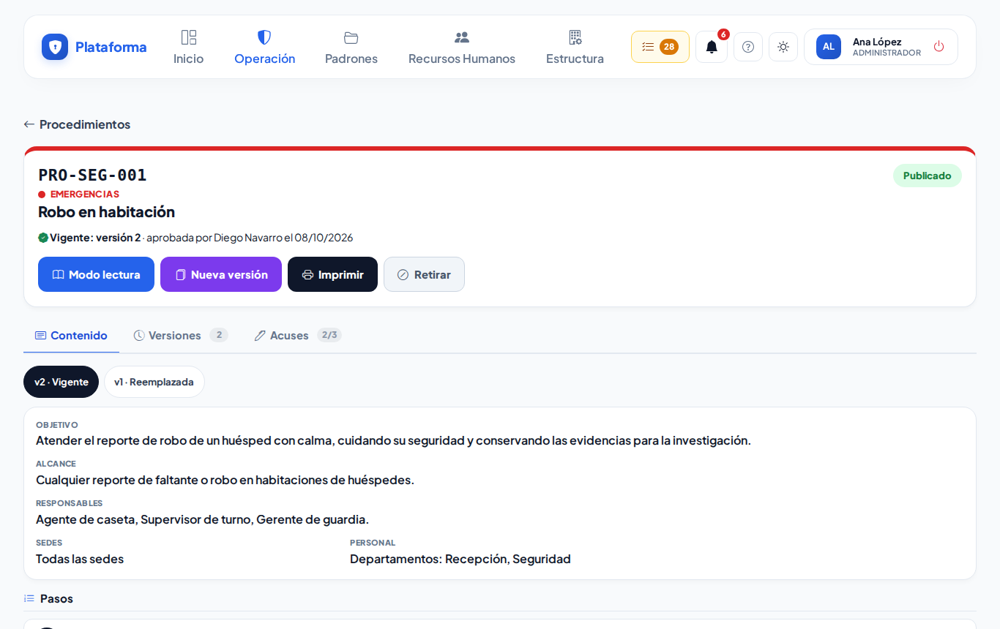
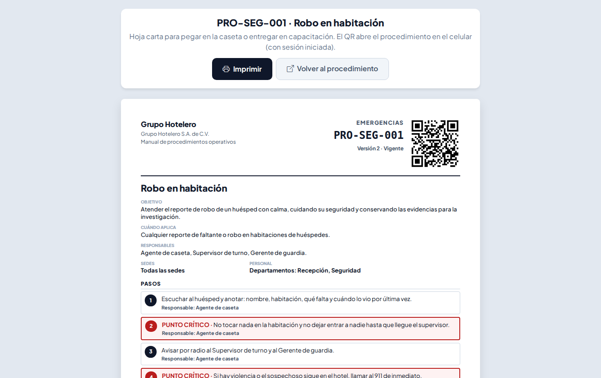
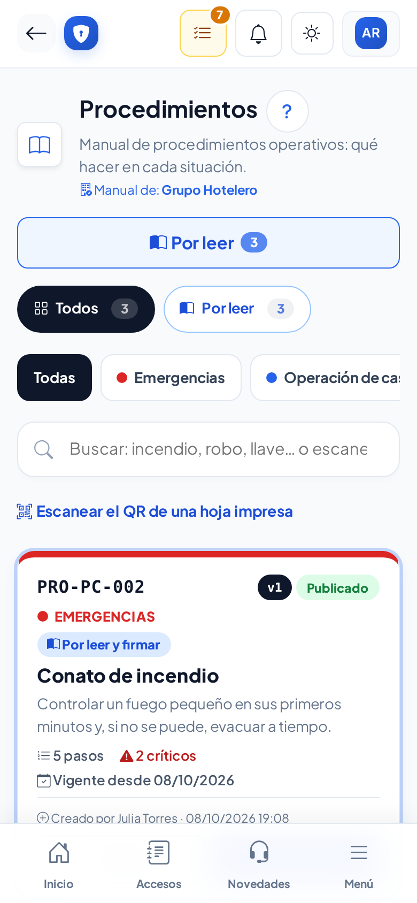

# Procedimientos

**¿Para qué sirve?** Es el **manual de procedimientos** de tu empresa: qué hacer ante un robo, un conato de incendio, un huracán, la entrega de turno, la pérdida de una llave… Aquí lo **consultas rápido** (también en el celular) y, cuando te toca, lo **lees y firmas «Leí y entendí»**.

**Antes de empezar:** para consultar y firmar de enterado basta con **ver** Procedimientos. Para escribir necesitas **crear**; para aprobar, **aprobar**; para retirar, **eliminar**. Si no ves un botón, tu rol no tiene ese permiso.

## Cómo buscar un procedimiento

1. Entra a **Operación → Consulta → Procedimientos**.
2. Toca una **categoría** (por ejemplo **Emergencias**, que siempre sale primero) o escribe una palabra en **Buscar**: «incendio», «robo», «llave»…
3. ¿Hay una hoja impresa pegada en la caseta? Toca **Escanear el QR de una hoja impresa** y apunta a su QR.
4. Toca **Leer** (letra grande) o **Ficha** (todo el detalle).

**Qué debes ver:** cada ficha con su clave (por ejemplo `PRO-SEG-001`), versión y estado:

| Estado | Qué quiere decir |
|---|---|
| **Publicado** (verde) | Es el que rige. Se consulta y se firma. |
| **En revisión** (naranja) | Espera que alguien lo apruebe. |
| **Borrador** (gris) | Se está escribiendo. Solo lo ven quienes lo preparan. |
| **Retirado (obsoleto)** (rojo) | Ya no se usa. |

## Cómo leer y firmar «Leí y entendí»

1. Toca **Mis pendientes → Procedimientos por leer**, o el botón **Por leer** de la lista.
2. Toca **Leer y firmar**. Se abre el **modo lectura**: letra grande, pasos numerados y los **puntos críticos en rojo**. Con **A−** y **A+** cambias el tamaño de la letra.
3. Lee todo con calma.
4. Al final, marca **Leí y entendí este procedimiento**, firma en el recuadro (o usa tu firma guardada) y toca **Firmar de enterado**.

**Qué debes ver:** el procedimiento ya no aparece en **Por leer**. Si después se publica una versión nueva, te lo pedirá otra vez.

## Cómo escribir un procedimiento nuevo

1. Toca **Nuevo Procedimiento**.
2. En **1. Datos generales** escribe la **clave** (viene una sugerida), elige la **categoría** y escribe el **título** y el **objetivo**.
3. En **2. A quién aplica** elige **Todas las sedes** o **Sedes elegidas**; si solo aplica a algunos departamentos o puestos, márcalos.
4. En **3. Pasos** escribe un paso por renglón. Marca **Punto crítico** lo que nunca debe olvidarse. **Agregar paso** pone otro; las flechas cambian el orden.
5. En **4. Notas y adjuntos** (opcional) agrega teléfonos, aclaraciones o archivos PDF o imágenes.
6. Toca **Guardar borrador** (para seguir después) o **Guardar y enviar a revisión**.

**Qué debes ver:** el procedimiento como **Borrador** o **En revisión**.

## Cómo aprobar o pedir cambios

1. Abre el procedimiento **En revisión** y revisa el contenido.
2. Si está bien, toca **Aprobar**, firma y toca **Aprobar y publicar**.
3. Si hay que corregir algo, toca **Pedir cambios** y escribe qué corregir.

**Qué debes ver:** al aprobar, queda **Publicado** y se avisa a quien debe leerlo. No puedes aprobar lo que tú escribiste o enviaste.

## Cómo cambiar un procedimiento publicado

1. En su ficha toca **Nueva versión**. Se crea un borrador copiando todo; la versión anterior sigue rigiendo.
2. Toca **Editar borrador**, haz los cambios y escribe **qué cambió**.
3. Toca **Enviar a revisión**. Cuando se aprueba, la versión nueva rige y todos deben firmar otra vez.
4. Si ya no se necesita el cambio, toca **Descartar borrador**.

**Qué debes ver:** en la pestaña **Versiones**, quién escribió, envió y aprobó cada versión.

## Cómo imprimir, ver acuses y retirar

1. **Imprimir:** toca **Imprimir**. Sale una hoja con los pasos, quién lo aprobó y un **QR**. Si es un borrador, dice **NO VIGENTE**.
2. **Acuses:** en la ficha, la pestaña **Acuses** muestra el porcentaje de cumplimiento, quién falta y quién firmó. Toca **Exportar** para bajarlo en Excel (CSV).
3. **Retirar:** toca **Retirar** y escribe el motivo. Se puede **Reactivar** después.

## En el celular

## Si algo sale mal

| Mensaje o síntoma | Qué significa | Qué hacer |
|---|---|---|
| «Marca la casilla «Leí y entendí este procedimiento».» | Falta la casilla. | Márcala y vuelve a firmar. |
| «No tienes una firma guardada: firma en el recuadro.» | No hay firma guardada. | Firma con el dedo en el recuadro. |
| «Agrega al menos un paso antes de enviarlo a revisión.» | El procedimiento no tiene pasos. | Escribe al menos un paso. |
| «La clave solo lleva letras, números y guiones (por ejemplo PRO-SEG-001).» | La clave tiene espacios o símbolos. | Corrige la clave. |
| «Escribe por qué lo rechazas y qué hay que corregir (es obligatorio).» | Falta el comentario. | Explica qué corregir. |
| «La versión publicada no se edita: usa «Nueva versión» para proponer cambios.» | Querías editar lo publicado. | Toca **Nueva versión**. |
| «Los adjuntos solo pueden ser PDF, JPG, PNG o WEBP.» | El archivo no es válido. | Conviértelo a PDF o imagen. |

## Preguntas frecuentes

- **¿Por qué me pide firmar otra vez?** Se publicó una versión nueva; algo cambió.
- **¿El Agente puede escribir procedimientos?** No; consulta, lee y firma de enterado.
- **¿Puedo leerlo en el celular?** Sí; el modo lectura está hecho para eso.
- **¿Se puede borrar un procedimiento?** Uno publicado se **retira**. Solo uno que nunca se publicó se puede eliminar definitivamente (administrador).

## Relacionado

- [Menús, Mis pendientes y modos de pantalla](menus.md)
- [Bitácora de novedades](novedades.md)
