# Empresas externas

**¿Para qué sirve?** Es el directorio de las **empresas de fuera** que entran a tus sedes: proveedores de insumos, transporte de personal y de huéspedes, contratistas, agencias de autos, de viajes y de tours, taxis y transportadoras. Cada empresa tiene su **ficha** con su **personal** y su **flotilla** (vehículos), que la caseta usa para registrar accesos y pases de salida.

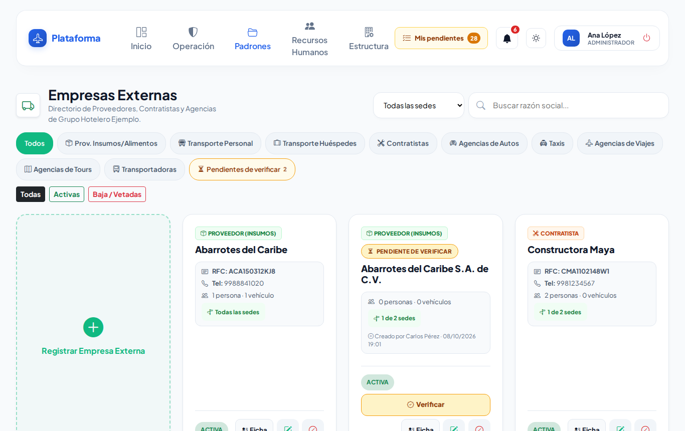

## Antes de empezar

- Para ver la pantalla tu rol debe poder consultar *Empresas externas*. Si no aparece en el menú, pide el permiso a tu administrador.
- Para registrar, editar o dar de baja necesitas esos permisos. Si no ves **Registrar Empresa Externa** ni el lápiz de editar, tu rol solo consulta.
- Si trabajas en **una sola sede**, solo ves las empresas que operan en tu sede, y solo puedes editar las que operan **únicamente** ahí.

## Cómo encontrar una empresa

1. Entra a **Padrones → Empresas externas**.
2. Escribe en **Buscar razón social...** parte del nombre (también busca por RFC o teléfono).
3. Toca una **categoría** para ver solo esa (por ejemplo **Contratistas** o **Taxis**). **Todos** las vuelve a mostrar. En el celular las categorías se deslizan de lado.
4. Si tienes varias sedes, elige una en **Todas las sedes**.
5. Usa **Todas**, **Activas** o **Baja / Vetadas** para ver según su estado.

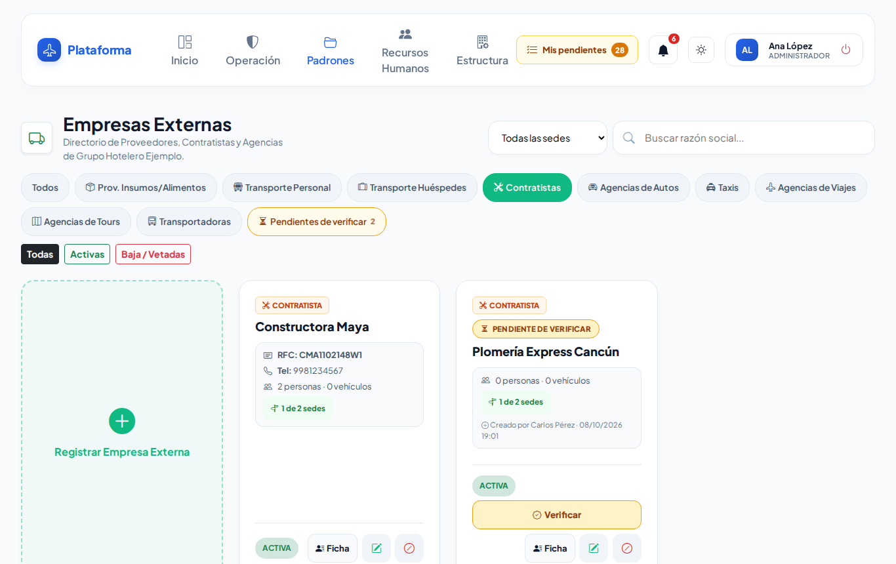

**Qué debes ver:** tarjetas con la categoría, el nombre, el RFC, el teléfono, cuántas personas y vehículos tiene y en qué sedes opera («Todas las sedes» o «1 de 2 sedes»).

## Cómo registrar una empresa externa

1. Toca la tarjeta **Registrar Empresa Externa**.
2. Escribe la **Razón Social o Nombre Comercial**. Mientras escribes te avisa si ya existe (ver abajo).
3. Elige la **Categoría de Proveedor**.
4. Si los tienes, escribe:
   - **RFC** (opcional): 12 caracteres para empresa o 13 para persona física. Puedes escribirlo en minúsculas o con guiones; se guarda limpio.
   - **Teléfono** (opcional): solo números, de 7 a 15 dígitos. Si es extranjero, empieza con «+» y el código del país.
   - **Dirección** (opcional).
5. En **Sedes donde opera** deja marcada **Todas las sedes** (recomendado: incluye las sedes que se abran después) o desmárcala y elige solo algunas.
6. Toca **Guardar Empresa**.

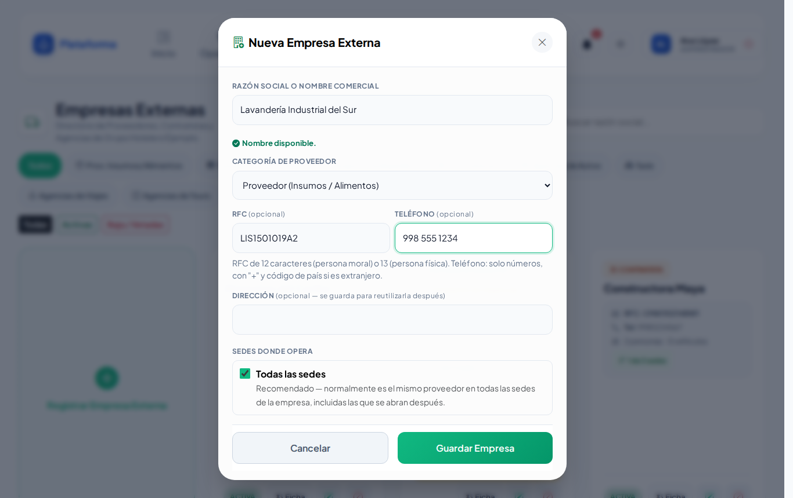

**Qué debes ver:** «Empresa externa «Lavandería Industrial del Sur» registrada correctamente.» y la tarjeta nueva en la lista.

### Avisos mientras escribes el nombre

- **Verde — «Nombre disponible.»**: puedes guardar.
- **Amarillo — «Se parece a una empresa que ya está registrada (no cuentan «S.A. de C.V.» ni los signos). Revisa que no sea la misma:»**: revisa la lista. «Abarrotes del Caribe SA» se parece a «Abarrotes del Caribe».
- **Rojo — «Ya existe «…» en esta empresa. Búscala en la lista para editarla.»**: no se puede guardar otra igual.
- **Rojo con botón Reactivar — «Ya existe «…», pero está desactivada.»**: toca **Reactivar** en lugar de registrarla otra vez.

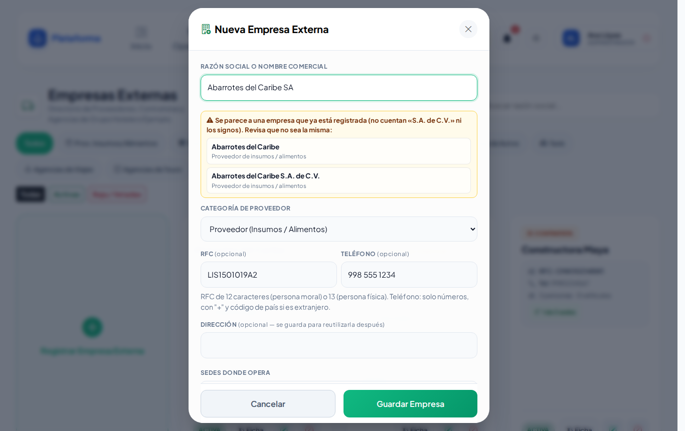

### Si trabajas en una sola sede

La ventana dice «Se registra para *tu sede*». Si otra sede ya tenía registrada esa empresa, **no se duplica**: se agrega a tu sede y verás «Ya existía «…»: se agregó a tu sede.».

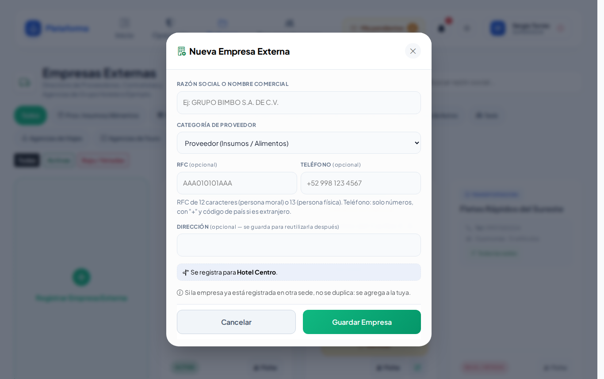

## Cómo editar una empresa

1. En la tarjeta toca el **lápiz** (Editar).
2. Corrige nombre, categoría, RFC, teléfono o dirección en **Editar Empresa Externa**.
3. Toca **Actualizar Datos**.

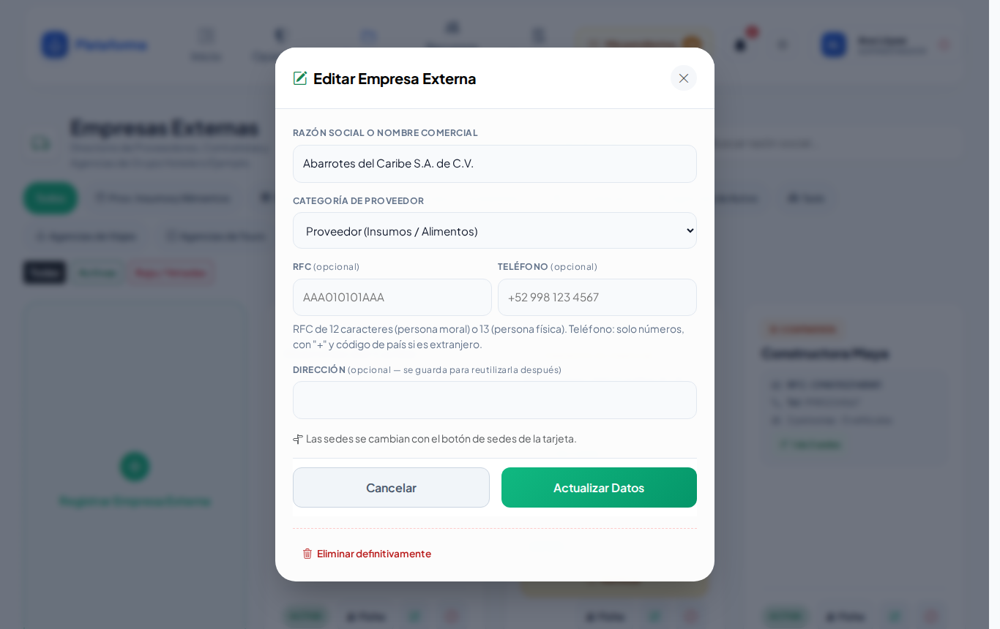

**Qué debes ver:** «Empresa externa «…» actualizada correctamente.»

## Cómo cambiar las sedes donde opera

1. En la tarjeta toca el botón verde de sedes («Todas las sedes» o «1 de 2 sedes»).
2. Marca **Todas las sedes** o solo las que correspondan. Si trabajas en una sola sede, solo agregas o quitas **tu** sede.
3. Toca **Guardar Sedes**.

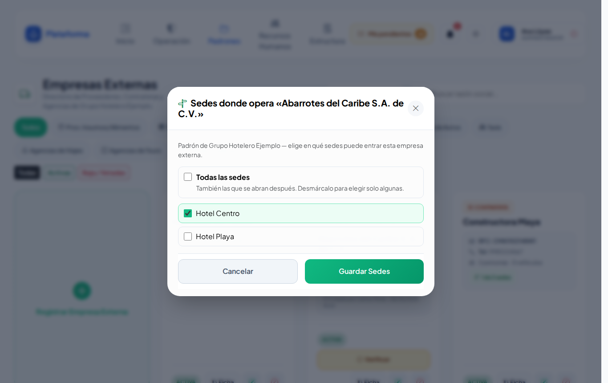

**Qué debes ver:** «Sedes de «…» actualizadas.»

## Cómo dar de baja (vetar) o reactivar una empresa

1. En la tarjeta toca el botón rojo **Desactivar** (círculo con raya) y confirma con **Aceptar**.
2. La tarjeta queda como **BAJA / VETADA** y ya no se puede elegir en accesos ni en pases de salida.
3. Para regresarla, toca **Reactivar** (flecha circular) y confirma.

**Qué debes ver:** «Empresa externa «…» desactivada (baja / vetada). Puedes reactivarla con el mismo botón cuando quieras.» No se borra nada: su personal, su flotilla y su historial se conservan.

## Cómo usar la ficha de la empresa

1. Toca **Ficha** en la tarjeta. Se abre la **Ficha de Proveedor** con tres pestañas:
   - **Resumen:** sedes donde opera y cuántas personas y vehículos tiene.
   - **Personal (n):** las personas de la empresa (las dadas de baja se ven en gris).
   - **Flotilla (n):** sus vehículos con número económico.
2. Desde la ficha también puedes tocar **Editar Datos Generales** o **Sedes donde opera**.

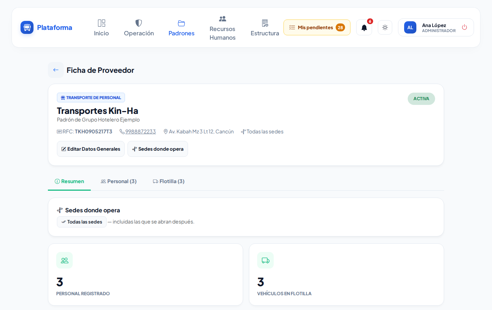

### Agregar personal o vehículos desde la ficha

1. En **Personal** toca **Agregar persona**, o en **Flotilla** toca **Agregar vehículo**.
2. Se abre el registro con la empresa **ya puesta** (con candado: no se puede cambiar).
3. Llena los datos y guarda.

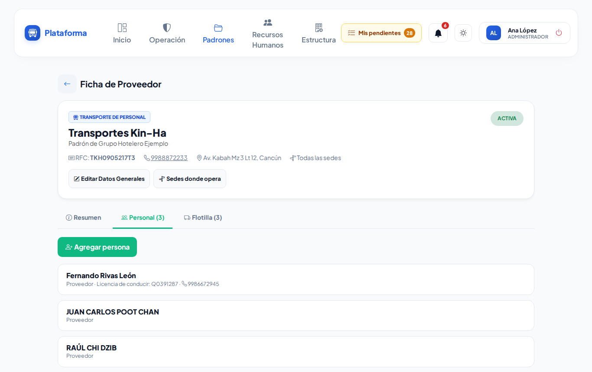

**Qué debes ver:** al guardar o al cerrar regresas a la ficha, con el registro nuevo en la lista.

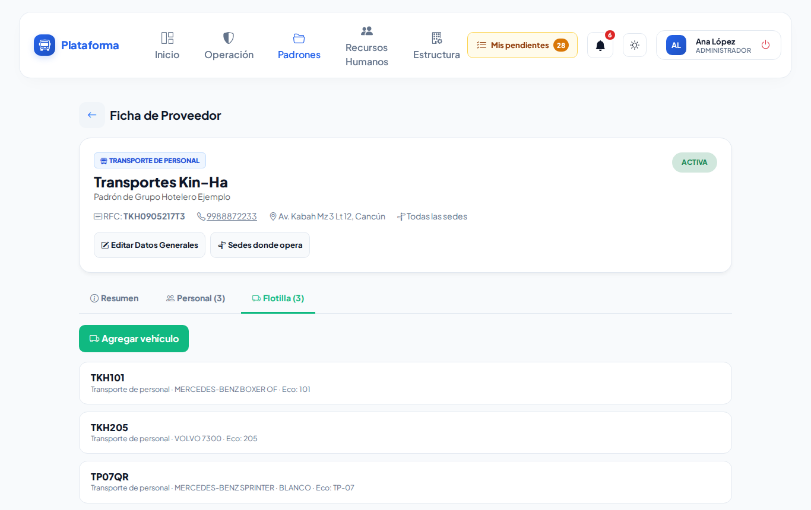

## En el celular y en modo Noche

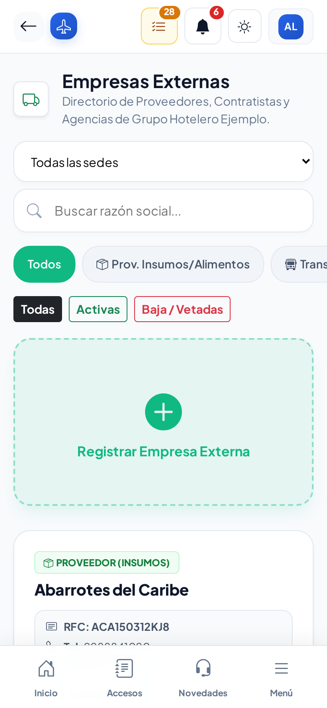 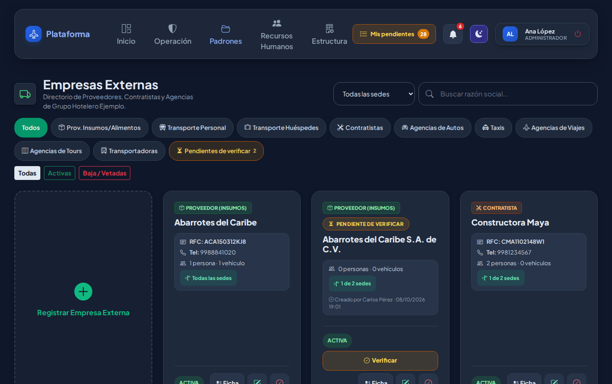

## Si algo sale mal

Los mensajes aparecen en rojo dentro de la misma ventana; lo que escribiste se conserva.

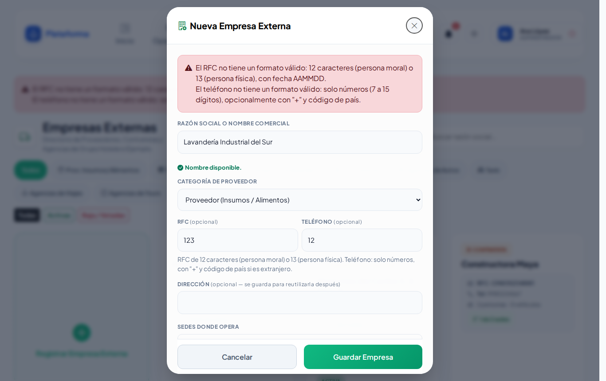

| Mensaje o síntoma | Qué significa | Qué hacer |
|---|---|---|
| La razón social o nombre comercial es obligatorio. | El nombre está vacío. | Escribe el nombre de la empresa. |
| El RFC no tiene un formato válido: 12 caracteres (persona moral) o 13 (persona física), con fecha AAMMDD. | El RFC está incompleto o mal escrito. | Cópialo de la factura o déjalo vacío. |
| El teléfono no tiene un formato válido: solo números (7 a 15 dígitos), opcionalmente con "+" y código de país. | El teléfono tiene letras o pocos números. | Escribe solo números. |
| Ya existe «…» en esta empresa. Búscalo en la lista para editarlo. | Esa empresa ya está registrada. | Búscala y edítala en vez de crear otra. |
| Marca al menos una sede o elige «Todas las sedes». | Quitaste todas las sedes. | Marca al menos una. |
| No tienes sedes activas donde registrar al proveedor. | Tu usuario no tiene sedes activas asignadas. | Pide a tu administrador que revise tus sedes. |
| No veo una empresa que sí existe. | Solo ves las que operan en tus sedes. | Regístrala con el mismo nombre: se agrega a tu sede sin duplicarse. |
| No me deja editar una empresa. | Opera también en otras sedes. | Pídeselo a tu administrador. |

## Preguntas frecuentes

**¿Qué categoría elijo?** La que describe a qué viene: *Contratista* para obras y mantenimiento; *Transporte de personal* para camiones de colaboradores; *Proveedor (Insumos / Alimentos)* para entregas, etc. La categoría decide en qué listas aparece (por ejemplo, el personal de un contratista se registra como *Contratista*).

**¿Qué significa «vetada»?** Que la empresa está dada de baja y la caseta ya no puede usarla. Se puede reactivar cuando quieras.

**¿Qué son las tarjetas con «Pendiente de verificar»?** Empresas que la caseta registró al momento. Alguien con permiso debe revisarlas con el botón **Verificar**. Ver [Altas por verificar](altas-por-verificar.md).

**¿Por qué «Todas las sedes» es lo recomendado?** Porque casi siempre es la misma empresa en todas tus sedes, y así también queda lista para las sedes nuevas.

## Relacionado

- [Padrón de personas](personas.md)
- [Padrón vehicular](vehiculos.md)
- [Altas por verificar](altas-por-verificar.md)
- [Pases de salida](pases-salida.md)
