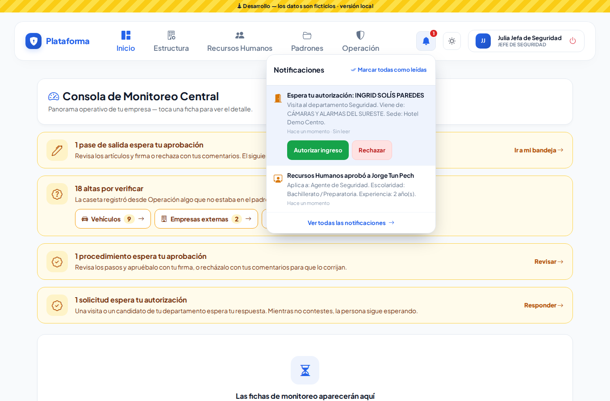
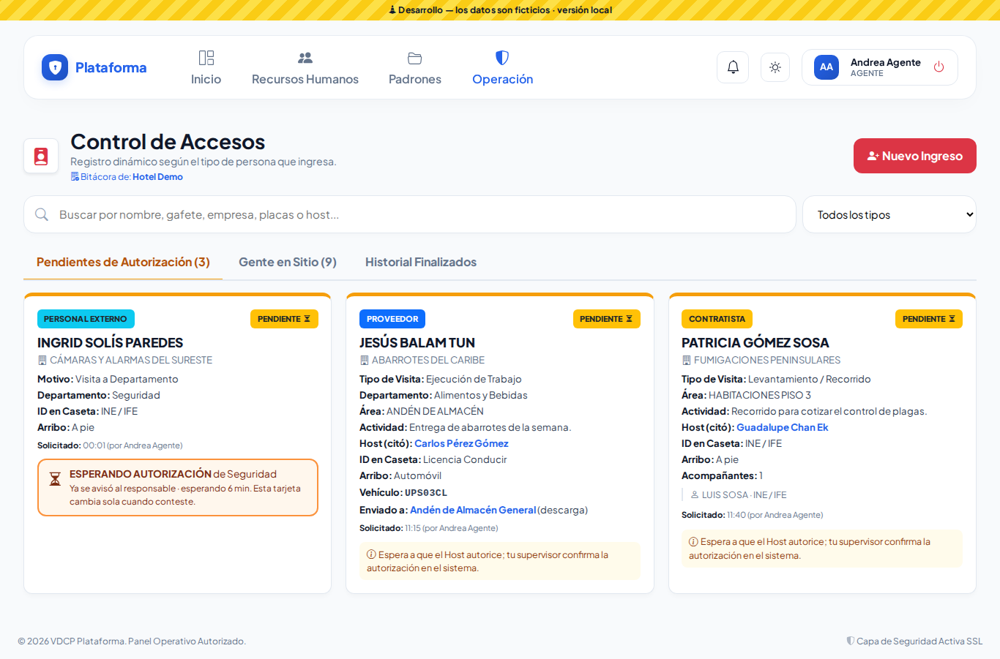
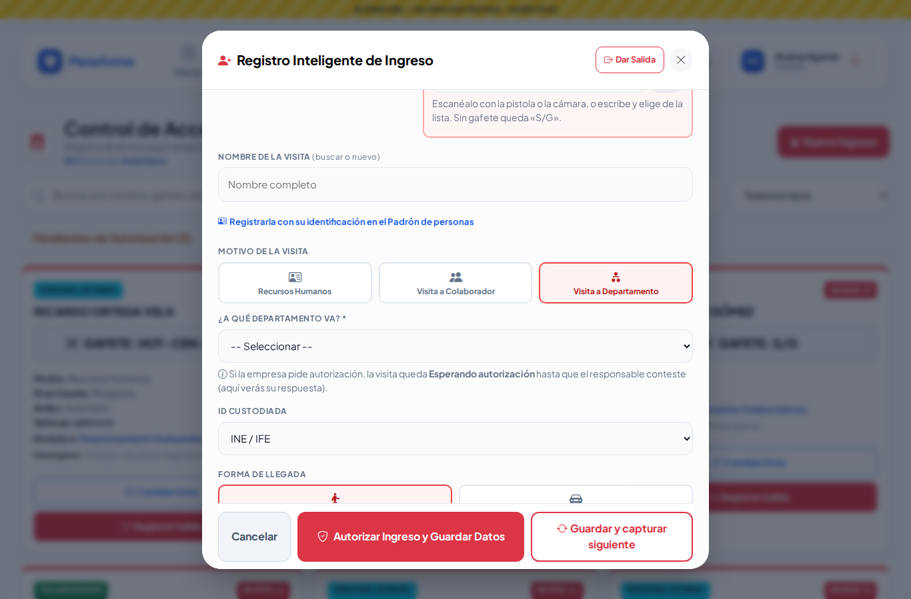
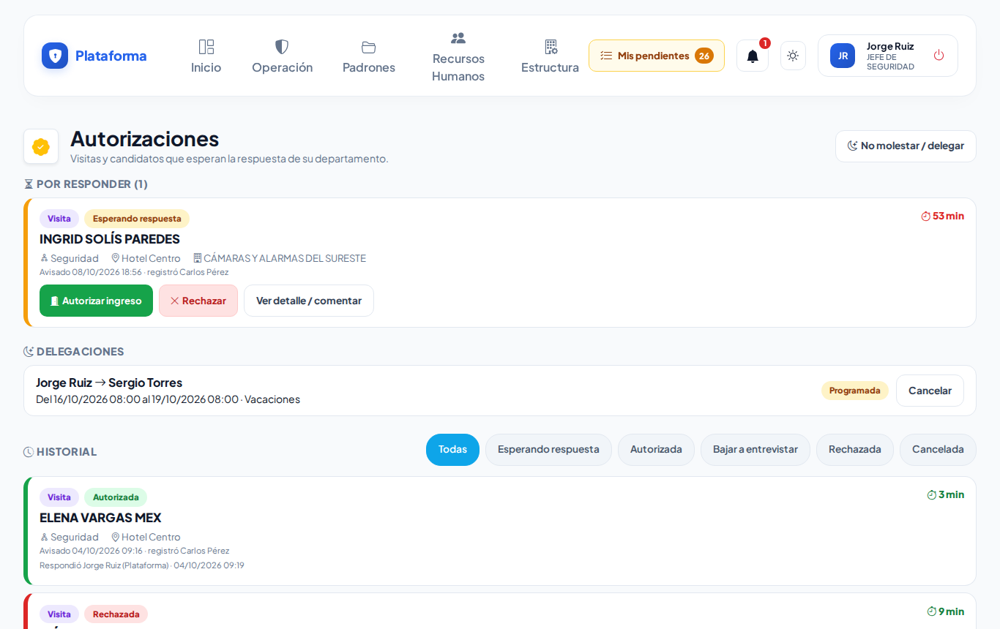
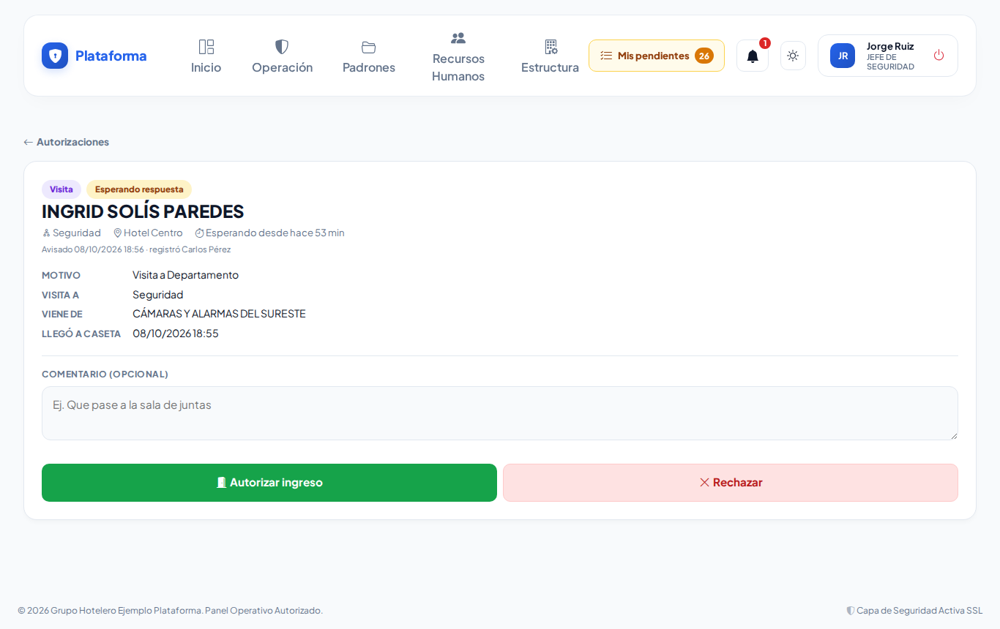
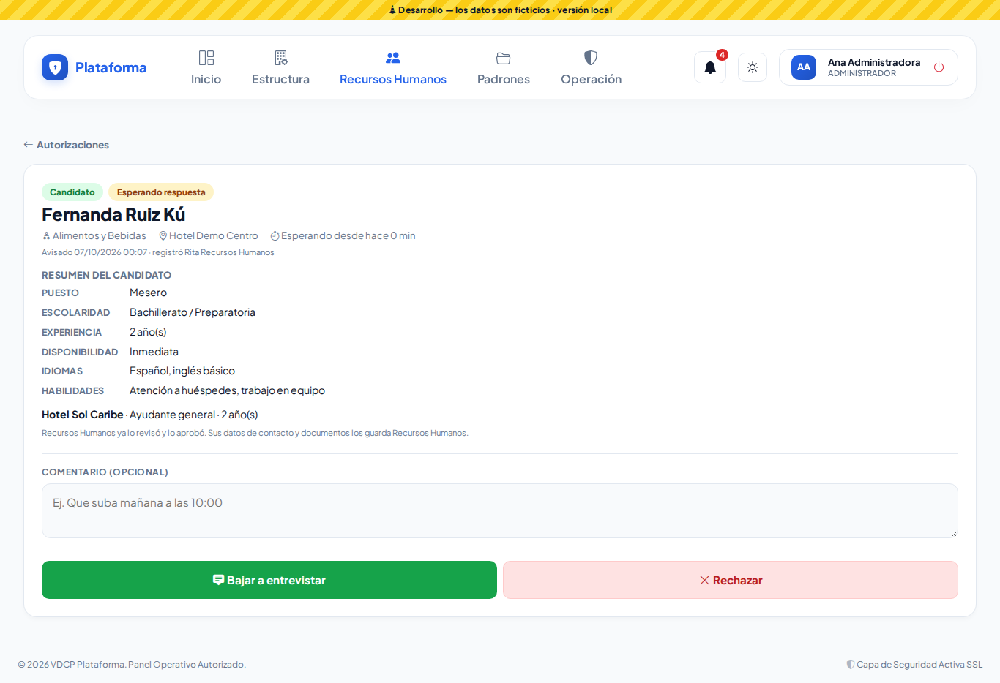
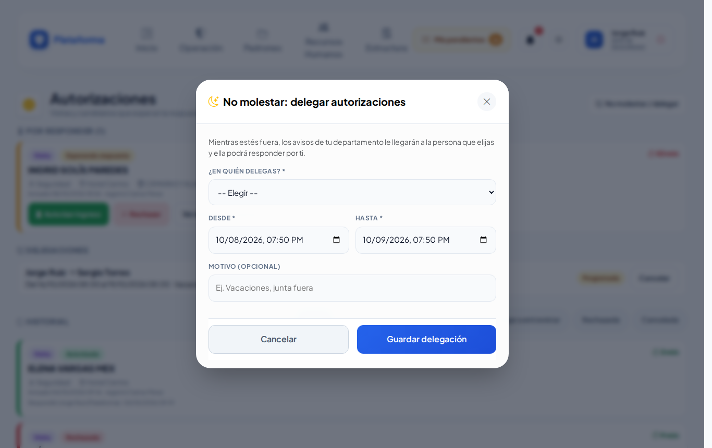
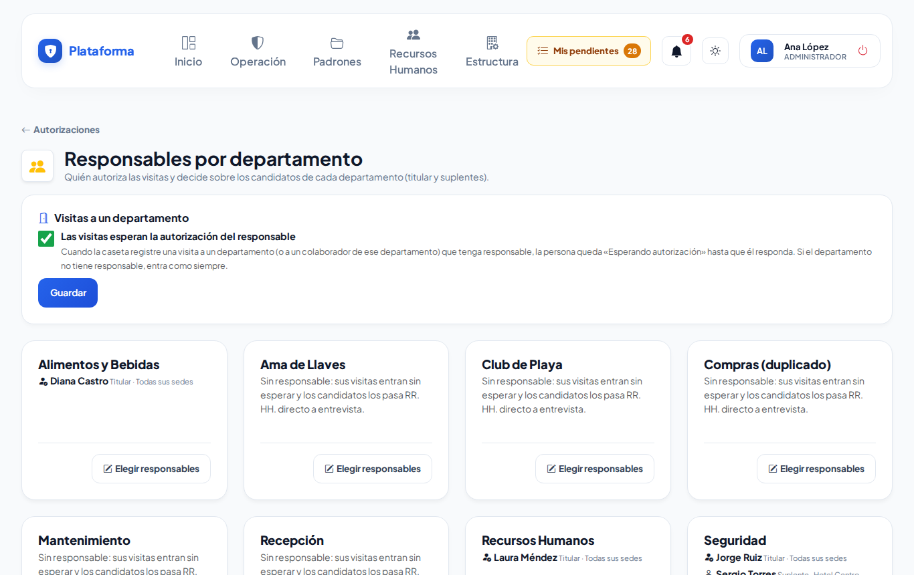
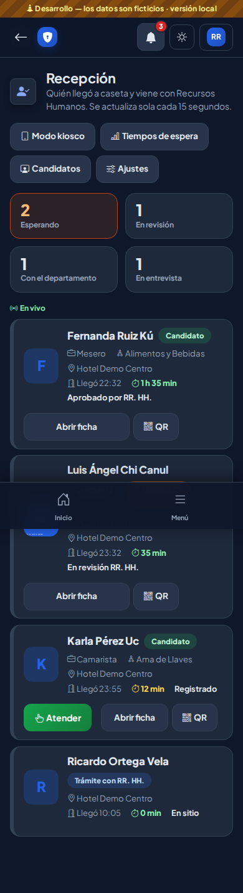
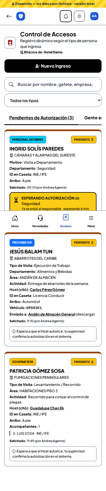

# Autorizaciones departamentales y notificaciones

Cuando alguien viene a ver a un **departamento**, su **responsable** decide si entra. Y cuando Recursos Humanos aprueba a un candidato, el departamento decide si lo **baja a entrevistar**. Todo llega como aviso en la **campana** (y por correo) con los botones para responder.

## La campana

Arriba a la derecha. El número rojo son tus avisos sin leer; se actualiza solo. Tócala para ver los últimos; toca uno para abrirlo. **Marcar todas como leídas** las limpia. **Ver todas** abre la lista completa.

Si el aviso pide tu respuesta, trae los botones ahí mismo:

## Visitas que esperan autorización

1. La caseta registra la visita con el motivo **Visita a Departamento** (o **Visita a Colaborador**).
2. Si la empresa lo pide y el departamento tiene responsable, la persona queda **«ESPERANDO AUTORIZACIÓN»**. Al responsable le llega el aviso.
3. El responsable toca **Autorizar ingreso** o **Rechazar** (en la campana, en **Autorizaciones** o en el botón del correo).
4. La tarjeta de la caseta **cambia sola**: autorizado → pasa a «Gente en Sitio»; rechazado → «NO AUTORIZADO» en el historial (devuélvele su identificación).

> Si el responsable avisa por teléfono, el supervisor puede usar **Confirmar Autorización** como siempre: queda anotado «respondida por caseta».

## La bandeja «Autorizaciones»

**Recursos Humanos → Autorizaciones**: arriba lo que espera tu respuesta (con los minutos que lleva esperando), luego tus delegaciones y el historial.

Toca el nombre para ver el detalle y dejar un comentario antes de responder:

### Desde el correo

El correo trae los mismos botones. Al tocarlo se abre la plataforma: **inicia sesión** y **confirma**. Así nadie puede autorizar solo con reenviar o abrir el correo. El botón vale 24 horas.

## «No molestar»: delegar

¿Vas a salir? Toca **No molestar / delegar**, elige a quién y de qué fecha y hora a cuál. Mientras dure, los avisos de tu departamento le llegan a esa persona y ella responde por ti. Puedes **cancelar** cuando regreses.

## Responsables por departamento (Recursos Humanos / Dirección)

**Autorizaciones → Responsables por departamento**:

- Enciende o apaga **«Las visitas esperan la autorización del responsable»**.
- En cada departamento toca **Elegir responsables**: el titular y los suplentes (todas las sedes o una).

Solo aparecen usuarios con permiso para **Responder** autorizaciones. Si falta alguien, dale ese permiso en la Matriz de permisos.

## Modos Sol y Noche

Todas estas pantallas funcionan en los modos de pantalla:

## Ronda 8

En **No molestar / delegar** ya no apareces tú en «¿En quién delegas?»: elige a otra persona. Si lo intentas, la ventana te avisa «No puedes delegar en ti mismo».
