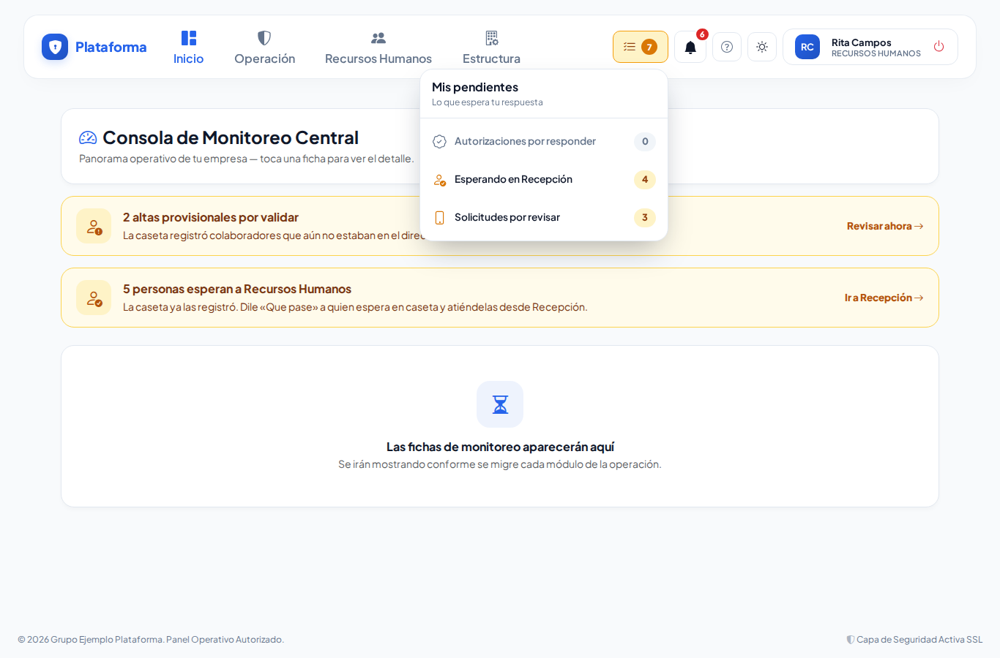

# Recepción y autorizaciones

**¿Para qué sirve?** Cuando alguien llega a la caseta y va con **Recursos Humanos**, aparece en el panel de **Recepción** con **a qué viene** y los minutos que lleva esperando, y Recursos Humanos le dice a la caseta **Que pase**, **Que espere** o **No puede pasar**. Cuando alguien viene a ver a un **departamento**, su **responsable** decide si entra; y cuando Recursos Humanos aprueba a un candidato, el departamento decide si lo **baja a entrevistar**. Todo llega como aviso en la **campana** (y por correo) con los botones para responder.

## Antes de empezar

- **Recepción:** necesitas poder consultar *Recepción de RR. HH.* (normalmente Recursos Humanos). Para decir **Que pase** necesitas poder consultar *Recepción de RR. HH.* o editar *Candidatos* en esa sede.
- **Responder autorizaciones:** necesitas el permiso **Responder** de *Autorizaciones departamentales* y ser **responsable** (o suplente) del departamento. Las autorizaciones no están en el menú: llegan por la **campana** y por **Mis pendientes**.
- **Ajustes y responsables por departamento:** necesitas el permiso **Configurar** con alcance de empresa.

## Cómo usar la campana

1. Arriba a la derecha está la **campana**. El número rojo son tus avisos sin leer; se actualiza solo.
2. Tócala para ver los últimos avisos; toca uno para abrirlo.
3. Si el aviso pide tu respuesta, trae los botones ahí mismo (por ejemplo **Que pase** / **Que espere** / **No puede pasar**, o **Autorizar ingreso** / **Rechazar**).
4. **Marcar todas como leídas** las limpia. **Ver todas las notificaciones** abre la lista completa.

Si tienes encendidos los avisos por correo en [Configuración](configuracion.md), también te llega un correo.

## Cómo atender a quien espera en Recepción

1. Entra a **Recursos Humanos → Recepción de RR. HH.**
2. Arriba ves cuántos hay **Esperando**, **En revisión**, **Con el departamento** y **En entrevista**. La lista se actualiza sola cada 15 segundos.
3. Cada persona muestra **Viene a:** y su puesto, departamento, sede, hora de llegada y **minutos esperando**. El borde cambia de color: **verde** recién llegó, **ámbar** más de 10 minutos, **rojo** más de 20, **azul** ya lo atendiste.

| Viene a | Qué significa |
|---|---|
| **Busca empleo — primera vez** | Es la primera vez que viene. |
| **Busca empleo — ya vino antes** | Ya tenía ficha: se usa la misma (no se crea otra). |
| **Busca empleo — por internet** (o **en el kiosco**, **registrado por RR. HH.**) | Hoy dejó su solicitud sin pasar por la caseta. |
| **Entrevista**, **Documentos** o **Firma** | Ya tiene ficha y viene a ese paso. |
| **Informes** o **Trámite** | No es candidato: solo pregunta o hace otro trámite. |

4. Si la persona sigue en caseta (dice «En caseta: espera que digas «Que pase»»), toca **Que pase**. Para pedirle que espere o decir que no puede pasar, toca **Que espere / No puede pasar**.
5. Cuando la recibas, toca **Atender**: el candidato pasa a «En revisión RR. HH.».
6. Toca **Abrir ficha** para ver su [ficha de candidato](candidatos.md). El QR para que llene su solicitud está en su ficha y en el **Modo kiosco**.

**Qué debes ver:** al tocar **Que pase**, «Listo: … ya puede pasar. La caseta ya lo ve.» y la tarjeta de la caseta cambia sola.

Botones de arriba: **Modo kiosco** (pantalla para la tableta de la sala de espera), **Tiempos de espera**, **Candidatos** y **Ajustes**.

## Cómo decir «Que pase» a quien llega a la caseta

Si tu empresa tiene encendido el ajuste **La caseta espera a que RR. HH. diga «Que pase»**, todo el que llega a la caseta con motivo **Recursos Humanos** queda **Esperando a RR. HH.** y te llega el aviso «Llegó un candidato: …» (o «Volvió a la caseta: …», o «En caseta para RR. HH.: …» si no es candidato).

1. Responde desde donde te sea más fácil: la **campana**, **Mis pendientes** (renglón **Esperando en Recepción**), el panel de **Recepción** o el botón del **correo**.

2. Elige una respuesta:
   - **Que pase:** la persona entra y pasa a «Gente en Sitio» en la caseta.
   - **Que espere:** la caseta ve «RR. HH. PIDE QUE ESPERE». El aviso sigue pendiente: cuando puedas recibirla, toca **Que pase**.
   - **No puede pasar:** la caseta ve «NO AUTORIZADO por Recursos Humanos» y le devuelve su identificación.
3. Si quieres, escribe un **Comentario (opcional)** (por ejemplo «Que pase a la oficina de RR. HH. en 5 minutos»): la caseta lo ve en su aviso.

**Qué debes ver:** «Listo: … ya puede pasar. La caseta ya lo ve.», «Listo: la caseta verá que … debe esperar.» o «Respuesta registrada: … no puede pasar. La caseta ya lo ve.»

> Si alguien de Recursos Humanos avisa por teléfono, el supervisor de la caseta puede usar **Confirmar Autorización**: queda anotado «respondida por caseta».

## Cómo poner la tableta de la sala de espera (Modo kiosco)

1. En Recepción toca **Modo kiosco** en la tableta.
2. En **Candidatos en proceso** toca **Generar QR** o **Mostrar QR** junto al candidato.
3. Aparece su QR en grande y un código de 6 letras. El candidato lo escanea con su celular, o entra a la dirección que indica la pantalla y escribe el código.

## Cómo responder una autorización

### Visitas a un departamento

1. La caseta registra la visita con el motivo **Visita a Departamento** (o **Visita a Colaborador**).
2. Si la empresa lo pide y el departamento tiene responsable, la tarjeta de la caseta queda **ESPERANDO AUTORIZACIÓN** y al responsable le llega el aviso.
3. El responsable toca **Autorizar ingreso** o **Rechazar** (en la campana, en **Mis pendientes**, en **Autorizaciones** o en el botón del correo).
4. La tarjeta de la caseta **cambia sola**: autorizado, la persona pasa a «Gente en Sitio»; rechazado, queda «NO AUTORIZADO» en el historial (hay que devolverle su identificación).

> Si el responsable avisa por teléfono, el supervisor puede usar **Confirmar Autorización** en la caseta, como siempre: queda anotado «respondida por caseta».

### Candidatos aprobados por Recursos Humanos

1. Al responsable del departamento le llega el aviso con un **resumen** del candidato (puesto, escolaridad, experiencia).
2. Toca **Bajar a entrevistar** o **Rechazar**.

**Qué debes ver:** «Listo: autorizaste el ingreso de …. La caseta ya lo ve.», «Listo: pediste entrevistar a …. Recursos Humanos ya lo sabe.» o «Respuesta registrada: rechazaste a ….»

### La bandeja «Autorizaciones»

Se abre desde **Mis pendientes** o la campana. Arriba está **Por responder** (con los minutos que lleva esperando), luego tus **Delegaciones** y el **Historial** (filtra por **Todas**, **Autorizada**, **Rechazada**…). Toca **Ver detalle / comentar** para dejar un **Comentario (opcional)** antes de responder.

### Desde el correo

El correo trae los mismos botones. Al tocarlo se abre la plataforma: **inicia sesión** y **confirma**. Así nadie puede autorizar solo con reenviar o abrir el correo. El botón vale 24 horas.

## Cómo delegar tus autorizaciones («No molestar»)

1. En **Autorizaciones** toca **No molestar / delegar**.
2. En **¿En quién delegas?** elige a otra persona (no puedes elegirte a ti mismo).
3. Escribe **Desde** y **Hasta** (fecha y hora) y, si quieres, el **Motivo (opcional)** (por ejemplo «Vacaciones»).
4. Toca **Guardar delegación**.

**Qué debes ver:** «Delegación guardada: mientras esté activa, los avisos de … le llegan a ….» Cuando regreses, toca **Cancelar** en tu delegación: «Delegación cancelada: los avisos vuelven a llegarle al responsable.»

## Cómo elegir los responsables por departamento

1. En **Autorizaciones** toca **Responsables por departamento**.
2. En **Visitas a un departamento** enciende o apaga **«Las visitas esperan la autorización del responsable»** y toca **Guardar**.
3. En cada departamento toca **Elegir responsables**: agrega el **Usuario**, la **Sede** (todas o una) y marca si es **suplente**.
4. Toca **Guardar responsables**.

**Qué debes ver:** «Responsables de … guardados.» Solo aparecen usuarios con permiso para **Responder** autorizaciones; si falta alguien, dale ese permiso en [Roles y permisos](roles-y-permisos.md).

## Cómo ver los tiempos de espera

1. En Recepción toca **Tiempos de espera**.
2. Elige **Desde** y **Hasta** y toca **Ver**.

**Qué debes ver:** el **Promedio de espera por departamento**, el detalle **Por día** y los **Candidatos por etapa**.

## Cómo cambiar los ajustes de Recepción

1. En Recepción toca **Ajustes** (también están en [Configuración](configuracion.md)).
2. Escribe el **Texto del aviso de privacidad**. El texto que trae la plataforma es un borrador: pide a tu abogado que lo revise.
3. Marca o desmarca **La caseta espera a que RR. HH. diga «Que pase»**. Marcado: quien viene a Recursos Humanos espera en caseta tu respuesta. Desmarcado: pasa directo y solo te llega el aviso.
4. Ajusta **El enlace del kiosco dura (horas)** y **Veces que se puede enviar**.
5. Toca **Guardar ajustes de Recepción**.

**Qué debes ver:** «Ajustes de Recepción guardados.»

## En modo Noche

## Si algo sale mal

| Mensaje o síntoma | Qué significa | Qué hacer |
|---|---|---|
| No puedes delegar en ti mismo: elige a otra persona que responda por ti. | Te elegiste a ti mismo. | Elige a otra persona. |
| Elige a quién delegas. / Indica desde cuándo (fecha y hora). / Indica hasta cuándo (fecha y hora). | Faltan datos de la delegación. | Complétalos. |
| «Hasta» debe ser después de «Desde». | Las fechas están al revés. | Corrige las fechas. |
| La delegación ya habría terminado: elige una fecha futura. | «Hasta» ya pasó. | Elige una fecha futura. |
| Ya hay una delegación en esas fechas: cancélala antes de crear otra. | Ya delegaste en esas fechas. | Cancela la anterior. |
| Elige a un usuario activo que pueda responder autorizaciones. | Esa persona no tiene el permiso. | Dale el permiso **Responder** o elige a otra. |
| Ese usuario ya está en la lista. / Máximo 10 responsables por departamento. | Repetiste un responsable o pasaste el límite. | Revisa la lista. |
| El enlace del correo ya venció o fue alterado. Abre la solicitud desde la plataforma. | El botón del correo pasó de 24 horas. | Responde desde la campana o **Autorizaciones**. |
| El enlace del kiosco dura de 1 a 24 horas. / se puede abrir de 1 a 10 veces. | El ajuste está fuera de rango. | Corrige el número. |
| No hubo cambios que guardar. | Guardaste sin cambiar nada. | Cambia algo o sal de la pantalla. |
| La visita no queda «esperando autorización». | El departamento no tiene responsable o la opción está apagada. | Revisa **Responsables por departamento**. |
| Quien viene a Recursos Humanos pasa directo, sin esperar el «Que pase». | El ajuste **La caseta espera a que RR. HH. diga «Que pase»** está apagado, o nadie atiende Recursos Humanos en esa sede. | Revisa **Ajustes** de Recepción y que alguien de esa sede tenga el permiso. |
| «Solo quien atiende Recursos Humanos en … puede responder.» | Esa persona llegó a una sede que no tienes a cargo. | Que responda Recursos Humanos de esa sede. |
| «Esta persona ya no está esperando en caseta. Revisa la lista.» | La caseta ya la dejó pasar o ya se fue. | No hace falta responder. |
| «Esta solicitud ya fue respondida o cancelada. Revisa la lista.» | Otra persona de Recursos Humanos ya contestó. | Revisa el panel de Recepción. |

## Preguntas frecuentes

**¿Dónde quedaron las Autorizaciones en el menú?** Ya no están en el menú: te llegan por la campana y por **Mis pendientes**.

**¿Qué pasa si nadie responde?** La persona sigue esperando en la caseta. El supervisor puede usar **Confirmar Autorización** si el responsable (o Recursos Humanos) avisa por teléfono.

**¿Ya no está el botón QR en Recepción?** Está en la ficha del candidato (**QR para que llene su solicitud**) y en el **Modo kiosco** de la tableta.

**¿La caseta ve en qué paso va el candidato?** No. Solo ve a qué viene (por ejemplo «Candidato · Entrevista»).

**¿El responsable ve el CV completo?** No, solo un resumen. Los datos personales los guarda Recursos Humanos.

**¿Quién ve el panel de Recepción?** Recursos Humanos y, si tiene el permiso, Dirección (solo el panel y los tiempos, no los CV). El «Que pase» solo lo dan quienes pueden editar candidatos (Recursos Humanos): a Dirección no le llega ese aviso.

## Relacionado

- [Candidatos](candidatos.md)
- [Bitácora de accesos](accesos.md)
- [Departamentos y puestos](departamentos-y-puestos.md)
- [Configuración](configuracion.md)
