# Recorridos de Protección Civil

Operación → **Recorridos de Protección Civil**. Aquí la guardia hace la **ronda de inspección** de extintores, hidrantes, detectores, botiquines y demás equipo de Protección Civil: escanea cada equipo, marca lo que está sano y anota lo que falla. Si algo falla, el sistema abre solo un **ticket en la Bitácora de Novedades** para que alguien lo repare.

Está pensado para hacerse **caminando con el celular**: botones grandes, un equipo a la vez y cada punto se guarda al momento.

## 1. La lista de recorridos

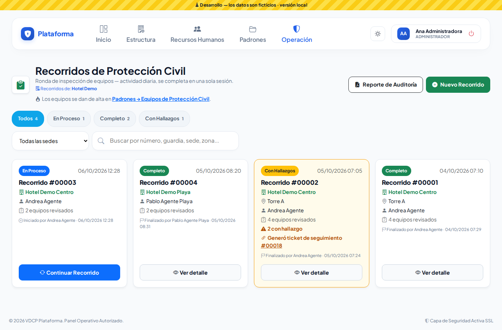

- Cada tarjeta es un recorrido con su número (**Recorrido #00003**), la fecha, la sede, el edificio o zona, quién lo hizo, cuántos equipos se revisaron y cuántos tienen hallazgo.
- El color de arriba es su **estatus**:
  - **En Proceso** (azul): todavía se puede continuar.
  - **Completo** (verde): se finalizó y todo estaba bien.
  - **Con Hallazgos** (amarillo): se finalizó y algún equipo falló. Dice qué **ticket de seguimiento** generó (tócalo para abrirlo en Novedades).
- Arriba puedes filtrar por estatus, por sede y buscar por número, guardia o zona.
- Botones: **Catálogo de Equipos**, **Reporte de Auditoría** (para imprimir) y **Nuevo Recorrido**.

En el celular se ve así:

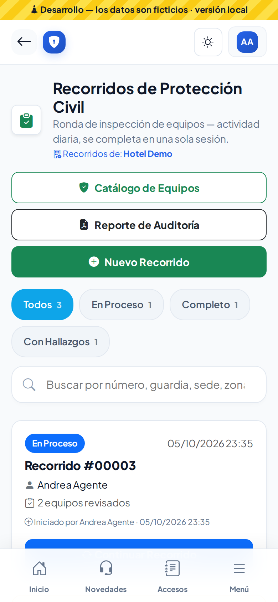

## 2. Empezar un recorrido

1. Toca **Nuevo Recorrido**.
2. La **Sede** ya viene elegida si solo trabajas en una.
3. **Edificio / Zona** es opcional: si lo eliges, el avance cuenta solo los equipos de ese edificio.
4. Si quieres, escribe **Observaciones Generales**.
5. Toca **Iniciar Recorrido**.

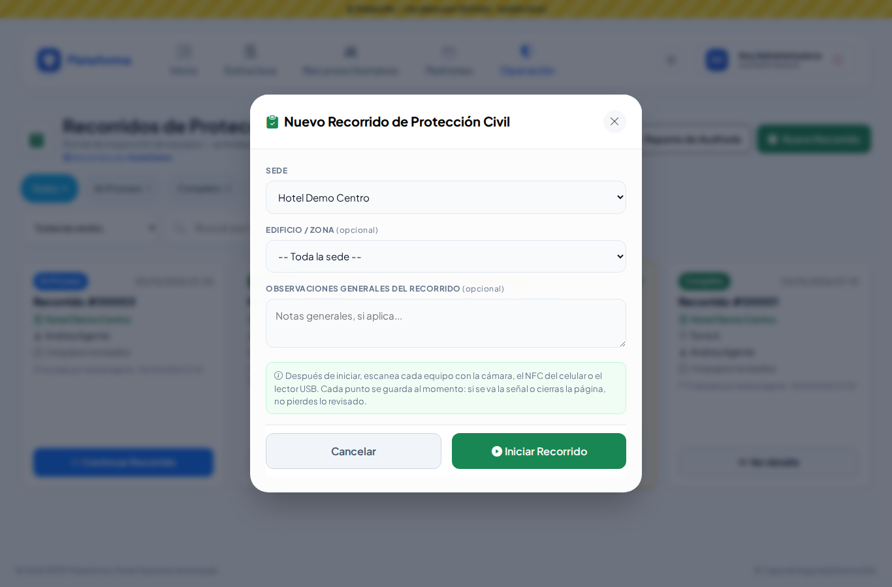

## 3. Revisar cada equipo (un punto a la vez)

Al iniciar (o al tocar **Continuar Recorrido**) ves el recorrido con:

- **El avance:** «2 de 11 equipos revisados», una barra verde, cuántos tienen hallazgo y cuántos faltan.
- **Punto de Inspección #3:** el campo para escanear.

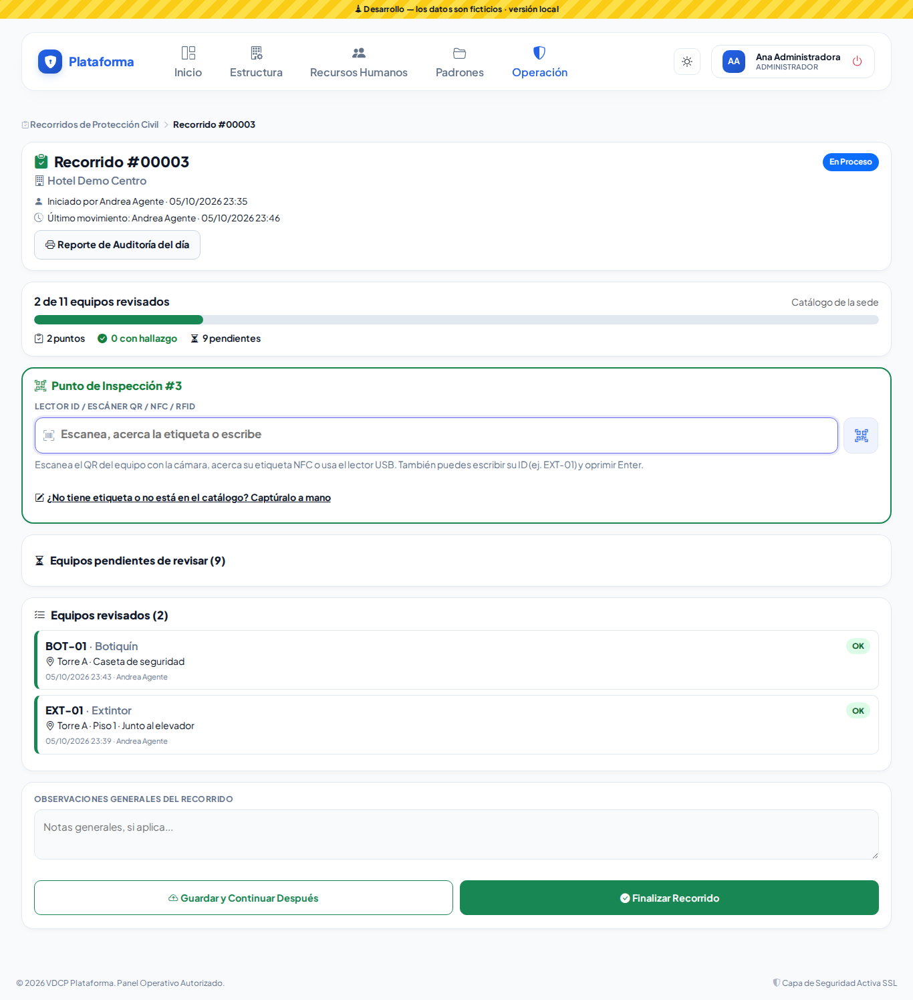

**Para identificar el equipo** usa lo que tengas a la mano:

- **Cámara:** toca el botón del QR y apunta a la etiqueta del equipo (funciona en Android y en iPhone).
- **NFC (Android):** toca el botón de la antena y acerca el celular a la etiqueta.
- **iPhone con etiqueta NFC:** si la etiqueta tiene grabada la dirección del equipo (la que aparece en «Ver QR»), acerca el iPhone y se abre solo el recorrido con ese equipo.
- **Lector USB o Bluetooth (PC de caseta):** solo pásalo; el campo ya está listo.
- **Escribiendo:** teclea el ID (por ejemplo `EXT-01`) y oprime Enter.

Si la etiqueta está dañada, abre **Equipos pendientes de revisar** y toca **Revisar** en el equipo.

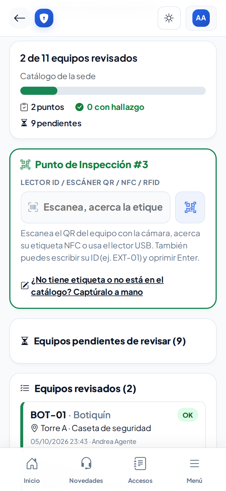

**Ya con el equipo en pantalla:**

1. Arriba ves su ID, tipo y ubicación.
2. Todas las piezas vienen **en verde (sano/presente)**. Toca la pieza que esté **dañada o falte**: se pone **en rojo**.
3. Revisa también los **Criterios Operativos Universales** (visible, accesible, funcional).
4. Si viste algo raro, escríbelo en **Observaciones / Desperfectos Encontrados**.
5. Abajo el sistema te dice el **Resultado**: *OK* o *FALLA*. Una pieza en rojo **o** una observación = FALLA.
6. Toca **Guardar y escanear siguiente**. El punto se guarda y vuelves al escáner.

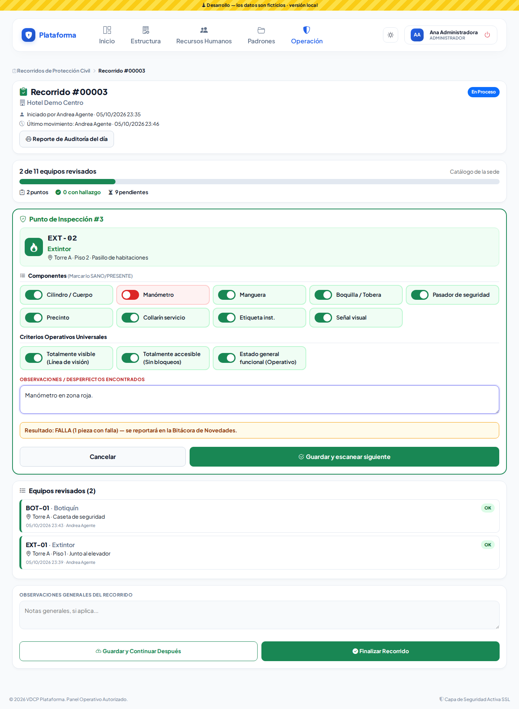

En el celular los botones se quedan siempre abajo, a la mano:

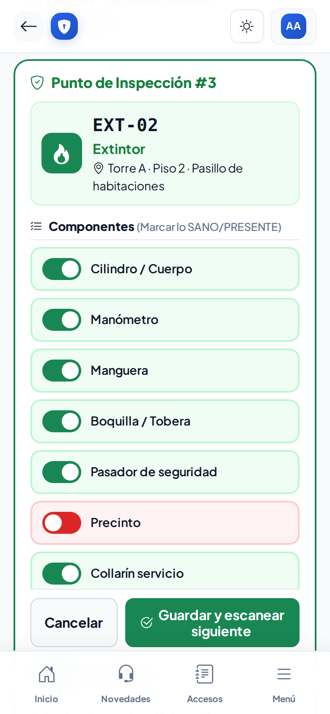
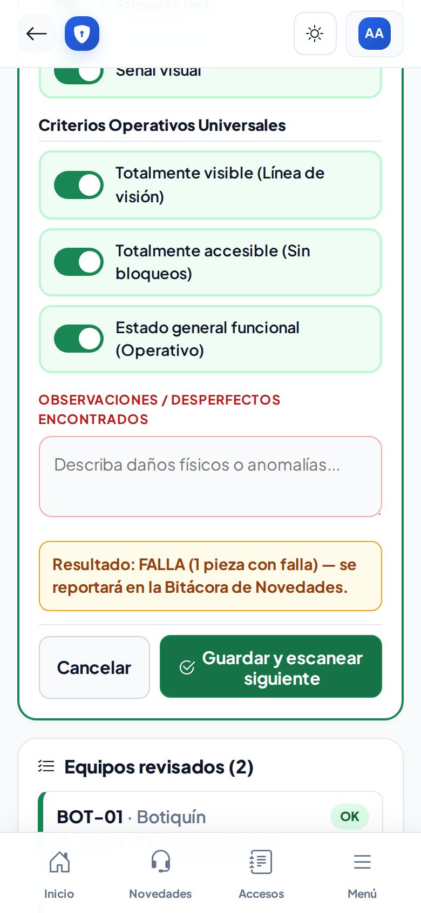

> Si escaneas un equipo que ya revisaste en este recorrido, aparece un aviso amarillo. Puedes guardarlo otra vez (queda un segundo registro).

### ¿Y si el equipo no tiene etiqueta o no está en el catálogo?

Toca **¿No tiene etiqueta o no está en el catálogo? Captúralo a mano**. Escribe su ID, elige la **Categoría del Equipo** (aparecen sus piezas) y, si quieres, la ubicación. Si el ID sí estaba en el catálogo, el sistema lo reconoce solo.

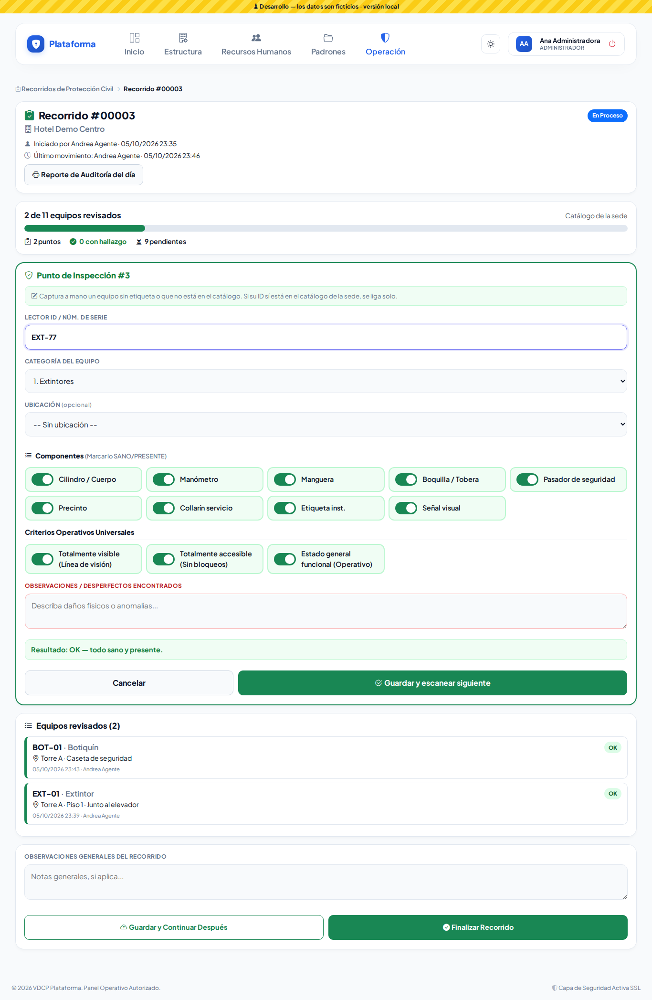

## 4. Cuando algo falla

El **primer** equipo con falla abre un ticket de **Siniestro Protección Civil** en la Bitácora de Novedades, con la ubicación «Ver detalle en Recorrido PC #00002» y lo que falló. Los siguientes equipos con falla del mismo recorrido se **anotan en ese mismo ticket** (en el Minuto a Minuto). Verás un aviso con el número del ticket.

## 5. Guardar para después o finalizar

Al final de la página:

- **Guardar y Continuar Después:** guarda las observaciones generales y deja el recorrido **En Proceso**. Para seguir, toca **Continuar Recorrido** en la lista. (Cada equipo ya quedó guardado al momento.)
- **Finalizar Recorrido:** te pide confirmar y lo cierra como **Completo** o **Con Hallazgos**. Necesita al menos un equipo revisado. Después ya no se le pueden agregar equipos.

## 6. Ver el detalle de un recorrido

Toca **Ver detalle** en la tarjeta. Ves todos los equipos revisados, en amarillo los que fallaron con **qué pieza** falló, el ticket que se generó y quién finalizó.

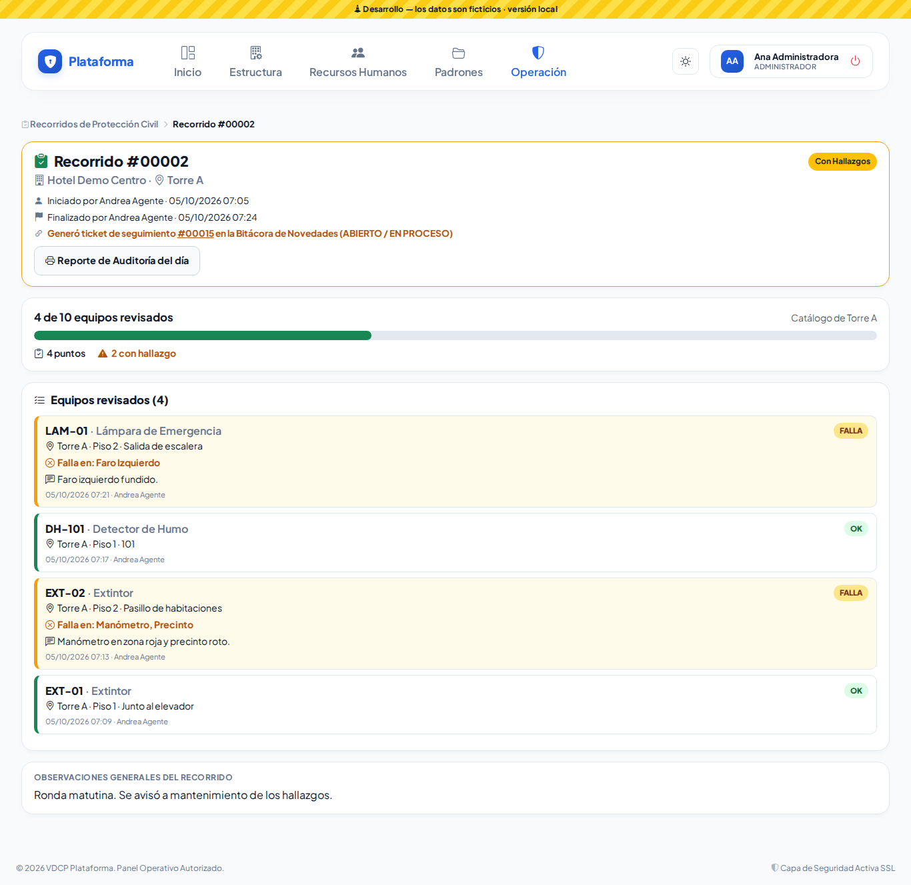
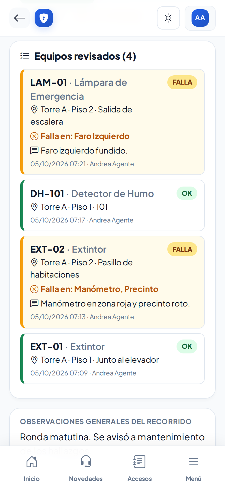

## 7. Reporte de Auditoría

**Reporte de Auditoría** abre una hoja para imprimir (o guardar como PDF) con los recorridos de un rango de fechas: cuántos se hicieron, cuántos equipos se revisaron y cuántos hallazgos hubo, y la tabla de cada recorrido. Elige **Desde**, **Hasta** y la sede, y toca **Filtrar**. Con permiso de exportar, **Exportar Excel** baja lo mismo en un archivo.

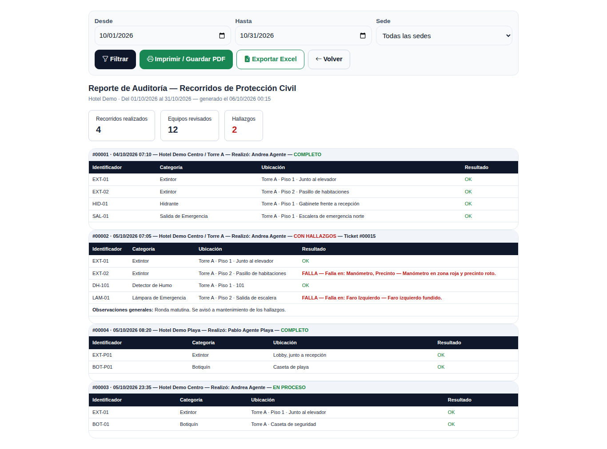

## 8. Catálogo de Equipos de Protección Civil

**Catálogo de Equipos** muestra los equipos de cada sede: tipo, ID, ubicación y referencia. Filtra por activos / de baja, sede, tipo o búsqueda.

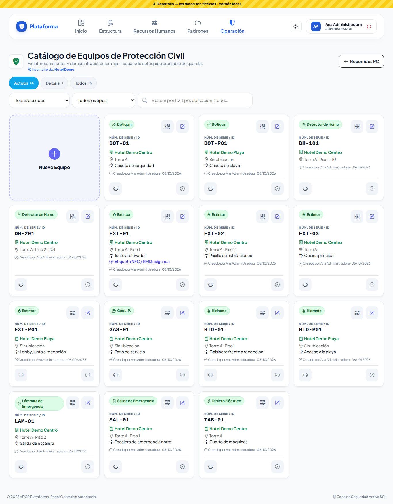

Para registrar uno (Supervisor, Jefe de seguridad, Asistente o Administrador):

1. Toca **Nuevo Equipo**.
2. Elige **Sede** y **Tipo de Equipo**.
3. Escribe el **Núm. de Serie / ID** que irá en la etiqueta (ej. `EXT-01`). No se puede repetir en la misma sede.
4. Elige **Zona / Piso** y, si quieres, el **Área Específica**. Escribe una **Referencia** para encontrarlo rápido («Junto al elevador»).
5. Si la etiqueta trae chip NFC, acércala en **Etiqueta NFC / RFID**.
6. **Guardar**, o **Guardar y capturar siguiente** para registrar otro con la misma sede, tipo y ubicación.

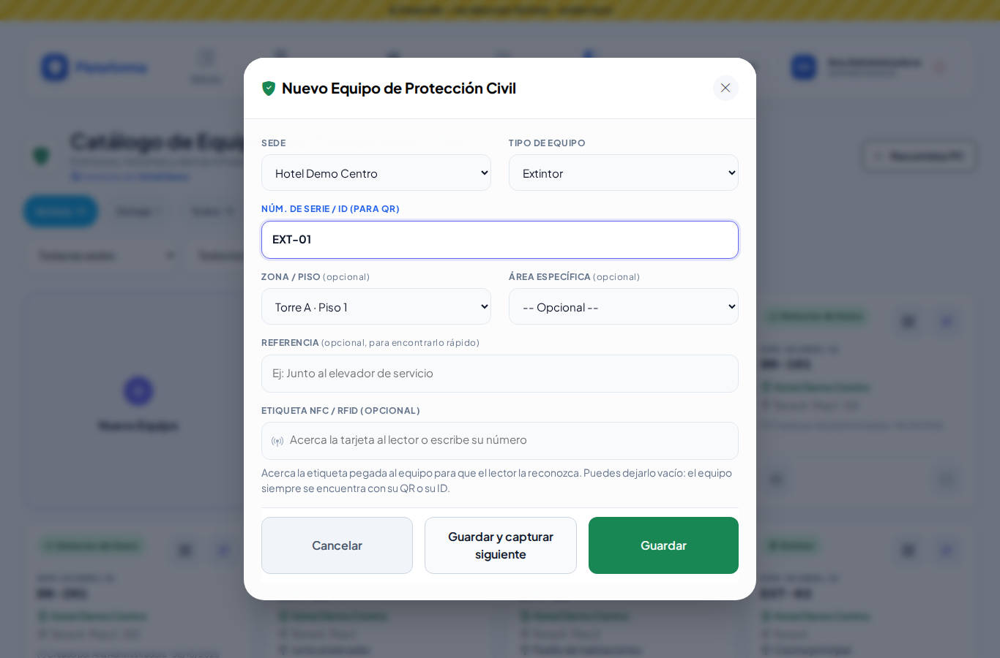

Si algo está mal, el mensaje aparece dentro de la ventana:

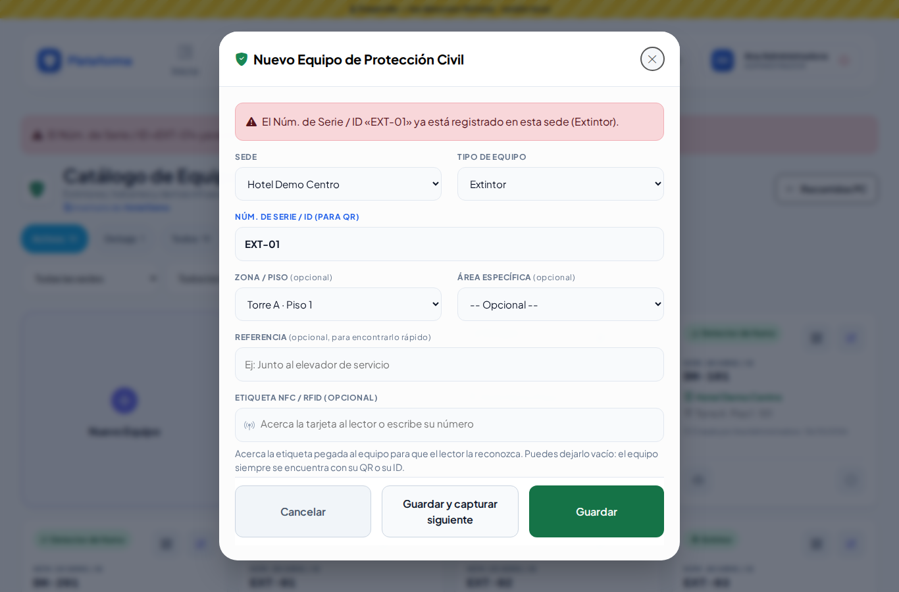

En cada equipo: **lápiz** para editar, **QR** para ver su código, **impresora** para imprimir su etiqueta y **círculo tachado** para darlo de baja (ya no aparece en los recorridos; con la flecha se reactiva).

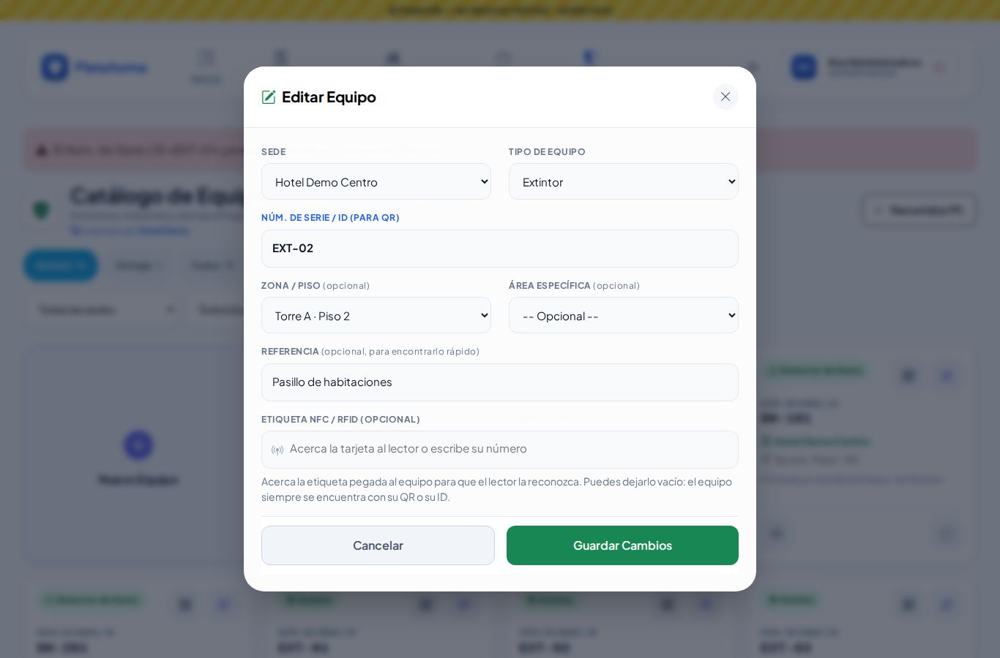
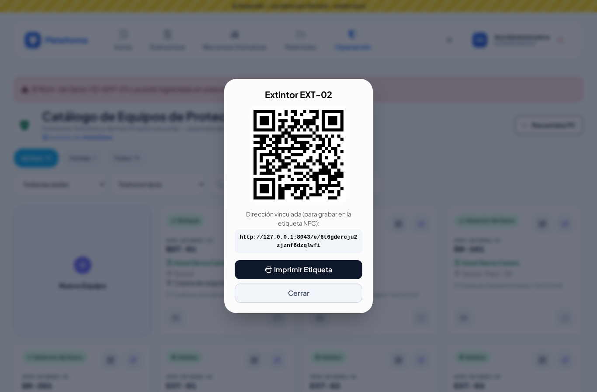
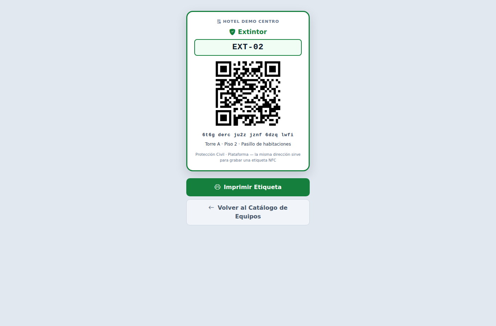

El **Agente** consulta el catálogo pero no registra ni edita equipos:

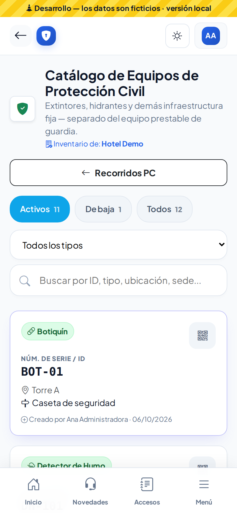

## 9. Modo Sol y modo Noche

Con el botón del sol (junto a tu nombre) cambias a **Sol** (alto contraste, para exteriores) o **Noche** (oscuro, para el turno nocturno).

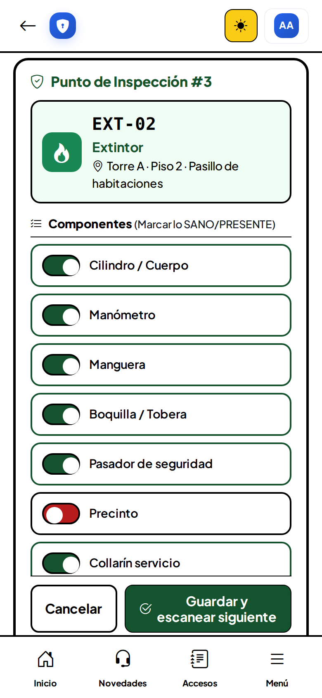
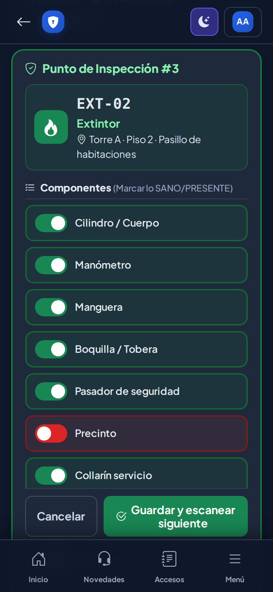
