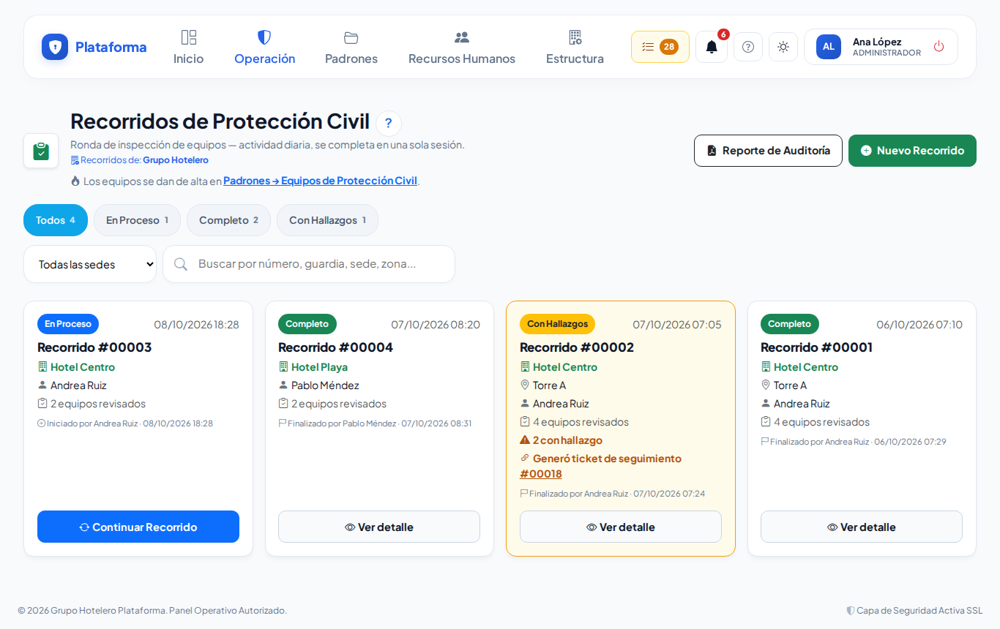
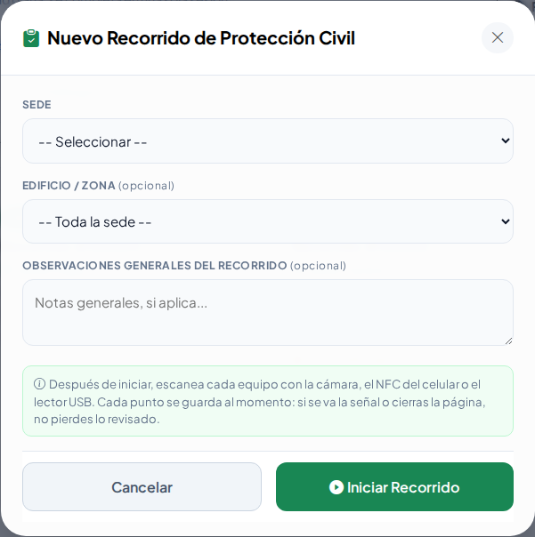
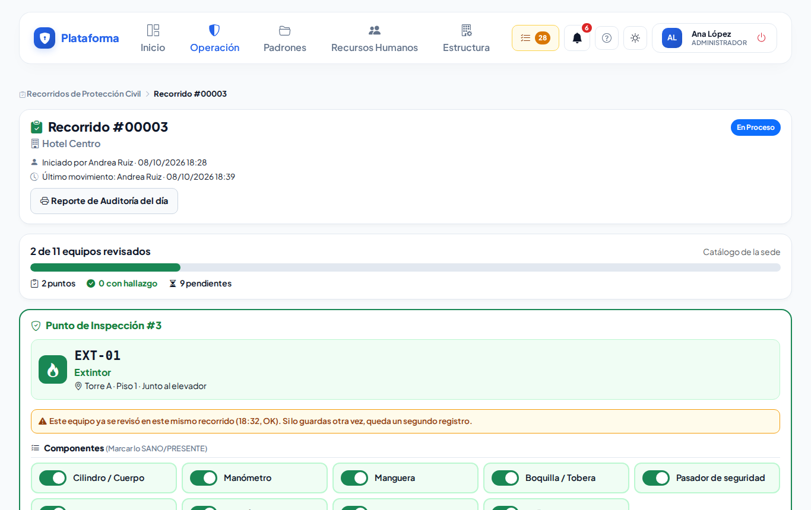
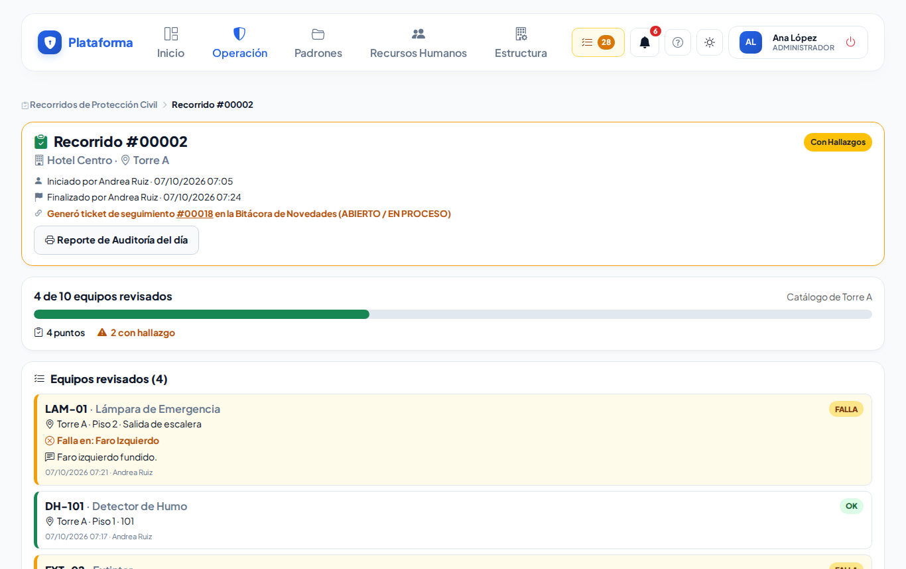
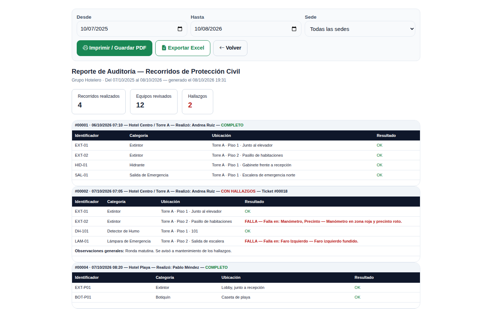
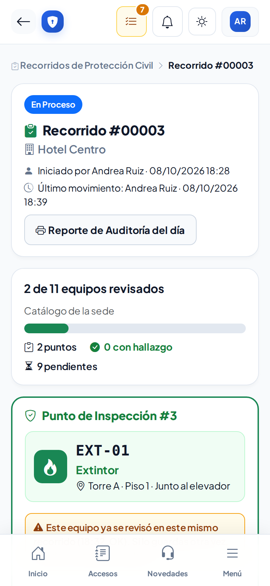

# Recorridos de Protección Civil

**¿Para qué sirve?** Para hacer la **inspección** de extintores, hidrantes, detectores, botiquines y demás equipo de Protección Civil: escaneas cada equipo, marcas lo que está bien y anotas lo que falla. Si algo falla, la plataforma abre sola un **ticket en la Bitácora de novedades** para que alguien lo repare.

Está pensado para hacerse **caminando con el celular**: botones grandes, un equipo a la vez, y cada equipo se guarda al momento.

**Antes de empezar:** necesitas que tu rol pueda **ver** y **crear** en Recorridos de Protección Civil. Los equipos se dan de alta antes en [Equipos de Protección Civil](equipos-pc.md). Si no ves **Nuevo Recorrido**, pide a tu administrador que revise tu rol.

## Cómo leer la lista de recorridos

1. Entra a **Operación → Protección civil → Recorridos de Protección Civil**.
2. Cada tarjeta es un recorrido con su número (por ejemplo **Recorrido #00003**), la fecha, la sede, la zona, quién lo hizo, cuántos equipos se revisaron y cuántos fallaron.
3. El color de arriba es su estado: **En Proceso** (azul, se puede continuar), **Completo** (verde, todo bien) o **Con Hallazgos** (amarillo, algo falló; dice qué ticket se abrió).

**Qué debes ver:** puedes filtrar por estado y sede, y buscar por número, guardia o zona.

## Cómo empezar un recorrido

1. Toca **Nuevo Recorrido**.
2. Revisa la **Sede** (si trabajas en una sola, ya viene elegida).
3. Si quieres, elige **Edificio / Zona**: el avance contará solo los equipos de esa zona.
4. Si quieres, escribe **Observaciones Generales**.
5. Toca **Iniciar Recorrido**.

**Qué debes ver:** la pantalla del recorrido con el avance («0 de 11 equipos revisados») y el campo para escanear el primer equipo.

## Cómo revisar cada equipo

1. **Identifica el equipo**: toca el botón del **QR** y apunta a la etiqueta; o toca la **antena** y acerca el celular a la etiqueta NFC (Android); o pasa el lector USB; o escribe su ID (por ejemplo `EXT-01`).
2. Revisa sus piezas: todas vienen **en verde** (bien). Toca la pieza **dañada o que falta**: se pone **en rojo**.
3. Revisa los **Criterios Operativos Universales** (visible, accesible, funcional).
4. Si viste algo raro, escríbelo en **Observaciones / Desperfectos Encontrados**.
5. Abajo ves el **Resultado**: *OK* o *FALLA* (una pieza en rojo o una observación = FALLA).
6. Toca **Guardar y escanear siguiente**.

**Qué debes ver:** el avance sube y el campo queda listo para el siguiente equipo.

- Si la etiqueta está dañada, abre **Equipos pendientes de revisar** y toca **Revisar** en el equipo.
- Si el equipo no tiene etiqueta o no está en el catálogo, toca **¿No tiene etiqueta o no está en el catálogo? Captúralo a mano**, escribe su ID y elige la **Categoría del Equipo**.
- Si escaneas un equipo que ya revisaste en este recorrido, sale un aviso amarillo.

## Qué pasa cuando algo falla

El **primer** equipo con falla abre un ticket de **Siniestro Protección Civil** en la Bitácora de novedades con lo que falló. Los siguientes equipos con falla del mismo recorrido se anotan en ese mismo ticket. Verás un aviso con el número del ticket.

## Cómo guardar para después o terminar

1. **Guardar y Continuar Después**: deja el recorrido **En Proceso**. Para seguir, toca **Continuar Recorrido** en la lista.
2. **Finalizar Recorrido**: confirma y se cierra como **Completo** o **Con Hallazgos**. Después ya no se le agregan equipos.

**Qué debes ver:** la tarjeta del recorrido con su estado final en la lista.

## Cómo ver el detalle y el reporte

1. En la tarjeta toca **Ver detalle**: ves cada equipo revisado y, en amarillo, los que fallaron con **qué pieza** falló y el ticket que se abrió.
2. Para el informe, toca **Reporte de Auditoría**, elige **Desde**, **Hasta** y la sede, y toca **Filtrar**. Imprímelo o toca **Exportar Excel**.

## En el celular

## Si algo sale mal

| Mensaje o síntoma | Qué significa | Qué hacer |
|---|---|---|
| «Escanea el equipo o escribe su Núm. de Serie / ID.» | No identificaste el equipo. | Escanéalo o escribe su ID. |
| «Ese equipo no es de la sede de este recorrido…» | El equipo es de otra sede. | Revisa la etiqueta o la sede del recorrido. |
| «Agrega al menos un equipo al recorrido antes de finalizarlo.» | El recorrido está vacío. | Revisa al menos un equipo. |
| «Elige la Categoría del Equipo.» | En la captura a mano falta la categoría. | Elígela de la lista. |
| «Este punto tiene un hallazgo y debe abrir un ticket…, pero tu rol no puede crear tickets en esta sede.» | No puedes abrir tickets de novedades. | Avisa a tu supervisor. |
| La cámara no abre | El navegador no tiene permiso de cámara. | Acepta el permiso de cámara o escribe el ID. |

## Preguntas frecuentes

- **¿Se pierde lo revisado si se me cierra el celular?** No; cada equipo se guarda al tocar **Guardar y escanear siguiente**.
- **¿Puedo hacer el recorrido en dos partes?** Sí, con **Guardar y Continuar Después**.
- **¿Dónde se dan de alta los extintores?** En [Equipos de Protección Civil](equipos-pc.md).
- **¿Funciona en iPhone?** Sí, con la cámara. La lectura NFC directa solo funciona en Android.

## Relacionado

- [Equipos de Protección Civil](equipos-pc.md)
- [Bitácora de novedades](novedades.md)
- [Etiquetas QR](etiquetas-qr.md)
