# Responsivas (Control de Resguardos)

Operación → Control de Activos → **Responsivas**. Aquí la caseta entrega **equipo de seguridad** (radios, lámparas, detectores, chalecos…) a un colaborador, **con su firma**, y lo recibe de vuelta. Cada entrega es un **resguardo** (lote) con su **folio**, por ejemplo `CENRES-000002`.

Los equipos se dan de alta en [Equipos de seguridad](equipos.md). Aquí solo se entregan y se reciben.

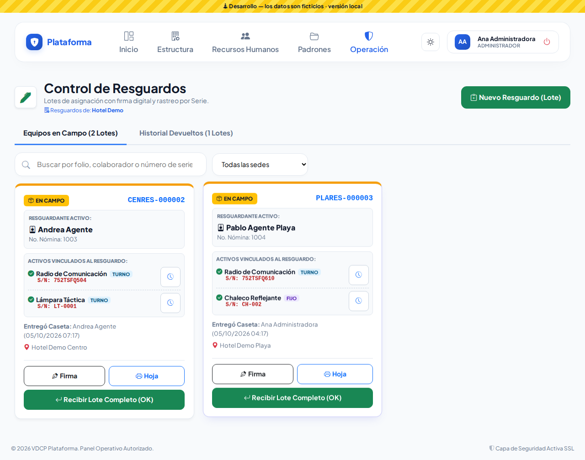

## Las dos pestañas

| Pestaña | Qué ves |
|---|---|
| **Equipos en Campo (N Lotes)** | Resguardos abiertos: los equipos los tiene el colaborador (**EN CAMPO**, borde ámbar). |
| **Historial Devueltos (N Lotes)** | Resguardos ya recibidos (**LOTE CERRADO**, borde verde). |

Cada ficha muestra el folio, el **resguardante**, los **equipos** con su número de serie (**S/N**) y si son **TURNO** (se devuelven al terminar) o **FIJO** (asignación fija), quién los entregó y cuándo.

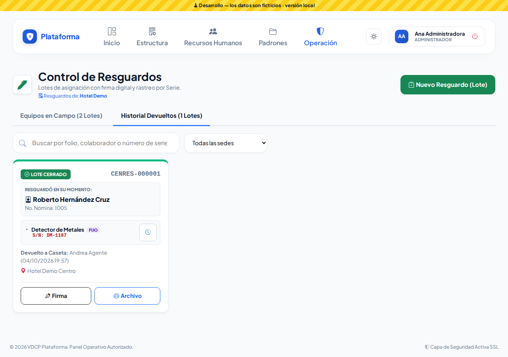

Usa **Buscar** para encontrar un folio, un colaborador o un número de serie.

## Nuevo resguardo (entregar equipo)

1. Toca **Nuevo Resguardo (Lote)**.
2. **Sede de Origen**: si solo tienes una, ya viene elegida.
3. **Colaborador (Responsable)**: escanea su gafete o escribe su número de nómina o su nombre.
4. **Equipos a Resguardar**: escanea el QR o la etiqueta de cada equipo; **se agrega solo a la lista**. También puedes tocar **+ Añadir Equipo** y elegirlo de la lista (solo aparecen los equipos **DISPONIBLES** de la sede).
5. En cada equipo elige **Turno** o **Fijo**. Con el bote de basura quitas una fila.
6. Pide al colaborador que **firme en el recuadro** con el dedo, un lápiz o el mouse. Si se equivoca, toca **Limpiar firma**. La firma es obligatoria.
7. Toca **Guardar Lote de Resguardo**.

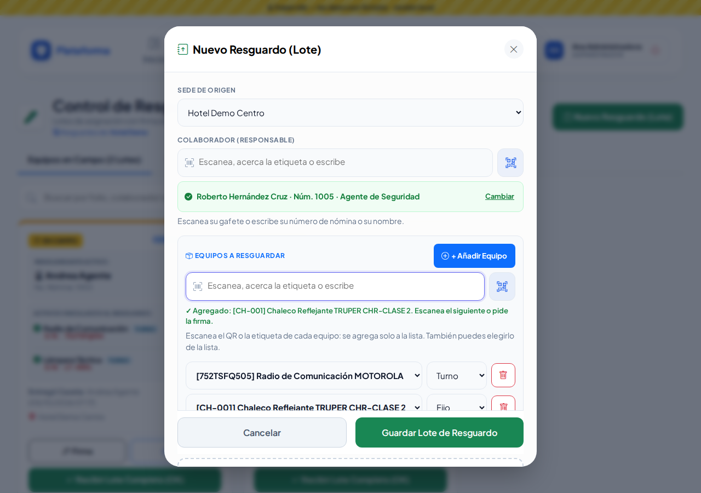
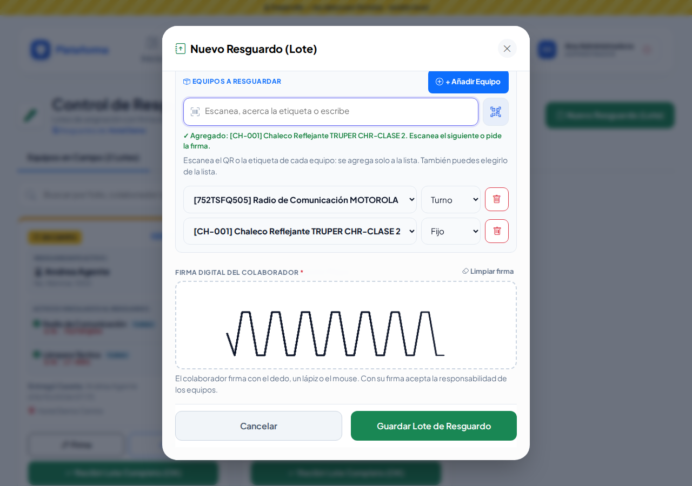

Al guardar, el aviso verde te da el **folio** y cada equipo queda **ASIGNADO** en el inventario (su ficha dice **A cargo de** quién está).

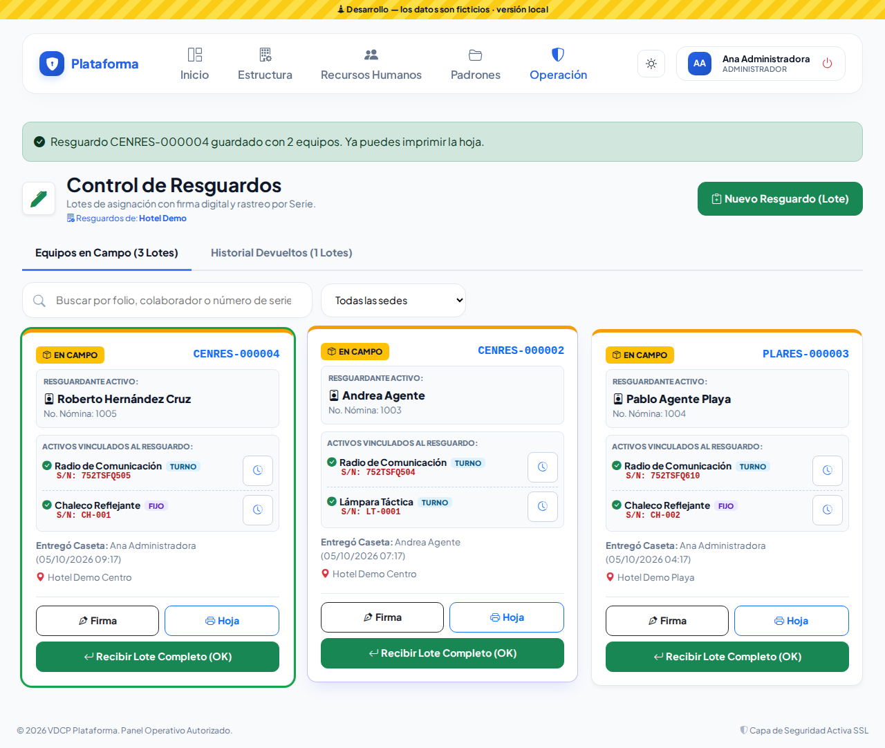
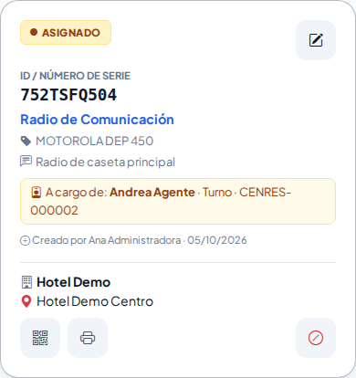

**Reglas:**

- Solo se entregan equipos **DISPONIBLES** de la sede elegida. Uno en mantenimiento, de baja o que sigue en otro resguardo no se puede.
- El colaborador debe estar activo y trabajar en esa sede (o ser corporativo).
- Sin firma no se guarda.

## Ver la firma

Toca **Firma** en la ficha. Solo la ven las personas con permiso en esa sede: la firma no está en una dirección pública.

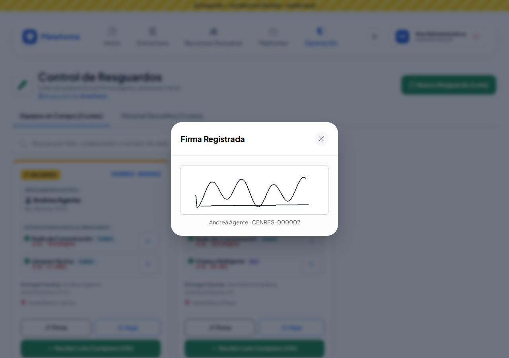

## Imprimir la hoja

Toca **Hoja** (o **Archivo** en el historial): se abre el **RESGUARDO MÚLTIPLE DE ACTIVOS DE SEGURIDAD** con el folio, los equipos, el texto de responsabilidad y la firma. Toca **Imprimir Resguardo** o guárdalo como PDF.

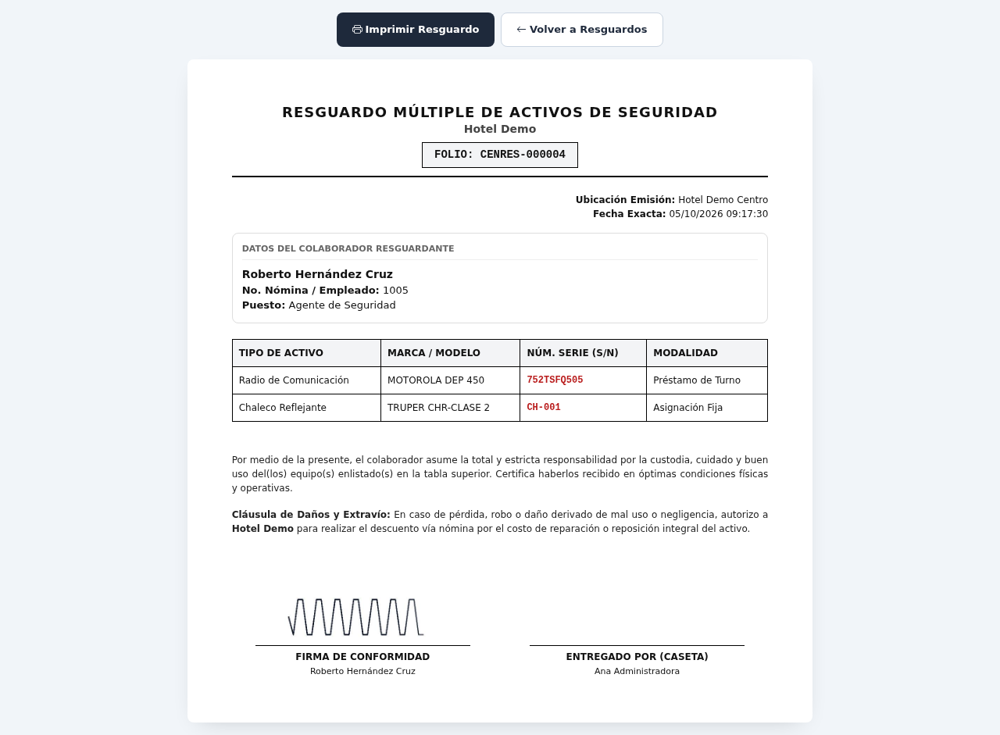

## Recibir el lote

Cuando el colaborador regresa los equipos:

1. Revisa que estén completos y en buen estado.
2. Toca **Recibir Lote Completo (OK)** y confirma.

Todos los equipos vuelven a **DISPONIBLE** y el resguardo pasa al **Historial Devueltos**.

> **Si un equipo se perdió o se dañó**: primero dalo de baja con su voucher en [Equipos de seguridad](equipos.md) y después recibe el lote. Ese equipo se queda de baja (en la ficha aparece **BAJA**) y los demás vuelven a DISPONIBLE.

## Historial de un equipo

Toca el **reloj** junto a un equipo: ves quién lo ha tenido, cuándo se entregó y cuándo regresó.

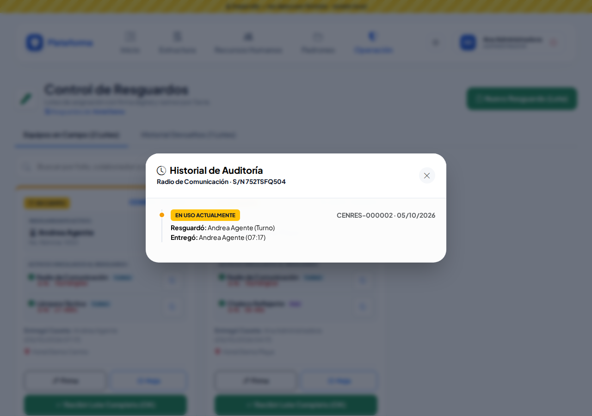

## En el celular y en modo Noche / Sol

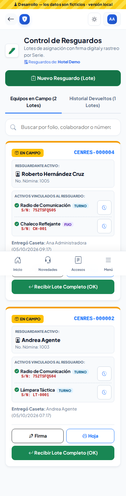
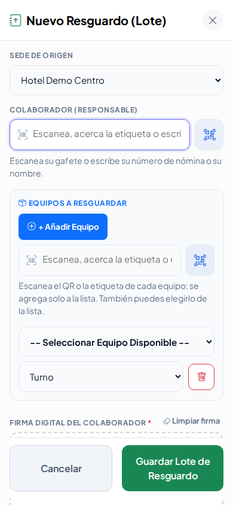
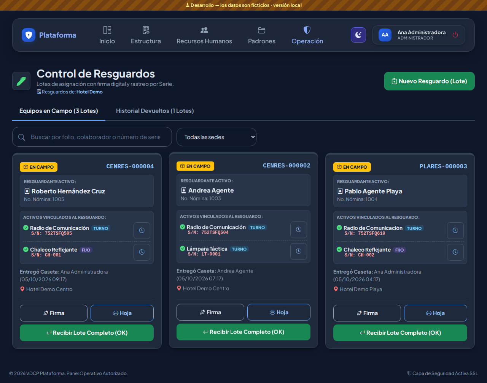
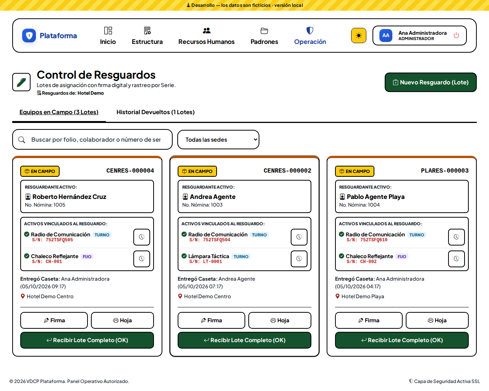

## ¿Quién puede hacer qué?

| Acción | Quién (plantillas) |
|---|---|
| Ver resguardos, firmas e historial | Todos los roles de Seguridad |
| Nuevo resguardo (necesita **crear** y **firmar**) | Administrador, Jefe de seguridad, Supervisor y Agente |
| Recibir el lote | Administrador, Jefe de seguridad, Asistente, Supervisor y Agente |
| Imprimir la hoja | Administrador, Director, Jefe de seguridad, Asistente, Supervisor y Agente |

Cada quien ve solo los resguardos de **sus sedes**.

## Ronda 8: recibir equipo por equipo (devolución parcial)

Si de un lote solo regresa una parte, ya no tienes que esperar: cada equipo del lote **EN CAMPO** tiene su botón **Recibir**.

1. Toca **Recibir** en el equipo que te entregan.
2. Elige cómo regresa: **OK**, **Dañado** o **Faltante**.
   - **OK**: el equipo vuelve a DISPONIBLE.
   - **Dañado**: escribe qué daño tiene. Queda **EN MANTENIMIENTO**; si ya no sirve, marca «Ya no sirve: darlo de baja con voucher de reposición».
   - **Faltante**: escribe qué pasó. Se genera el **voucher de reposición** (Extraviado o Robado) y el equipo queda de BAJA/PERDIDO; si aplica cobro, se le cobra al resguardante. (El voucher solo lo puede generar quien tiene permiso de dar de baja equipos, como el supervisor.)
3. **Recibir Equipo**.

El lote sigue **EN CAMPO** hasta que regresa el último equipo; entonces pasa solo a **Historial Devueltos**. **Recibir Lote Completo (OK)** sigue igual: recibe de una vez los que falten. En la tarjeta y en la hoja impresa se ve cómo y cuándo regresó cada equipo.

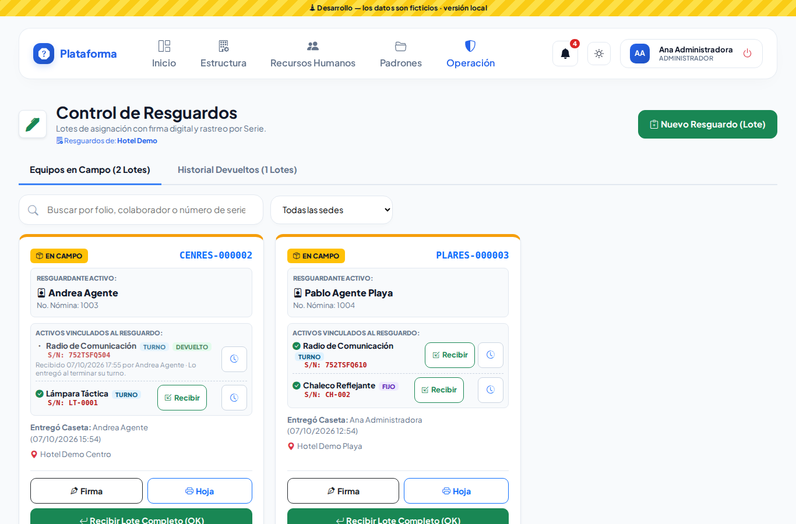

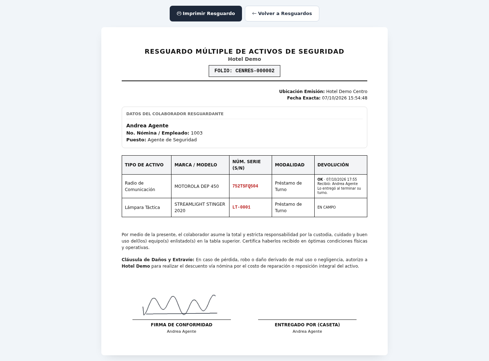
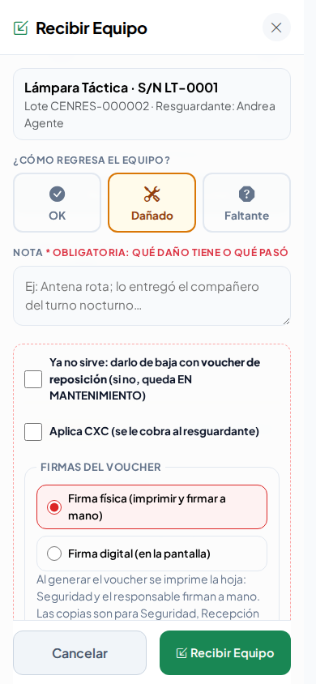
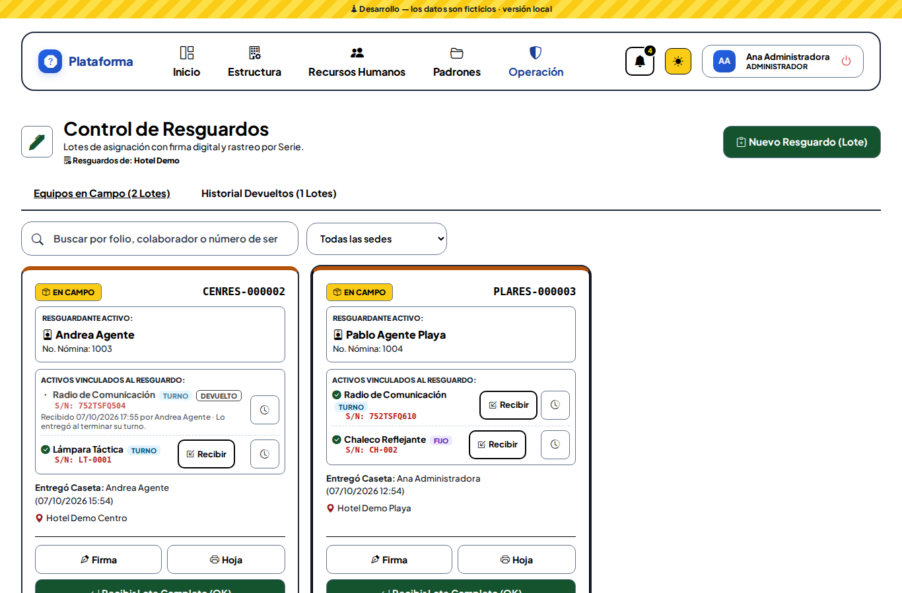
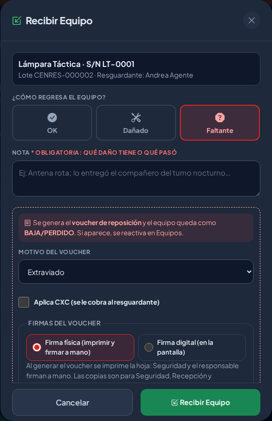
