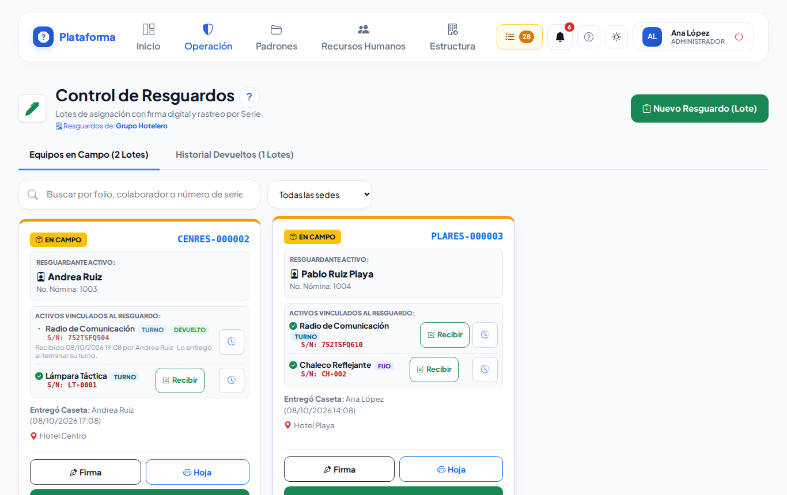
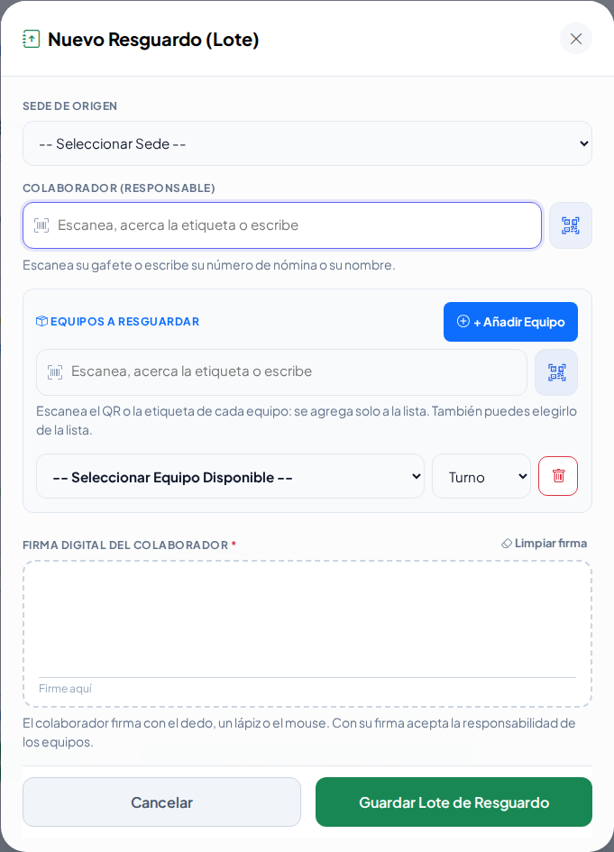
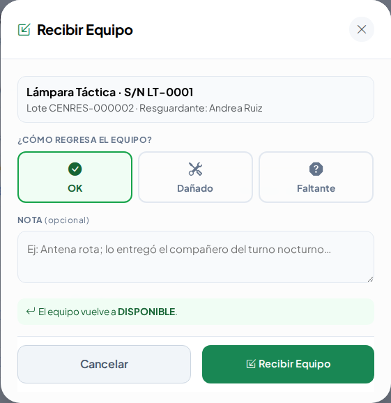
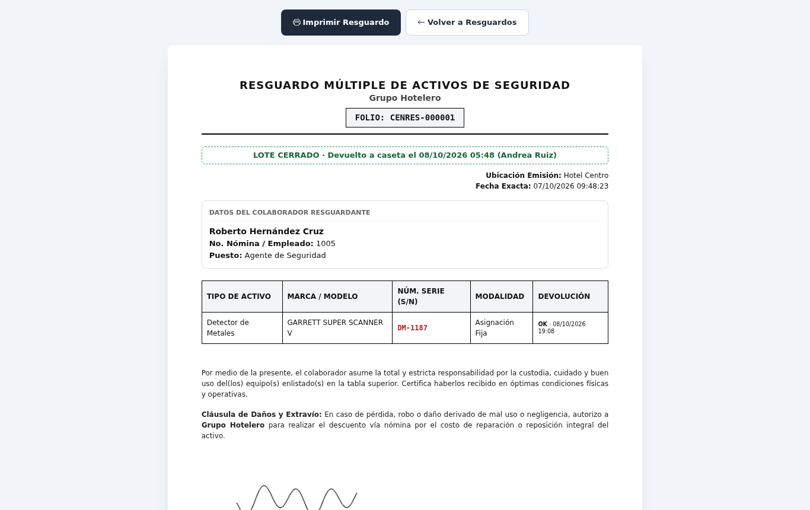
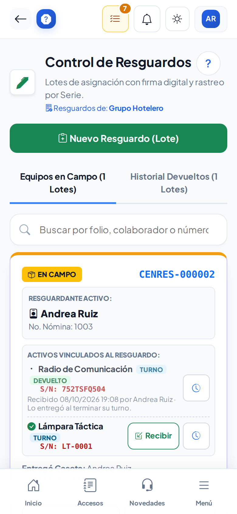

# Responsivas

**¿Para qué sirve?** Aquí la caseta entrega **equipo de seguridad** (radios, lámparas, detectores, chalecos…) a un colaborador, **con su firma**, y lo recibe de vuelta. Cada entrega es un **resguardo** (lote) con su **folio**, por ejemplo `CENRES-000002`.

**Antes de empezar:** para entregar necesitas que tu rol pueda **crear** y **firmar** en Responsivas; para recibir, **editar**. Los equipos se dan de alta antes en [Equipos de seguridad](equipos.md). Si no ves **Nuevo Resguardo (Lote)**, pide a tu administrador que revise tu rol.

## Cómo leer la pantalla

1. Entra a **Operación → Activos → Responsivas**.
2. Tienes dos pestañas:

| Pestaña | Qué ves |
|---|---|
| **Equipos en Campo** | Resguardos abiertos: el colaborador tiene los equipos (**EN CAMPO**, borde ámbar). |
| **Historial Devueltos** | Resguardos ya recibidos (**LOTE CERRADO**, borde verde). |

**Qué debes ver:** cada ficha con el folio, el **resguardante**, los equipos con su número de serie (S/N) y si son **Turno** (se devuelven al terminar) o **Fijo** (asignación fija), quién los entregó y cuándo. Usa **Buscar** para un folio, colaborador o número de serie.

## Cómo entregar equipo (nuevo resguardo)

1. Toca **Nuevo Resguardo (Lote)**.
2. Revisa la **Sede de Origen**.
3. En **Colaborador (Responsable)** escanea su gafete o escribe su número de nómina o nombre.
4. En **Equipos a Resguardar** escanea el QR o la etiqueta de cada equipo: se agrega solo. También puedes tocar **Añadir Equipo** y elegirlo (solo salen los **DISPONIBLES** de la sede).
5. En cada equipo elige **Turno** o **Fijo**. Con el bote de basura quitas una fila.
6. Pide al colaborador que **firme en el recuadro**. Si se equivoca, toca **Limpiar firma**.
7. Toca **Guardar Lote de Resguardo**.

**Qué debes ver:** el aviso verde con el **folio** y la ficha nueva en **Equipos en Campo**. Cada equipo queda **ASIGNADO** y su ficha en el inventario dice **A cargo de** quién está.

## Cómo recibir el equipo de vuelta

**Todo el lote de una vez:**

1. Revisa que los equipos estén completos y en buen estado.
2. Toca **Recibir Lote Completo (OK)** y confirma.

**Equipo por equipo** (si solo regresa una parte):

1. Toca **Recibir** en el equipo que te entregan.
2. Elige cómo regresa: **OK** (vuelve a DISPONIBLE), **Dañado** (escribe el daño; queda en mantenimiento) o **Faltante** (escribe qué pasó; se genera el voucher de reposición).
3. Toca **Recibir Equipo**.

**Qué debes ver:** el lote sigue **EN CAMPO** hasta que regresa el último equipo; entonces pasa solo a **Historial Devueltos**.

## Cómo ver la firma e imprimir la hoja

1. Toca **Firma** en la ficha para verla (solo la ven quienes tienen permiso en esa sede).
2. Toca **Hoja** (o **Archivo** en el historial): se abre el **Resguardo múltiple de activos de seguridad** con folio, equipos, texto de responsabilidad y firma.
3. Toca **Imprimir Resguardo** o guárdalo como PDF.

**Qué debes ver:** la hoja con cómo y cuándo regresó cada equipo.

## Cómo ver el historial de un equipo

1. Toca el **reloj** junto a un equipo.
2. Revisa quién lo ha tenido, cuándo se entregó y cuándo regresó.

## En el celular

## Si algo sale mal

| Mensaje o síntoma | Qué significa | Qué hacer |
|---|---|---|
| «Debe añadir al menos 1 equipo al lote.» | El lote está vacío. | Escanea al menos un equipo. |
| «El equipo … no está DISPONIBLE (está …)» | El equipo está en mantenimiento, de baja o prestado. | Usa otro equipo. |
| «El equipo … sigue en el resguardo … sin recibir.» | Otro colaborador lo tiene. | Recíbelo primero en ese resguardo. |
| «El equipo … es de otra sede…» | El equipo no es de la sede elegida. | Cambia la sede o el equipo. |
| «Escanea el gafete o busca al colaborador responsable.» | Falta el colaborador. | Escanea su gafete. |
| «Un mismo equipo está en dos filas. Quita la fila repetida.» | Escaneaste dos veces el mismo. | Quita una fila. |
| «Pide a un supervisor que reciba este equipo faltante.» | Tu rol no puede generar el voucher. | Llama a tu supervisor. |
| No se guarda y el recuadro de firma se marca | Falta la firma. | Pide la firma y vuelve a guardar. |

## Preguntas frecuentes

- **¿Qué diferencia hay entre Turno y Fijo?** **Turno** se devuelve al terminar el turno; **Fijo** es una asignación que se queda con la persona.
- **¿Qué hago si un equipo se perdió?** Recíbelo como **Faltante**: se genera el voucher de reposición.
- **¿Puedo entregar equipo de otra sede?** No; solo de la sede elegida.
- **¿Dónde veo quién tiene un radio?** En [Equipos de seguridad](equipos.md) la ficha del equipo dice **A cargo de**.

## Relacionado

- [Equipos de seguridad](equipos.md)
- [Vouchers de reposición](vouchers.md)
- [Préstamo de llaves](prestamo-llaves.md)
