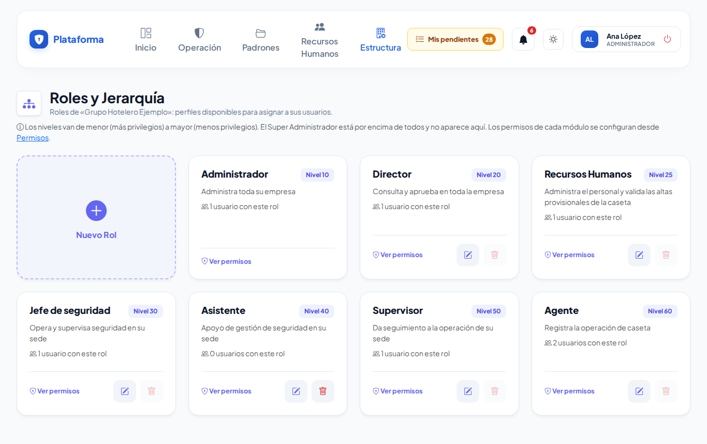
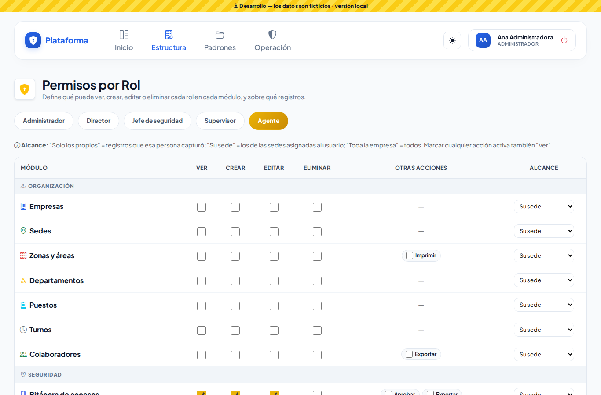
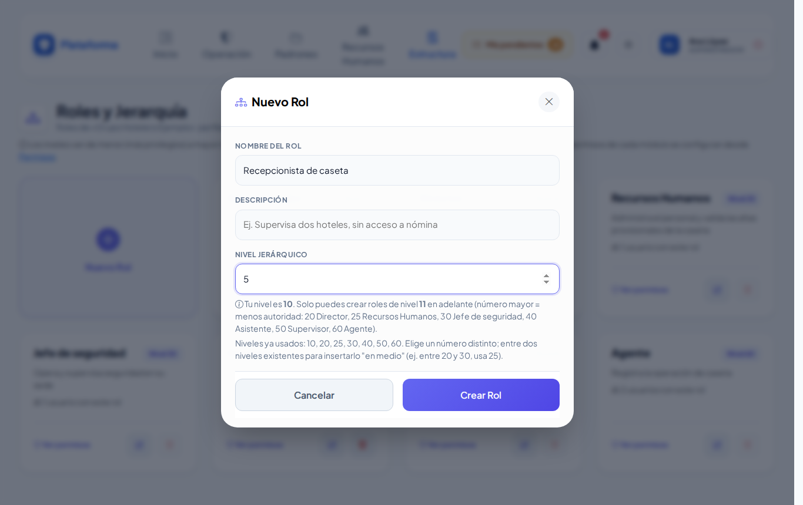
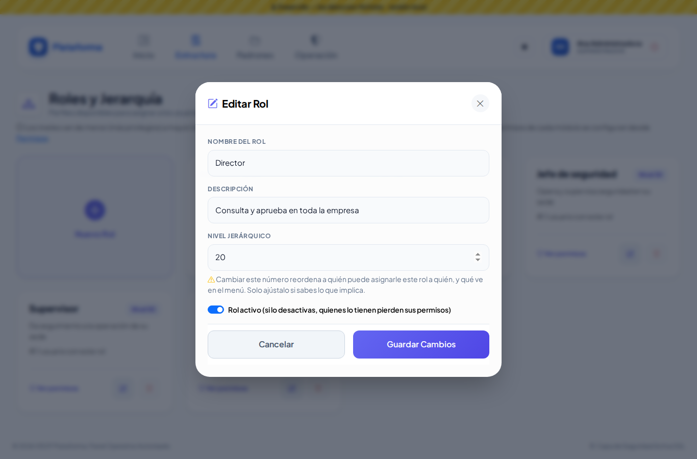
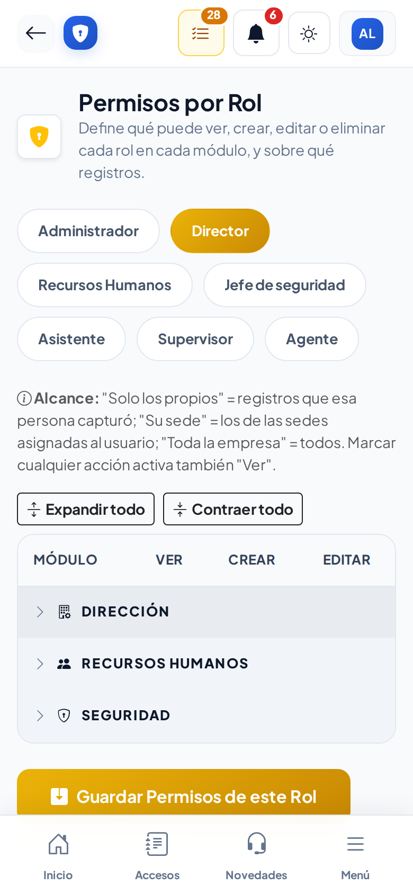
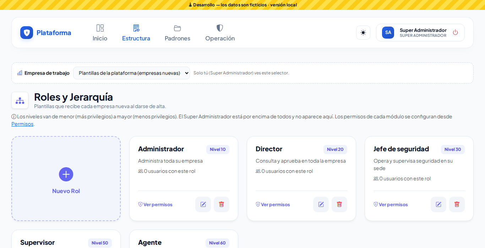

# Roles y permisos

**¿Para qué sirve?** Los **roles** son perfiles (Administrador, Supervisor, Agente…). Los **permisos** dicen qué puede hacer cada rol en cada pantalla (módulo): ver, crear, editar, eliminar, aprobar, imprimir… y sobre qué registros (los propios, los de su sede o toda la empresa). A cada usuario se le asigna un rol en [Usuarios](usuarios.md).

## Antes de empezar

- Para ver estas pantallas tu rol debe poder consultar *Roles* y *Matriz de permisos* (normalmente el administrador).
- Cada rol tiene un **nivel**: menor número = más autoridad. Solo puedes administrar roles con un número **mayor** que el tuyo.
- Las casillas grises de la matriz son permisos que tú no tienes y por eso no puedes dar ni quitar.

### Roles que trae cada empresa

| Rol | Nivel | Para qué |
|---|---|---|
| Administrador | 10 | Administra toda su empresa. |
| Director | 20 | Consulta y aprueba en toda la empresa. |
| Recursos Humanos | 25 | Administra el personal y valida las altas provisionales de la caseta. |
| Jefe de seguridad | 30 | Opera y supervisa seguridad en su sede; desbloquea usuarios. |
| Asistente | 40 | Apoyo de gestión de seguridad en su sede: captura, corrige, imprime y exporta; no elimina, no aprueba ni firma. |
| Jefe de departamento | 45 | Aprueba y responde las solicitudes de su departamento en su sede (pases de salida y autorizaciones), entrevista y elige a los candidatos que le canaliza Recursos Humanos y pide vacantes. |
| Supervisor | 50 | Da seguimiento a la operación de su sede. |
| Agente | 60 | Registra la operación de caseta; en Padrones solo consulta. |
| Solicitante | 70 | Personal de cualquier departamento que solo pide pases de salida y ve los suyos. |

Son un punto de partida: cada empresa los ajusta en la Matriz de permisos.

### Solicitante y Jefe de departamento

Son para el personal que **no trabaja en la caseta** (Recepción, Ama de llaves, Mantenimiento, Cocina…).

| | Solicitante | Jefe de departamento |
|---|---|---|
| **Pases de salida** | Pide pases **a su nombre** y ve solo los que él pidió. | Pide pases a su nombre; ve los pases de su sede; **aprueba y firma** el paso «Jefe de Departamento» de los pases de su gente; imprime la hoja del pase. |
| **Autorizaciones departamentales** | — | Ve y **responde** las visitas de los departamentos donde es responsable, en su sede. |
| **Candidatos** | — | Con el permiso **Evaluar**: **entrevista, califica y elige** a los candidatos que Recursos Humanos le canaliza, en su pantalla **Entrevistar**. No ve la lista de candidatos ni sus datos personales. |
| **Vacantes** | — | Ve las vacantes publicadas de su sede y **pide** vacantes nuevas: quedan en **Borrador** hasta que Recursos Humanos las revisa y las publica. |
| **Procedimientos** | Lee los publicados que aplican a su sede y firma «Leí y entendí». | Igual que el Solicitante. |
| **Mis pendientes y Manual** | Sí. | Sí. |
| **No puede** | Aprobar, operar la caseta (accesos, llaves, salidas), ver el directorio de colaboradores ni pedir pases a nombre de otra persona. | Operar la caseta, registrar salidas o regresos de pases, editar o publicar vacantes, ni elegir responsables de departamento. |

**¿Cómo sabe la plataforma de qué departamento es el jefe?** Por el **colaborador vinculado a su usuario**: el paso «Jefe de Departamento» de un pase lo firma quien tiene este rol en la sede de origen y pertenece al mismo departamento que quien pide el pase. Si nadie de ese departamento puede firmar, firma cualquier persona con «Aprobar» en esa sede, para que el pase no se atore.

## Cómo asignar los roles Solicitante y Jefe de departamento

1. Revisa que la persona exista en **Recursos Humanos → Colaboradores** con su **departamento** correcto. Para el jefe, el departamento que va a aprobar.
2. Entra a **Estructura → Usuarios** y toca la tarjeta **Nuevo Usuario** (o el **lápiz** de su cuenta si ya tiene una).
3. En **Núm. Colaborador** escribe su número o su nombre y elígelo de la lista: debe aparecer en verde **Vinculado a Colaboradores**. Sin este vínculo el Solicitante no puede pedir pases y el jefe no aparece como firmante de su departamento.
4. En **1. Sede** elige la sede donde trabaja.
5. En **2. Rol en el Sistema** elige **Solicitante** o **Jefe de departamento**.
6. Escribe **Usuario**, **Correo** y **Contraseña** (si es nueva la cuenta) y toca **Registrar Usuario** (o **Guardar Cambios** si la editaste).
7. Solo para el jefe que responde visitas o candidatos: entra a **Recursos Humanos → Autorizaciones → Responsables por departamento**, toca **Elegir responsables** en su departamento, agrégalo con su sede y toca **Guardar responsables**.
8. Solo si el circuito de pases de tu empresa es distinto al de siempre: en **Estructura → Configuración → Pases de salida → Configurar circuito**, revisa que haya un paso con **Cualquier usuario con permiso «Aprobar» en la sede de origen** y **Del mismo departamento que el solicitante (jefe del departamento)**. El circuito de siempre ya lo trae como primer paso («Jefe de Departamento»).

**Qué debes ver:** al entrar, el Solicitante tiene **Operación → Caseta → Pases de salida** con su nombre ya puesto en **Solicitante**; el jefe ve en **Mis pendientes** las **Firmas de pases de salida** y, si es responsable, las **Autorizaciones por responder**. Más detalle en [Pedir y aprobar solicitudes](solicitudes.md).

## Cómo crear un rol

1. Entra a **Estructura → Roles**. Se abre **Roles y Jerarquía**.
2. Toca la tarjeta **Nuevo Rol**.
3. Escribe el **Nombre del Rol**, una **Descripción** y el **Nivel Jerárquico**. Debajo dice tu nivel, desde qué número puedes crear y qué niveles ya se usan. Para meterlo entre dos niveles usa un número intermedio (por ejemplo 35 entre 30 y 40).
4. Toca **Crear Rol**.

**Qué debes ver:** «Rol creado correctamente. Ya puedes configurarle sus permisos por módulo.»

## Cómo editar, desactivar o eliminar un rol

1. **Lápiz:** se abre **Editar Rol**. Cambia el nombre, la descripción, el nivel o desactívalo, y toca **Guardar Cambios**. Un rol desactivado deja sin permisos a quienes lo tienen.
2. **Bote de basura:** confirma con **Aceptar** («¿Eliminar el rol «…»? Solo se puede si ningún usuario lo tiene asignado.»). Si está gris, primero reasigna a esas personas.
3. **Ver permisos:** abre la matriz de ese rol.

### El permiso «Evaluar» de Candidatos

Sirve para **entrevistar, calificar y elegir** a los candidatos que Recursos Humanos canaliza a un departamento. Lo traen **Jefe de departamento** y **Supervisor** (en su sede), **Jefe de seguridad** (en su sede) y **Director** (en toda la empresa). Con **Evaluar**:

- la persona puede aparecer en **¿Quién lo entrevista?** cuando Recursos Humanos canaliza a un candidato de su sede (primero los responsables del departamento);
- recibe el aviso de la entrevista y la ve en **Mis pendientes → Entrevistas por evaluar**;
- solo evalúa las entrevistas que le asignaron (o las de quien le delegó sus avisos).

Quien atiende candidatos (Recursos Humanos) no aparece como entrevistador, salvo que sea responsable del departamento: la decisión de elegir es del departamento. Más detalle en [Entrevistar y elegir](entrevistar-y-elegir.md).

## Cómo dar o quitar permisos

1. Entra a **Estructura → Matriz de permisos**. Se abre **Permisos por Rol**.
2. Arriba toca el rol (la píldora amarilla es el que estás viendo).
3. Los módulos están agrupados por área (Dirección, Recursos Humanos, Seguridad). Toca el nombre de un área para abrirla o cerrarla; **Expandir todo** y **Contraer todo** las abren o cierran todas.
4. En cada módulo marca **Ver**, **Crear**, **Editar**, **Eliminar** y, si las tiene, las **Otras acciones** (Aprobar, Firmar, Imprimir, Exportar, Configurar…).
5. En **Alcance** elige sobre qué registros aplica:
   - **Solo los propios:** solo lo que esa persona capturó.
   - **Su sede:** lo de las sedes asignadas al usuario.
   - **Toda la empresa:** todo.
6. Toca **Guardar Permisos de este Rol** y confirma con **Aceptar**.

**Qué debes ver:** «Permisos actualizados correctamente.» El cambio aplica de inmediato a todos los usuarios con ese rol.

- Al marcar cualquier acción se marca **Ver** sola; al quitar **Ver** se quitan las demás. La excepción es **Evaluar** de *Candidatos*: no marca **Ver**, porque quien entrevista solo ve el resumen del candidato en su pantalla **Entrevistar**, no la lista ni los datos personales.
- Si el rol es de tu nivel o superior, la matriz se abre en modo consulta.
- En el celular la tabla se desliza de lado.

## Super Administrador: empresa de trabajo

Arriba aparece **Empresa de trabajo**:

- **Plantillas de la plataforma (empresas nuevas):** los roles y permisos que recibe cada empresa nueva.
- **Una empresa:** administras sus roles como si fueras su administrador.

## Si algo sale mal

| Mensaje o síntoma | Qué significa | Qué hacer |
|---|---|---|
| Tu nivel es 10: solo puedes crear o administrar roles de nivel 11 en adelante (número mayor = menos autoridad). | Escribiste un nivel igual o superior al tuyo. | Usa un número mayor que tu nivel. |
| Ya existe un rol con ese nivel jerárquico; cada nivel debe ser único. | Ese nivel ya lo tiene otro rol. | Usa un número intermedio libre. |
| Ya existe un rol con ese nombre. | El nombre ya se usa. | Usa otro nombre. |
| El bote de basura está gris. | Hay usuarios con ese rol. | Reasígnalos en [Usuarios](usuarios.md) o desactiva el rol. |
| No puedo marcar una casilla (está gris). | Tú no tienes ese permiso. | Pídelo a alguien de nivel superior. |
| Un usuario no ve una pantalla que le di. | Falta **Ver**, o el alcance no incluye su sede. | Revisa **Ver** y el **Alcance** del módulo. |
| El Jefe de departamento no ve los pases de su gente en **Mis pendientes**. | Su usuario no está vinculado a un colaborador de ese departamento, o su sede no es la sede de origen del pase. | Vincúlalo en [Usuarios](usuarios.md) y revisa su sede. |
| El Solicitante ve «Tu usuario no está vinculado a un colaborador…». | Su cuenta no tiene colaborador. | Vincúlala en [Usuarios](usuarios.md). |

## Preguntas frecuentes

**¿Qué alcance doy a un agente de caseta?** Normalmente **Su sede**: así solo ve y registra lo de su sede.

**¿Cuándo uso «Solo los propios»?** Cuando alguien solo debe corregir lo que él mismo capturó. El rol Solicitante lo usa en Pases de salida: cada quien ve solo lo que pidió.

**¿Qué rol le doy a un gerente de área que pide pases y los aprueba?** **Jefe de departamento**, vinculado a su colaborador. Si además opera la caseta, dale el rol de seguridad que corresponda.

**¿Qué le doy a un jefe para que entreviste candidatos sin ver los CV?** El permiso **Evaluar** de *Candidatos* (sin **Ver**). El rol **Jefe de departamento** ya lo trae.

**¿Cambiar un permiso afecta a quien ya está dentro?** Sí, de inmediato, a todos los que tienen ese rol.

**¿Puedo crear un rol con más autoridad que el mío?** No. Solo roles de nivel inferior al tuyo.

## Relacionado

- [Usuarios](usuarios.md)
- [Pedir y aprobar solicitudes](solicitudes.md)
- [Bitácora de auditoría](auditoria.md)
- [Configuración](configuracion.md)
