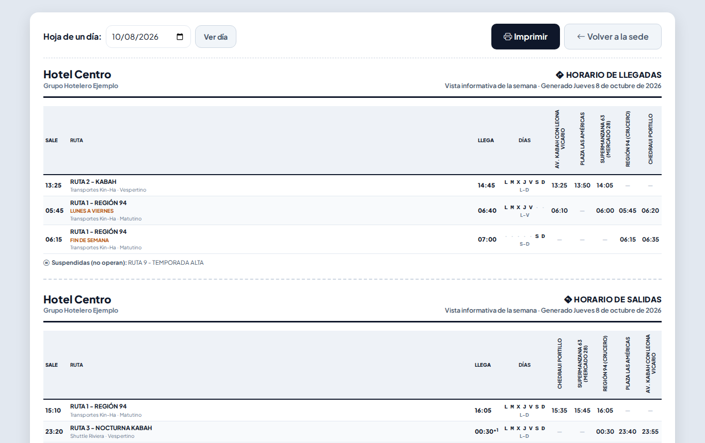

# Rutas de transporte

**¿Para qué sirve?** Aquí se configuran las rutas del transporte de personal de cada sede: las que **llegan** a la sede (para entrar al turno) y las que **salen** de ella (al terminar el turno), con sus horarios y paraderos. La caseta imprime de aquí la **hoja de horarios** de la semana y la **hoja del día**, y la [Bitácora de transporte](transporte.md) usa estas rutas.

## Antes de empezar

- Para ver la pantalla tu rol debe poder consultar *Rutas de transporte*. Si no aparece en el menú, pide el permiso a tu administrador.
- Para crear, editar, clonar o suspender rutas necesitas esos permisos. Si no ves **Nueva Llegada**, tu rol solo consulta e imprime.
- Antes de capturar una ruta deben existir:
  - el **turno** en [Turnos](turnos.md), marcado para esa sede;
  - la **empresa transportista** en [Empresas externas](proveedores.md), activa y operando en esa sede.

## Cómo elegir la sede

1. Entra a **Padrones → Rutas de transporte**.
2. Cada sede tiene una tarjeta con cuántas **Llegadas**, **Salidas** y **Paraderos** tiene, las **próximas** llegadas y salidas (por ejemplo «Hoy 13:25 · RUTA 2 - KABAH»), las transportistas y un aviso si hay rutas suspendidas.
3. Si hay varias sedes, escribe en **Buscar por sede, ruta o transportista...**.
4. Toca **Ver Detalles** para entrar a la sede (o la impresora para la hoja de la semana).

**Qué debes ver:** la pantalla de la sede con tres pestañas: **Llegadas (n)**, **Salidas (n)** y **Paraderos (n)**.

Cada ruta muestra su horario, turno, transportista, cuántos paraderos tiene, el tope de taxi y si está **ACTIVA** o **SUSPENDIDA**. Debajo van sus horarios en corto: **L-V** = lunes a viernes, **S-D** = sábado y domingo, **L-D** = todos los días. Un **+1** quiere decir que llega al día siguiente. Puedes buscar en **Buscar ruta, transportista o paradero...** y filtrar **Todas / Activas / Suspendidas**.

## Cómo dar de alta una ruta

1. En la pestaña **Llegadas** toca **Nueva Llegada** (o en **Salidas**, **Nueva Salida**). Se abre **Configurar Ruta y Horarios**.
2. Revisa el **Sentido de la Ruta**: **Llegada a la Sede** o **Salida de la Sede**.
3. Escribe el **Nombre de la Ruta / Trayecto** (por ejemplo `RUTA 1 - REGIÓN 94`). Se guarda en mayúsculas.
4. Elige el **Turno Operativo** y la **Empresa Transportista**.
5. **Costo Máximo por Taxi (opcional):** si un vale de taxi de esta ruta pasa de ese monto, la caseta tendrá que justificarlo. Déjalo vacío si no hay tope.
6. Llena el **Horario 1**:
   - **Nombre del Horario (opcional)**, por ejemplo «Lunes a viernes».
   - **Hora Inicio del Recorrido** y **Hora de Llegada a Destino**, en 24 horas (por ejemplo `05:30` y `06:40`). Si la llegada es más temprano que el inicio (23:20 a 00:30), se entiende que llega al día siguiente.
   - **Días:** marca los días que sale. Si no marcas ninguno, sale **todos los días**.
   - **Paraderos:** toca **Agregar paradero**, escribe el nombre (te sugiere los de la sede) y su hora. Si el paradero no existe, se crea solo al guardar.
7. Si la ruta pasa a otra hora algunos días, toca **Agregar otro Horario (ej. fin de semana distinto)**: se copian los paraderos del anterior y solo ajustas lo que cambie. Con el bote de basura quitas un horario (siempre queda al menos uno).
8. Toca **Guardar Ruta**.

**Qué debes ver:** «Ruta «RUTA 5 - PUERTO JUÁREZ» creada correctamente.»

## Cómo editar, clonar o suspender una ruta

- **Editar** (lápiz): abre **Modificar Ruta y Horarios** con todo lo capturado. Cambia lo necesario y toca **Guardar Cambios**. Verás «Ruta «…» actualizada correctamente.»
- **Clonar** (dos hojas): crea una copia llamada «NOMBRE (COPIA)» con los mismos horarios y paraderos. Verás «Ruta clonada como «…». Ajusta los horarios de la copia cuando quieras.»
- **Suspender** (círculo con raya): la ruta sale de las próximas salidas y de la hoja del día. Verás «Ruta «…» suspendida. Puedes reactivarla con el mismo botón cuando quieras.» Con la **flecha circular** la reactivas.

## Cómo administrar los paraderos de la sede

1. Toca la pestaña **Paraderos**. Cada paradero dice cuántas rutas activas lo usan.
2. **Nuevo Paradero:** escribe el **Nombre del Paradero** y toca **Guardar**.
3. **Editar** (lápiz): si cambias el nombre, todas las rutas que lo usan muestran el nombre nuevo.
4. **Desactivar** (círculo con raya): deja de sugerirse al capturar; las rutas que ya lo tienen no cambian.

**Qué debes ver:** «Paradero «…» agregado a la sede.» o «Paradero «…» actualizado. Las rutas que lo usan ya muestran el nombre nuevo.»

## Cómo imprimir las hojas de horarios

- **Hoja de horarios** (en la sede, o la impresora de la tarjeta de la sede): todos los horarios de la semana de cada ruta con los días en que opera (L M X J V S D; un punto · = ese día no sale). Las rutas suspendidas se mencionan al pie.
- **Hoja del día:** las rutas activas que salen ese día, por hora, una hoja para Llegadas y otra para Salidas, con una columna por paradero (hora, ✓ si para sin hora fija, — si no para). Arriba elige otra fecha en **Hoja de un día** y toca **Ver día**. Al pie dice qué horarios no operan ese día y qué rutas están suspendidas.
- **Itinerario** (impresora de cada ruta): los datos de la ruta y cada horario con sus paraderos.

En cada hoja toca **Imprimir**; **Volver a la sede** te regresa. Salen en hoja carta horizontal y se pueden guardar como PDF.

## Lo que ve el agente de caseta

El agente consulta las rutas de su sede e imprime la hoja de horarios y la hoja del día, pero no crea ni modifica rutas.

## En el celular y en modo Noche

## Si algo sale mal

Los mensajes salen en rojo dentro de la ventana; lo que capturaste se conserva. La ventana tiene una sola barra para desplazarte y los botones quedan fijos abajo.

| Mensaje o síntoma | Qué significa | Qué hacer |
|---|---|---|
| Escribe el nombre de la ruta (por ejemplo: RUTA 1 - CENTRO). | El nombre está vacío. | Escribe el nombre. |
| Ya existe una ruta de llegada (o salida) llamada «…» en esta sede. | Ese nombre ya se usa en ese sentido. | Usa otro nombre o edita la existente. |
| … (suspendida): reactívala o usa otro nombre. | La ruta existe pero está suspendida. | Reactívala con la flecha circular. |
| Elige el turno de la ruta. / Elige la empresa transportista. | Falta el turno o la transportista. | Elige uno de la lista. |
| El turno elegido no existe, está desactivado o no se usa en esta sede. Elige otro de la lista. | El turno no aplica a la sede. | Márcalo para la sede en [Turnos](turnos.md) o elige otro. |
| La empresa transportista no existe, está dada de baja o no opera en esta sede. Elige otra de la lista. | La transportista no opera en la sede. | Agrégale la sede en [Empresas externas](proveedores.md). |
| Horario 1: falta la hora de llegada a destino. | Un horario está incompleto. | Escribe las dos horas. |
| Horario 1: escribe la hora de inicio como HH:MM (24 horas). | La hora está mal escrita. | Escribe por ejemplo `05:30`. |
| Horario 1: la hora de llegada debe ser distinta a la de inicio. | Pusiste la misma hora dos veces. | Corrige una de las horas. |
| El costo máximo por taxi debe ser un número, por ejemplo 250 o 250.50. | Escribiste letras. | Escribe solo la cantidad. |
| Ya existe el paradero «…» en esta sede. | Ese paradero ya está. | Usa el existente. |
| Una ruta no aparece en la hoja del día. | Está suspendida o no opera ese día. | Revisa el pie de la hoja; ahí lo explica. |

## Preguntas frecuentes

**¿Qué pasa si no marco ningún día?** La ruta sale todos los días.

**¿Cómo capturo una ruta que sale a otra hora el fin de semana?** Con **Agregar otro Horario** en la misma ruta; se copian los paraderos y solo cambias las horas y los días.

**¿Puedo borrar una ruta?** No; se suspende y se puede reactivar. Así se conserva su historial en la bitácora de transporte.

**¿Por qué no aparece mi turno o mi transportista en la lista?** Porque no está activo o no está marcado para esa sede.

## Relacionado

- [Bitácora de transporte](transporte.md)
- [Turnos](turnos.md)
- [Empresas externas](proveedores.md)
