# Rutas de transporte

Padrones → **Rutas de transporte**. Aquí se configuran las rutas del transporte de personal de cada sede: las que **llegan** a la sede (para entrar al turno) y las que **salen** de la sede (al terminar el turno), con sus horarios y paraderos. La caseta imprime de aquí la **hoja del día**.

## 1. Elegir la sede

Cada sede tiene una ficha con:

- cuántas **Llegadas**, **Salidas** y **Paraderos** tiene;
- las **próximas llegadas y salidas** a partir de este momento (por ejemplo "Hoy 13:25 · RUTA 2 - KABAH");
- las empresas transportistas que dan el servicio y un aviso si hay rutas suspendidas.

Toca **Ver Detalles** para entrar a la sede, o el botón de la impresora para la hoja del día. Si hay varias sedes, usa **Buscar** (por sede, ruta o transportista).

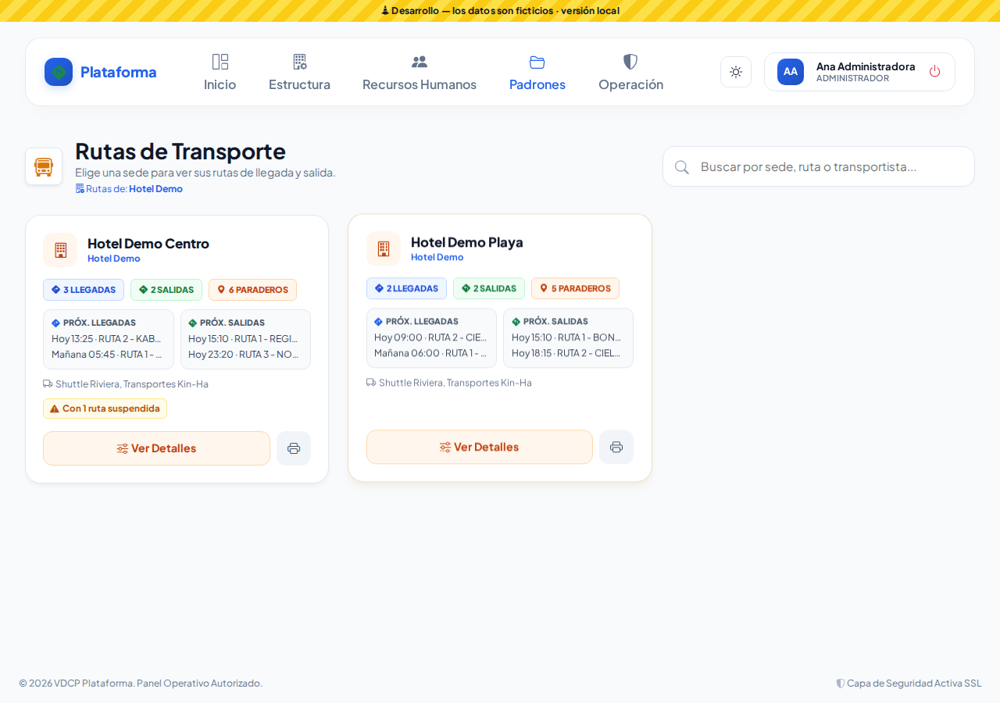

## 2. La pantalla de la sede

Tiene tres pestañas: **Llegadas (n)**, **Salidas (n)** y **Paraderos (n)**.

Cada ruta muestra su horario, turno, transportista, cuántos paraderos tiene, el tope de taxi si lo tiene y si está **ACTIVA** o **SUSPENDIDA**. Debajo van sus horarios en corto: **L-V** = lunes a viernes, **S-D** = sábado y domingo, **L-D** = todos los días. Un **+1** quiere decir que llega al día siguiente.

Botones de cada ruta: imprimir itinerario, editar, clonar y suspender (o reactivar).

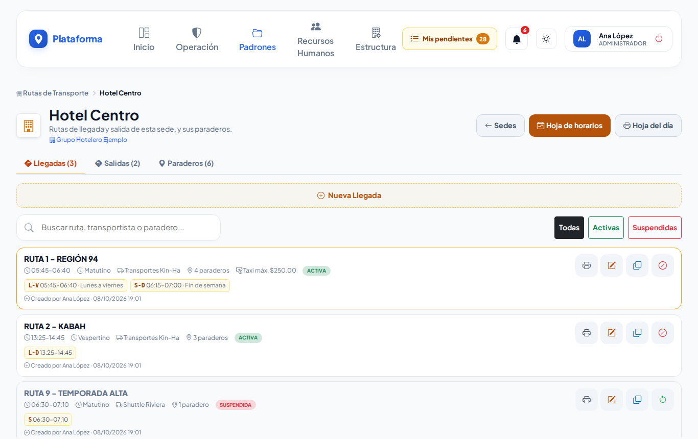

Puedes buscar por ruta, transportista o paradero y filtrar **Todas / Activas / Suspendidas**.

## 3. Dar de alta una ruta

1. En la pestaña **Llegadas** toca **Nueva Llegada** (o en Salidas, **Nueva Salida**).
2. Revisa el **Sentido**: *Llegada a la Sede* o *Salida de la Sede*.
3. Escribe el **Nombre de la Ruta** (por ejemplo `RUTA 1 - REGIÓN 94`). Se guarda en mayúsculas. No puede repetirse en la misma sede y sentido.
4. Elige el **Turno Operativo** y la **Empresa Transportista**. Solo aparecen los turnos que se usan en esta sede y los proveedores activos que operan en ella.
5. **Costo Máximo por Taxi** (opcional): si un vale de taxi de esta ruta pasa de ese monto, la caseta tendrá que justificarlo. Déjalo vacío si no hay tope.
6. Llena el **Horario 1**:
   - Nombre (opcional, por ejemplo "Lunes a viernes").
   - **Hora Inicio del Recorrido** y **Hora de Llegada a Destino**. Si la llegada es más temprano que el inicio (23:20 a 00:30), se entiende que llega al día siguiente.
   - **Días**: marca los días que sale. Si no marcas ninguno, sale **todos los días**.
   - **Paraderos**: toca **Agregar paradero**, escribe el nombre (te sugiere los de la sede) y su hora. Si el paradero no existe, se crea solo al guardar.
7. Si la ruta pasa a otra hora algunos días (por ejemplo el fin de semana), toca **Agregar otro Horario**: se copian los paraderos del anterior y solo ajustas lo que cambie. Con el bote de basura quitas un horario (siempre queda al menos uno).
8. Toca **Guardar Ruta**.

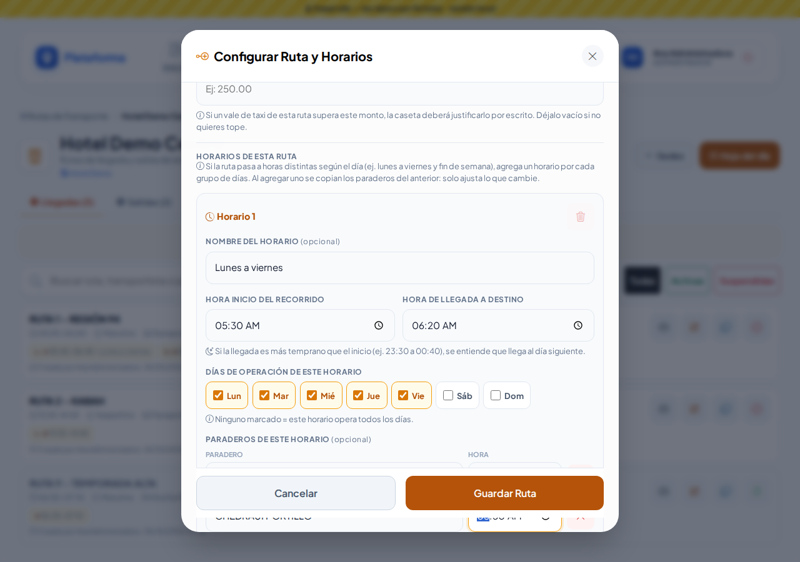
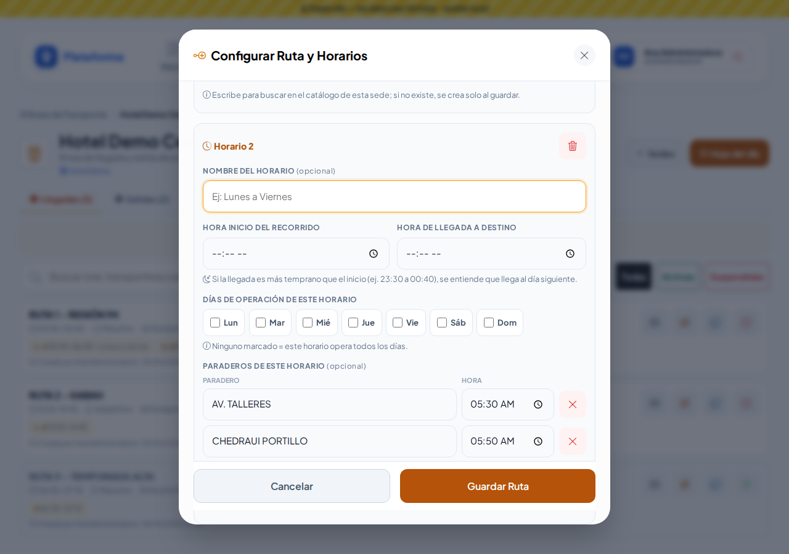

Si algo falta o está mal, el aviso aparece **dentro de la misma ventana** y no pierdes lo capturado:

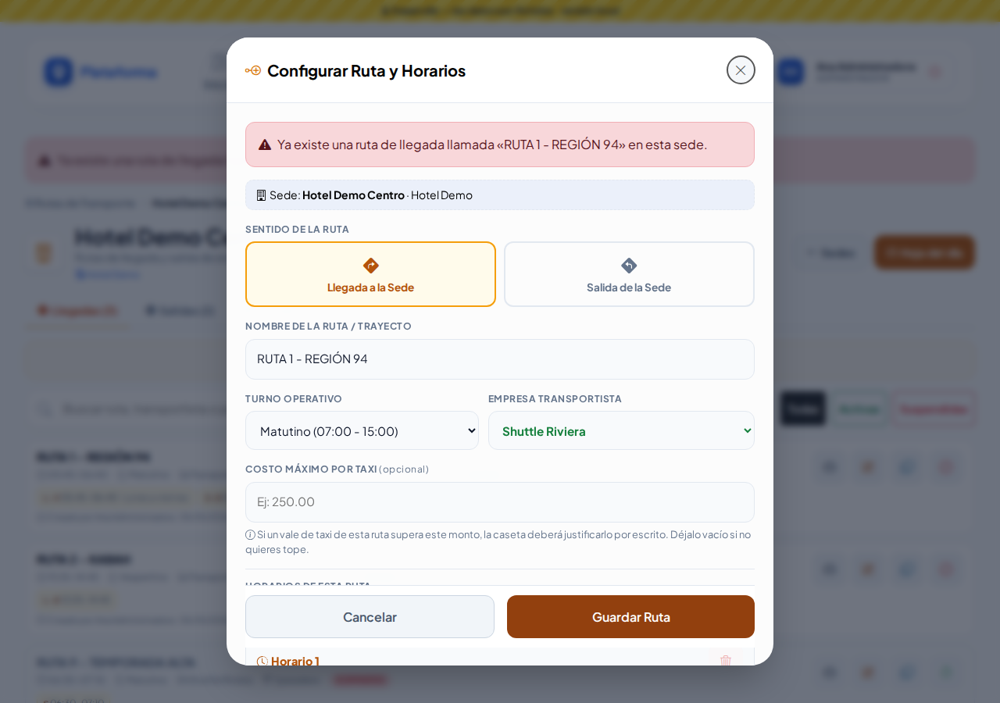

## 4. Editar, clonar y suspender

- **Editar** (lápiz) abre *Modificar Ruta y Horarios* con todo lo capturado. Puedes cambiar horas, días y paraderos.
- **Clonar** crea una copia llamada «NOMBRE (COPIA)» con los mismos horarios y paraderos. Útil para una ruta parecida.
- **Suspender** (círculo tachado) deja la ruta fuera de las próximas salidas y de la hoja del día. Con el mismo botón (flecha circular) la **reactivas**.

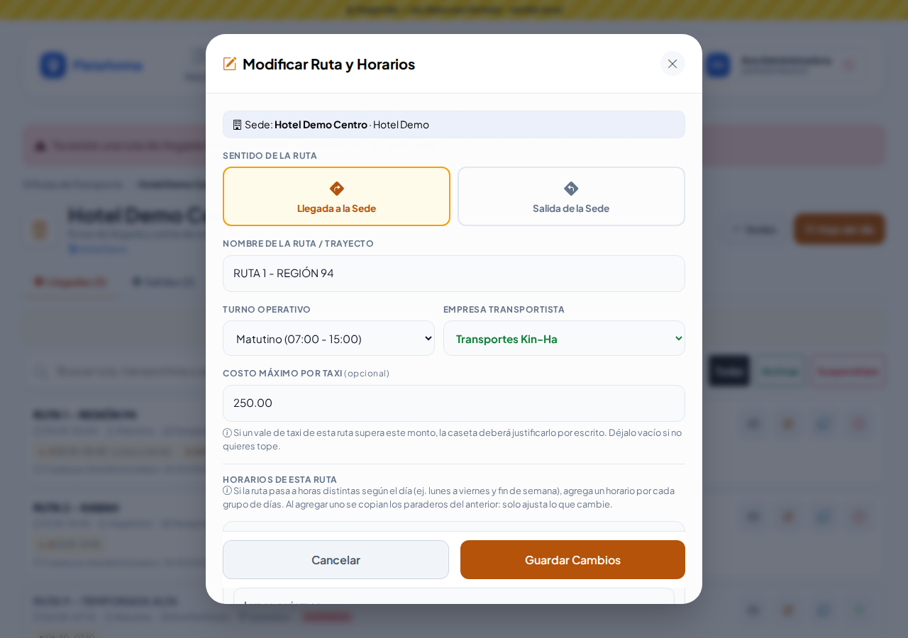
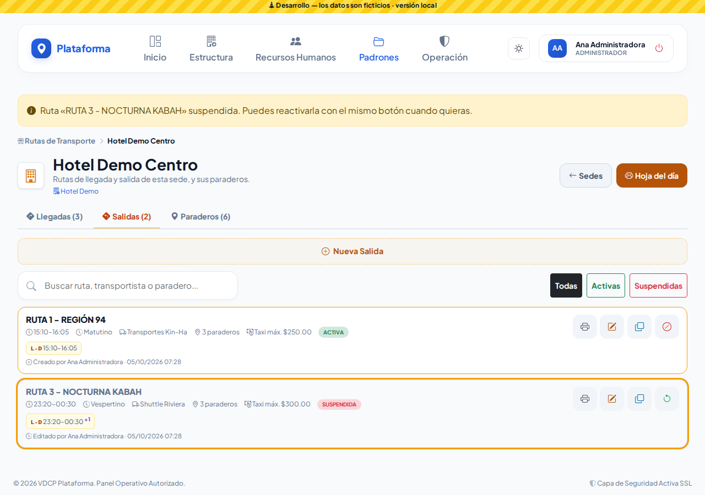

## 5. Paraderos de la sede

En la pestaña **Paraderos** está el catálogo de la sede (cada sede tiene los suyos). Cada uno dice cuántas rutas activas lo usan.

- **Nuevo Paradero**: escribe el nombre y guarda.
- **Editar**: si cambias el nombre, todas las rutas que lo usan muestran el nombre nuevo.
- **Desactivar**: deja de sugerirse al capturar; las rutas que ya lo tienen no cambian. Si alguien lo vuelve a escribir en una ruta, se reactiva solo.

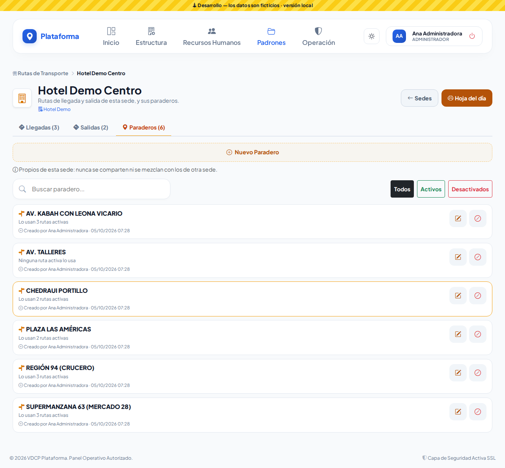

## 6. Imprimir

- **Hoja del día** (botón *Hoja del día* o la impresora de la ficha): las rutas activas que salen ese día, por hora, en una hoja para Llegadas y otra para Salidas, con una columna por paradero (hora, ✓ si para sin hora fija, — si no para). Puedes elegir otro **Día** arriba. Sale en hoja carta horizontal.
- **Itinerario** (impresora de cada ruta): datos de la ruta y cada horario con sus paraderos. Se puede guardar como PDF.

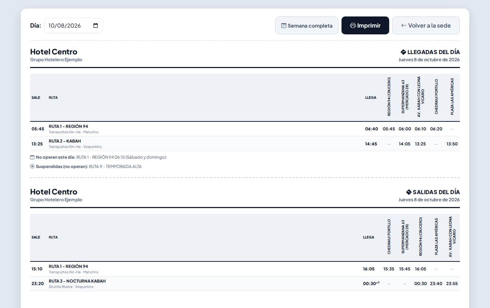
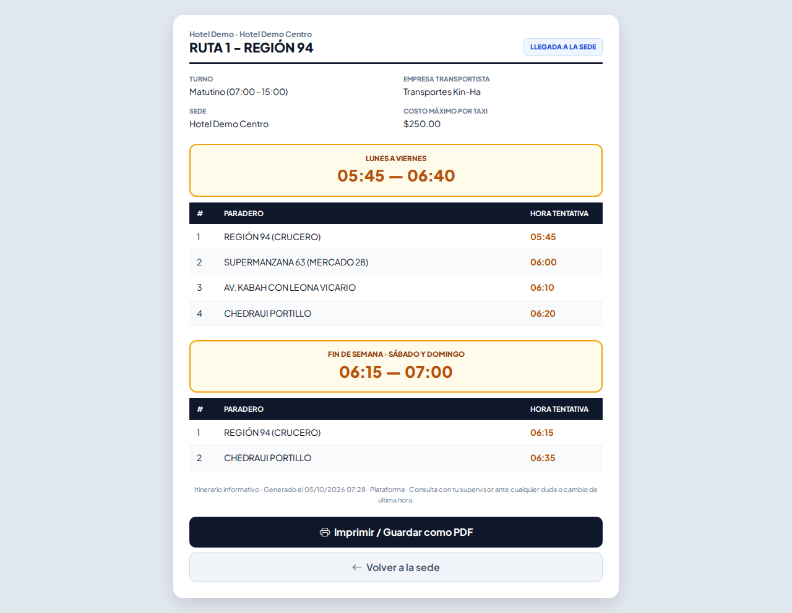

## En el celular y de noche

Todo funciona en el celular; los paraderos se acomodan en dos renglones. Con el botón de modo de pantalla puedes usar **Sol** (alto contraste) o **Noche**.

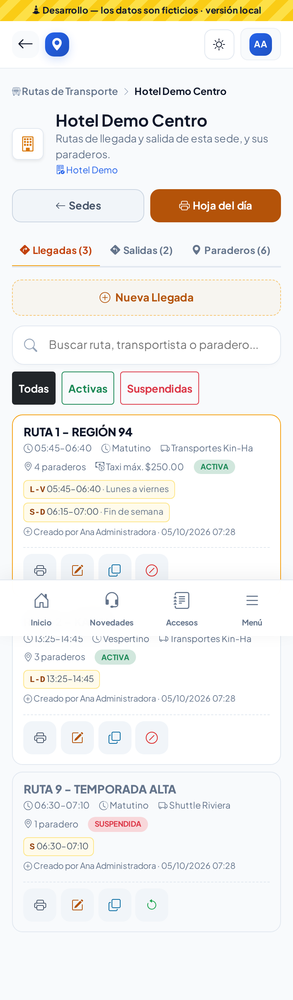
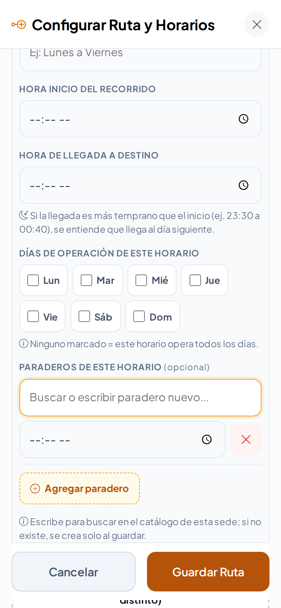
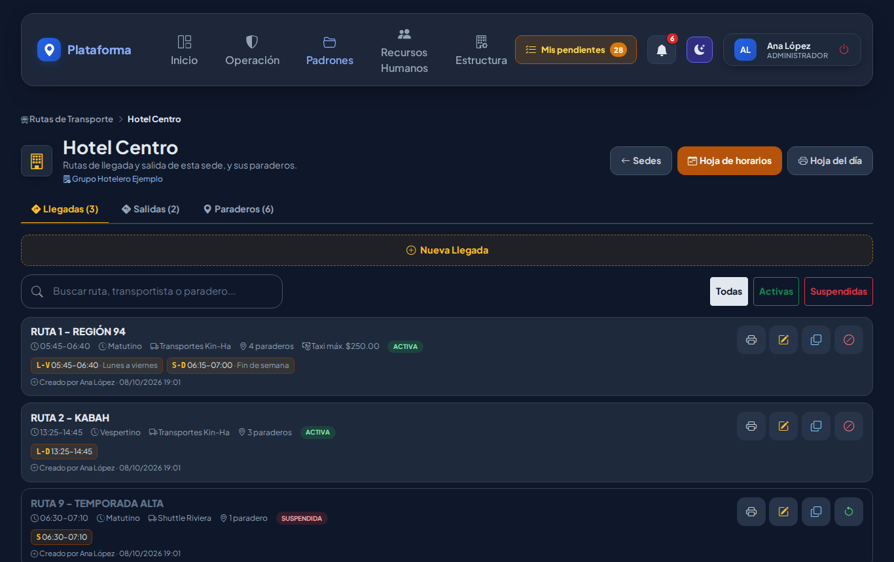

## ¿Quién puede hacer qué?

| Perfil (plantilla) | Puede |
|---|---|
| Administrador | Todo, en todas las sedes |
| Jefe de seguridad | Todo, en su sede (si está asignado a todas las sedes, en todas) |
| Director | Consultar e imprimir |
| Supervisor | Ver, crear, editar, clonar e imprimir en su sede (no suspende) |
| Agente | Solo consultar las rutas de su sede |

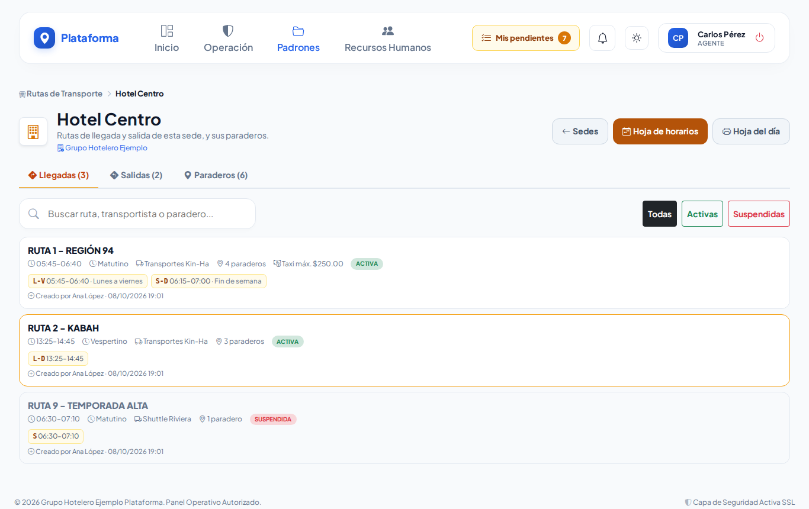

## Ronda 6

- El diálogo **Nueva Ruta** se desplaza con una sola barra, aunque no hayas elegido la empresa transportista.
- Al tocar **Agregar otro Horario**, el nuevo horario trae ya los **paraderos y horas** del anterior: solo cambia lo que sea distinto.
- En Hotel Demo Centro hay **6 paraderos activos**. «PARADERO DE PRUEBA» aparece como **desactivado**: es el de la práctica de Eliminar definitivamente.

