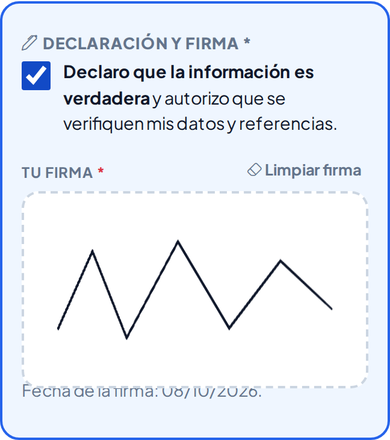
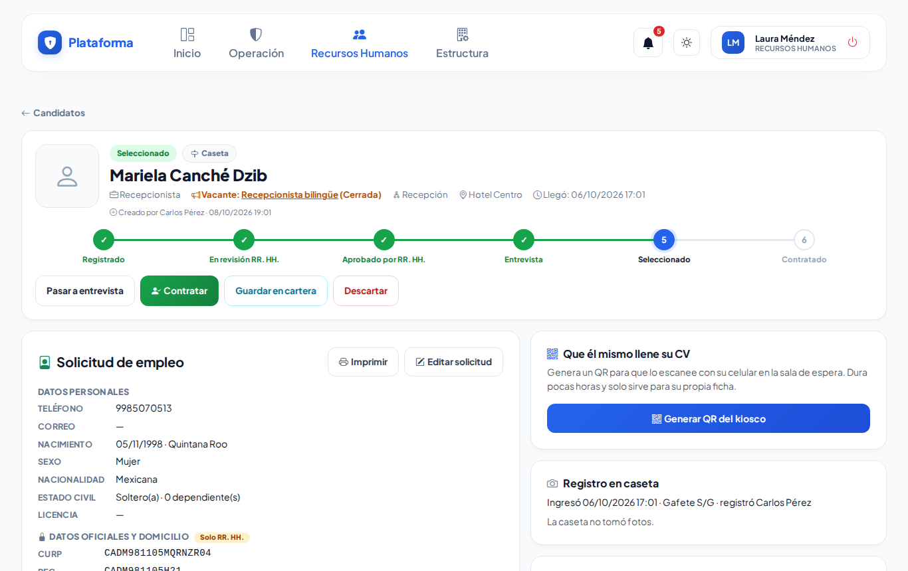
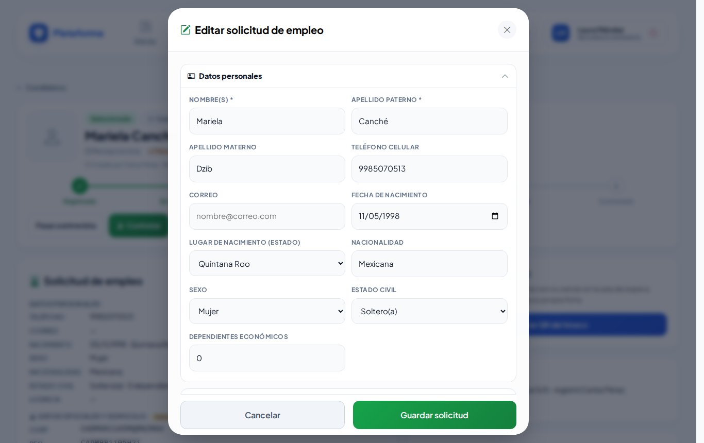
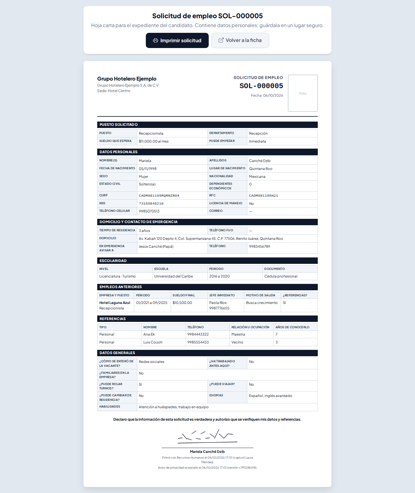

# Solicitud de empleo

La ficha de cada candidato ahora tiene la **solicitud de empleo completa** (la de papel de siempre): datos personales, documentos oficiales, domicilio, escolaridad, empleos anteriores, referencias, datos generales y **firma**. Se llena una sola vez y, al contratar, los datos pasan solos a Colaboradores.

Lo encuentras en **Recursos Humanos → Recepción y candidatos → Candidatos** → abre un candidato.

## 1. El candidato la llena en su celular (kiosco)

Igual que antes: desde la ficha o el panel de Recepción toca **QR** y que el candidato lo escanee. Ahora el formulario viene por secciones que se abren y se cierran:

1. **Datos personales**: nombre(s) y apellidos por separado, teléfono, correo, fecha y lugar de nacimiento, sexo, estado civil y dependientes.
2. **Documentos oficiales**: CURP, RFC, NSS y licencia de manejo. Si no los trae, los deja en blanco.
3. **Domicilio y contacto de emergencia**.
4. **Puesto al que aplica**.
5. **Escolaridad**: nivel, escuela, periodo y documento obtenido (certificado, título, cédula o trunco).
6. **Empleos anteriores**: empresa, puesto, mes de ingreso y de salida, sueldo, jefe y su teléfono, por qué salió y si podemos pedir referencias.
7. **Referencias**: personales (mínimo 2) y laborales.
8. **Datos generales**: cómo se enteró de la vacante, familiares en la empresa, si ya trabajó aquí, si puede rolar turnos, viajar o cambiar de residencia, cuándo puede empezar y el sueldo que espera.
9. **Declaración y firma**: marca «Declaro que la información es verdadera» y **firma con el dedo**.

> Sin la declaración, la firma o las 2 referencias personales, la solicitud **no se envía**: aparece arriba, en rojo, qué falta. El enlace no se gasta.

## 2. Recursos Humanos la revisa en la ficha

La tarjeta **Solicitud de empleo** muestra todo. El bloque **«Datos oficiales y domicilio · Solo RR. HH.»** (CURP, RFC, NSS, domicilio y emergencia) solo lo ve Recursos Humanos: no aparece en el resumen que recibe el jefe del departamento, ni en la campana, ni en los correos.

## 3. Editar o capturar por el candidato

**Editar solicitud** abre el mismo formulario. Si el candidato está contigo, puede **firmar en tu pantalla**: marca la declaración y que firme. Queda anotado que tú capturaste la firma.

Si algo está mal escrito (por ejemplo, un CURP incompleto o un código postal de 4 números), el aviso sale **dentro del diálogo** y la sección con el error se abre sola.

## 4. Imprimir para el expediente

**Imprimir** (arriba de la solicitud) abre la hoja carta con el logo de la empresa, el folio (SOL-000123), la fecha, la foto que tomó la caseta, todas las secciones y la firma.

## 5. Contratar sin volver a escribir

Al tocar **Contratar**, el colaborador nuevo ya lleva su CURP, RFC, NSS, nacimiento, nacionalidad, teléfono, correo y domicilio. Solo escribes el **número de empleado**. Si el CURP ya lo tiene otro colaborador, te avisa en el mismo diálogo.

## 6. Exportar

- **Exportar a Excel**: la lista sin datos personales.
- **Con datos personales**: agrega teléfono, correo, CURP, RFC, NSS, domicilio y emergencia (columnas marcadas «[DATO PERSONAL]»). Te pide confirmar y queda registrado en la Bitácora de auditoría. Guarda el archivo en un lugar seguro.

## Preguntas frecuentes

- **¿Por qué no pide datos de salud o religión?** Por ley y por respeto al candidato no se piden datos de salud, religión, política ni similares.
- **¿Los candidatos de antes se perdieron?** No. Siguen igual; al editarlos, el nombre completo aparece ya partido en nombre y apellidos para que lo confirmes.
