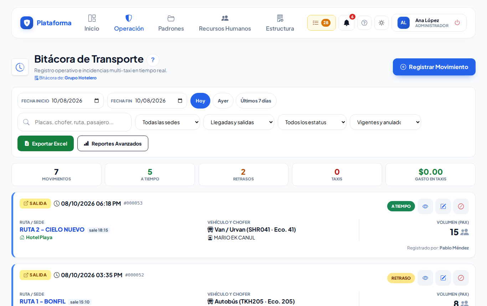
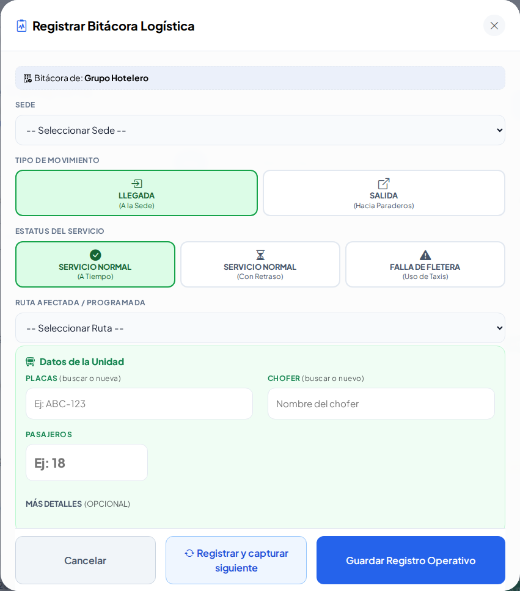
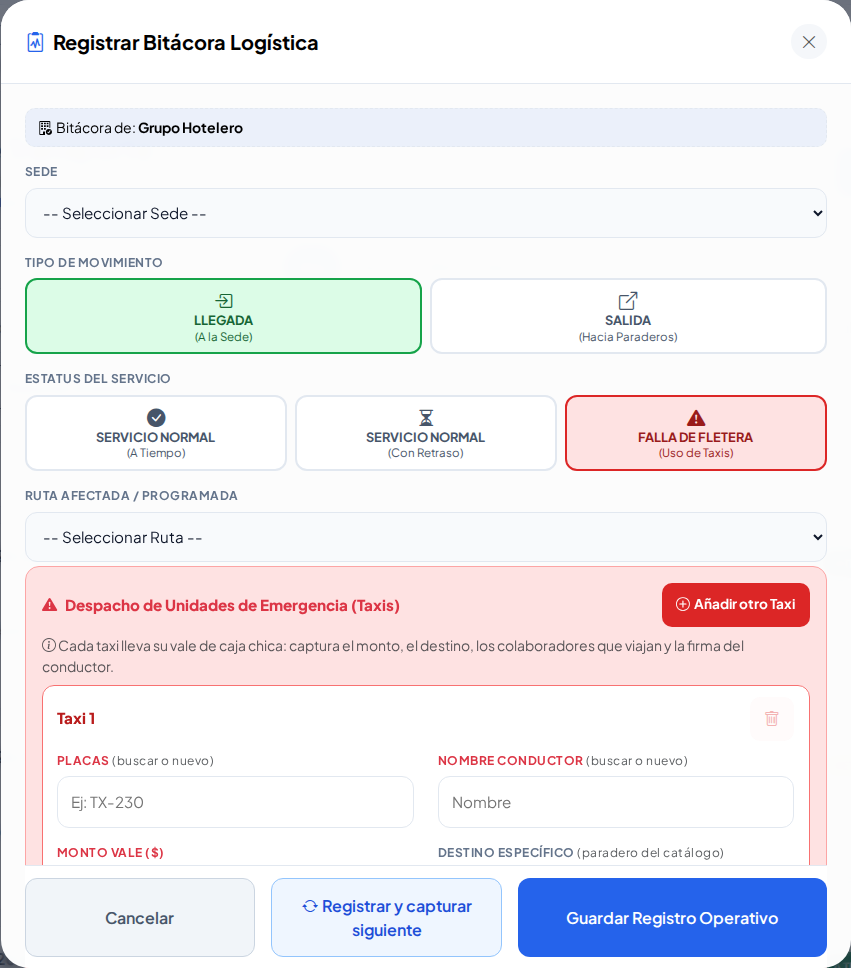
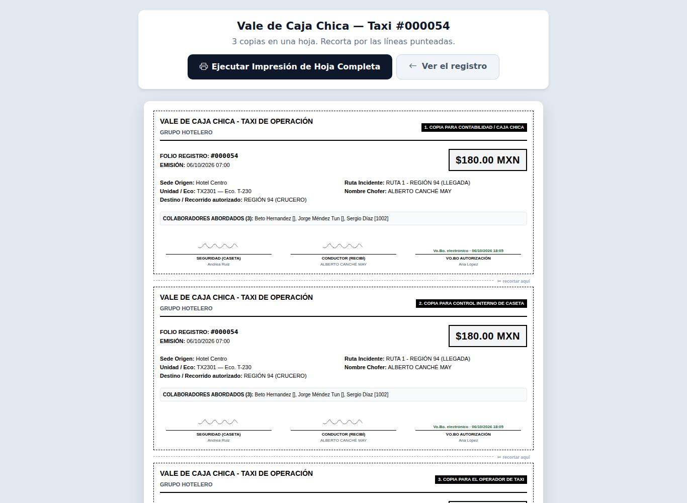
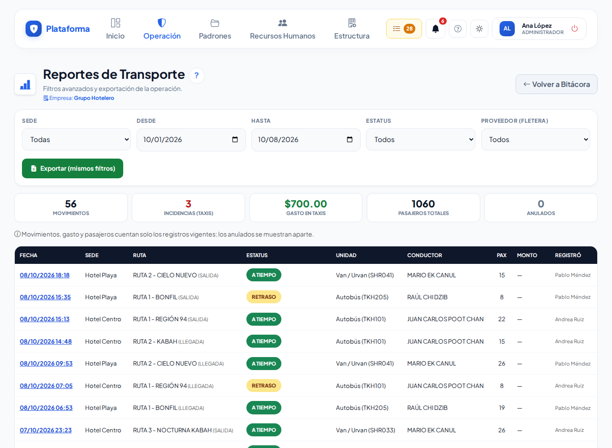
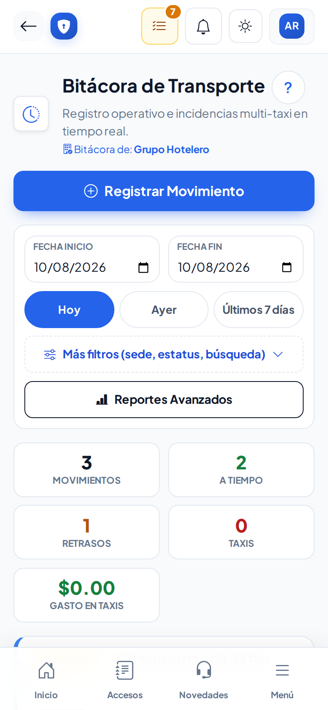

# Bitácora de transporte

**¿Para qué sirve?** Aquí la caseta anota cada **llegada** y **salida** del transporte de personal y, cuando la unidad **no llega**, los **taxis** que se pagaron con caja chica, con su vale para imprimir.

**Antes de empezar:** necesitas que tu rol pueda **ver** y **crear** en Bitácora de transporte. Las rutas y sus horarios se dan de alta antes en [Rutas de transporte](rutas.md). Si no ves **Registrar Movimiento**, pide a tu administrador que revise tu rol.

## Cómo leer la lista

1. Entra a **Operación → Caseta → Bitácora de transporte**.
2. Al entrar ves los movimientos de **hoy**. Cambia las fechas con **Fecha Inicio** y **Fecha Fin**, o toca **Hoy**, **Ayer** o **Últimos 7 días**.
3. Busca por placas, chofer, ruta o pasajero y filtra por sede, tipo, estatus y estado (en el celular, en **Más filtros**).

**Qué debes ver:** cada tarjeta dice **LLEGADA** (verde) o **SALIDA** (amarillo), la hora, la ruta, la unidad, el chofer y los pasajeros. Las tarjetas **rojas** son taxis, con su pago, destino y si tienen el **Vo.Bo.** Arriba hay un resumen: movimientos, a tiempo, retrasos y gasto en taxis.

## Cómo registrar una llegada o salida

1. Toca **Registrar Movimiento**.
2. Revisa la **Sede** (si atiendes una sola, ya viene elegida).
3. En **Tipo de Movimiento** elige **LLEGADA** o **SALIDA** (ya viene el más probable por la hora).
4. En **Estatus del Servicio** elige **SERVICIO NORMAL (A Tiempo)** o **SERVICIO NORMAL (Con Retraso)**.
5. Revisa la **Ruta**: ya viene la más cercana a la hora actual.
6. Si quieres, escribe placas, chofer y número de pasajeros. Si ya están registrados, aparecen en la lista y se llenan solos los demás datos.
7. Toca **Guardar Registro Operativo**, o **Registrar y capturar siguiente** si viene otra unidad.

**Qué debes ver:** la tarjeta nueva en la lista. Si los pasajeros pasan la capacidad de la unidad, sale un aviso de **sobrecupo**.

Mientras escribes las placas o el chofer, la ventana te muestra los parecidos del padrón: si es uno de ellos, **tócalo**; si no, sigue escribiendo y se registrará como nuevo (pendiente de verificar).

## Cómo registrar taxis cuando la unidad no llegó

1. En **Estatus del Servicio** elige **FALLA DE FLETERA (Uso de Taxis)**. Aparece el **Taxi 1**.
2. Escribe **Placas**, **Nombre Conductor**, **Monto Vale ($)** y **Destino** (el paradero).
3. Si el monto pasa del tope de la ruta, escribe la **justificación** (aviso amarillo).
4. En **Pasajeros de este Taxi** escanea el gafete de cada colaborador o escribe su número de empleado. Para quitar a alguien toca la **×**. Si no aparece, toca **¿No aparece? Alta provisional**.
5. Pide al conductor que firme en **Firma del taxista** y firma tú en **Firma del guardia**.
6. ¿Fueron varios taxis? Toca **Añadir otro Taxi** y repite.
7. Guarda.

**Qué debes ver:** se crea **un vale por taxi** y aparecen los botones para imprimir cada uno. Si algo falta, el aviso sale **dentro de la ventana**, en el taxi que corresponde (solo tendrás que volver a firmar).

## Cómo imprimir el vale de caja chica

1. En la tarjeta del taxi toca el **ojo** (detalle).
2. Toca **Imprimir Planilla**.

**Qué debes ver:** el «VALE DE CAJA CHICA - TAXI DE OPERACIÓN» con tres copias (Contabilidad / Caja chica, Control interno de caseta y Operador de taxi), las firmas y el Vo.Bo. si ya lo tiene.

## Cómo corregir, anular o autorizar

1. **Corregir:** toca el **lápiz**. En un servicio normal solo se cambian pasajeros, a tiempo / retraso y observaciones; en un taxi, monto, destino, justificación, pasajeros y observaciones.
2. **Anular:** toca el **círculo tachado** y confirma. El registro queda gris como **ANULADO** (se puede **reactivar**).
3. **Autorizar un vale:** quien tiene permiso ve **Autorizar (Vo.Bo.)** en los vales pendientes. Un vale autorizado ya no se edita.

**Qué debes ver:** la tarjeta cambia de estado. Si te equivocaste de ruta, unidad o chofer, anula y captura de nuevo.

## Cómo sacar reportes

1. Toca **Reportes Avanzados**.
2. Filtra por sede, fechas, estatus y proveedor.
3. Toca **Exportar Excel** para bajar lo mismo en un archivo de Excel (CSV).

**Qué debes ver:** los totales solo cuentan registros vigentes (no anulados).

## En el celular

## Si algo sale mal

| Mensaje o síntoma | Qué significa | Qué hacer |
|---|---|---|
| «Elige el estatus del servicio: A tiempo, Con retraso o No llegó (uso de taxis).» | Falta el estatus. | Toca una de las tres opciones. |
| «Falta la firma del guardia: firma en el recuadro antes de guardar.» | No firmaste. | Firma en el recuadro y guarda. |
| «Falta el destino (paradero).» | El taxi no tiene destino. | Escribe o elige el paradero. |
| «Debe quedar al menos un colaborador registrado.» | El taxi no tiene pasajeros. | Escanea al menos un gafete. |
| ««…» ya va en el Taxi 1.» | Pusiste a la misma persona en dos taxis. | Quítala de uno. |
| «Este vale ya tiene el Vo.Bo. de autorización: ya no se puede editar.» | El vale ya se autorizó. | Pide a quien lo autorizó que lo revise. |
| «En un servicio normal solo se puede corregir entre A TIEMPO y RETRASO…» | Querías cambiar a taxis desde editar. | Anula el registro y captura los taxis. |

## Preguntas frecuentes

- **¿Tengo que llenar placas y chofer?** No es obligatorio en un servicio normal, pero ayuda a llevar el control.
- **¿Qué pasa si el guardia no firma en pantalla?** El vale impreso trae las líneas para firmar a mano.
- **¿A quién le llega el correo del vale?** A las personas que el administrador puso en **Estructura → Configuración → Avisos por correo**.
- **¿Puedo borrar un registro?** No; se anula y queda en el historial.

## Relacionado

- [Rutas de transporte](rutas.md)
- [Colaboradores](colaboradores.md)
- [Altas por verificar](altas-por-verificar.md)
