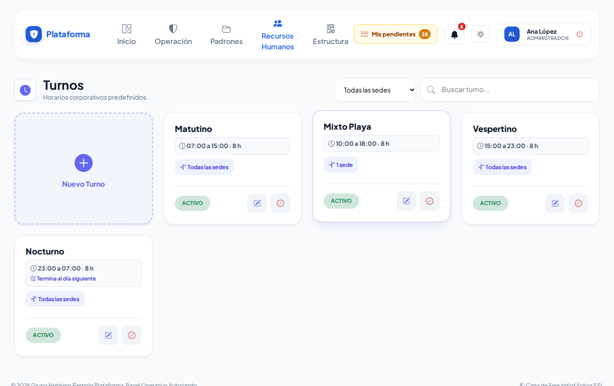
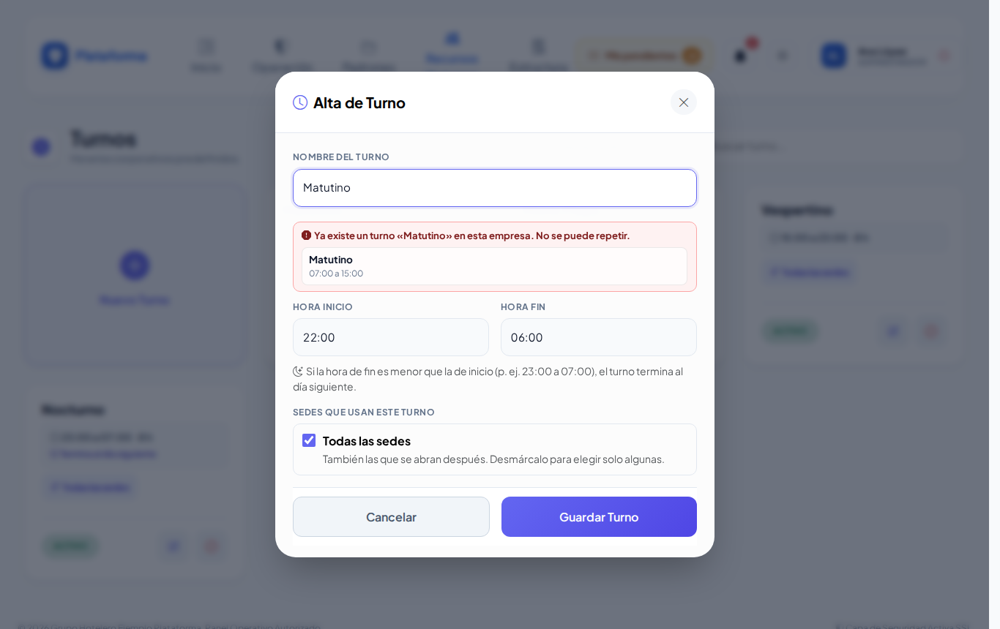
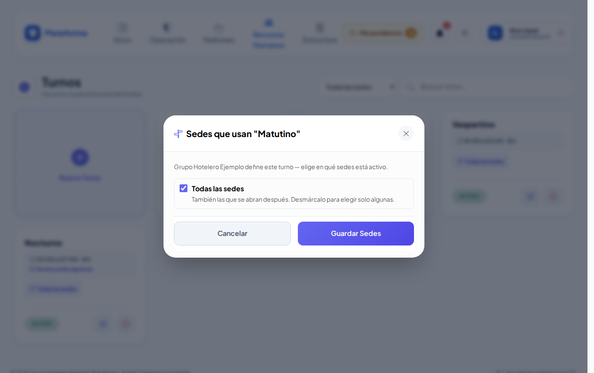
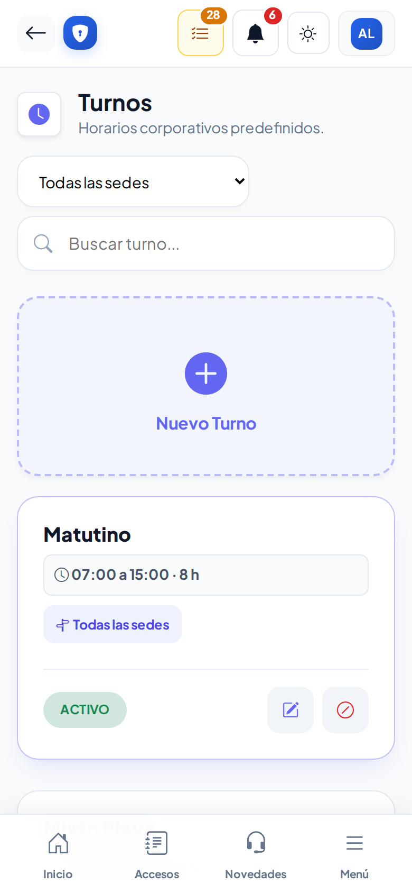
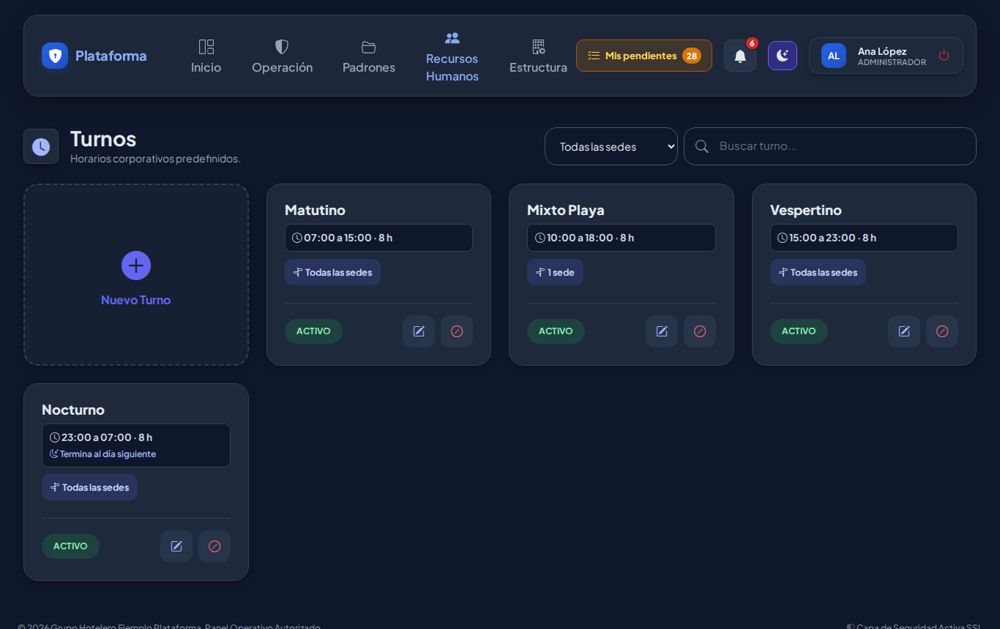
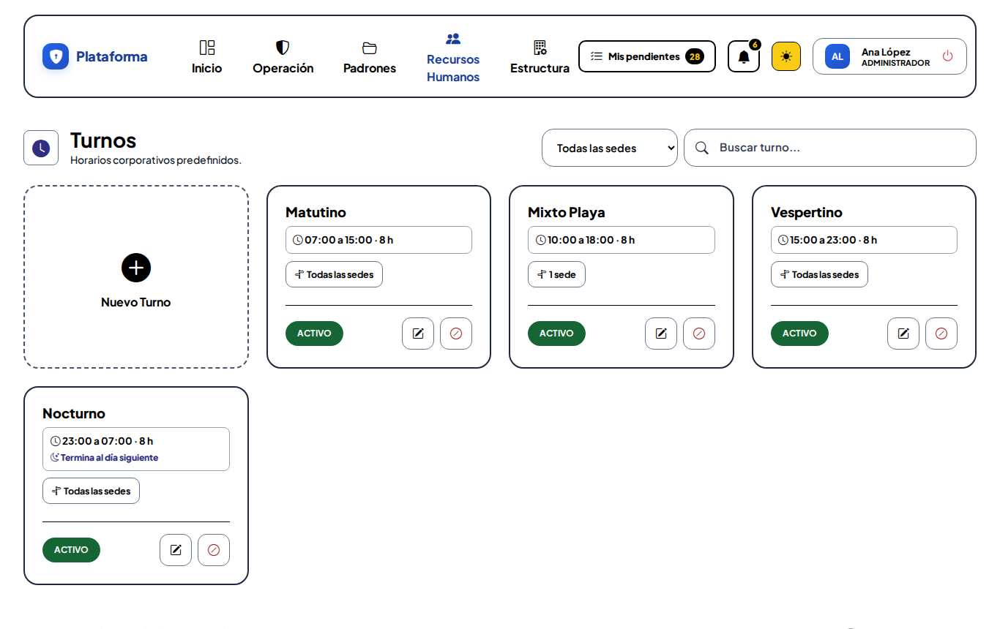
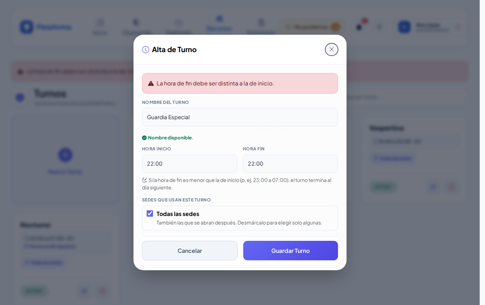

# Turnos

**¿Para qué sirve?** Los turnos son los **horarios fijos** de la empresa: Matutino, Vespertino, Nocturno… Se usan en otras pantallas, por ejemplo en [Rutas de transporte](rutas.md) (cada ruta lleva su turno).

## Antes de empezar

- Para ver la pantalla tu rol debe poder consultar *Turnos*. Si no aparece en el menú, pide el permiso a tu administrador.
- Crear, editar y desactivar turnos es de **toda la empresa**: solo lo hace quien tiene alcance de empresa (por ejemplo el administrador).
- Si tu usuario tiene **una sola sede**, ves todos los turnos de la empresa y solo puedes activar o quitar el turno **en tu sede**.

## Cómo leer la pantalla

1. Entra a **Recursos Humanos → Turnos**.
2. Cada ficha muestra el **horario** y cuánto dura (por ejemplo «07:00 a 15:00 · 8 h»), el aviso **Termina al día siguiente** si cruza la medianoche, y en qué **sedes** se usa.
3. Para encontrar un turno usa **Buscar turno...** o **Todas las sedes**.

## Cómo dar de alta un turno

1. Toca la tarjeta **Nuevo Turno**. Se abre **Alta de Turno**.
2. Escribe el **Nombre del Turno**. Mientras escribes te avisa si ya existe o se parece a otro.
3. Escribe la **Hora Inicio** y la **Hora Fin** en 24 horas (por ejemplo `22:00` y `06:00`).
   - Si el fin es menor que el inicio, el turno termina al día siguiente. Es correcto.
   - Lo único que no se permite es que empiece y termine a la misma hora.
4. En **Sedes que usan este turno** deja **Todas las sedes** (incluye las que abras después) o desmárcala y elige las sedes.
5. Toca **Guardar Turno**.

**Qué debes ver:** «Turno «Nocturno Fin de Semana» creado correctamente.»

### Avisos mientras escribes el nombre

- **Verde:** «Nombre disponible.»
- **Rojo:** «Ya existe un turno «…» en esta empresa. No se puede repetir.» Si está desactivado, aparece **Reactivar**.
- **Amarillo:** «Se parece a uno que ya existe (sin contar acentos, mayúsculas ni signos). Revisa que no sea el mismo:».

## Cómo cambiar las sedes de un turno

1. Toca el botón de sedes de la ficha (por ejemplo **1 sede** o **Todas las sedes**). Se abre **Sedes que usan "…"**.
2. Marca o desmarca las sedes.
3. Toca **Guardar Sedes**.

**Qué debes ver:** «Sedes del turno «…» actualizadas.» Si tu usuario tiene una sola sede, en esta ventana solo aparece tu sede; las demás se quedan como están.

## Cómo editar, desactivar o reactivar un turno

1. **Editar** (lápiz): cambia el nombre o el horario en **Editar Turno** y toca **Actualizar**. Verás «Turno «…» actualizado correctamente.»
2. **Desactivar** (círculo rojo): confirma con **Aceptar**. El turno no se borra.
3. **Reactivar** (flecha circular): lo vuelve a activar.

## En el celular y en los modos Noche y Sol

## Si algo sale mal

Los mensajes salen en rojo dentro de la ventana; lo que escribiste se conserva.

| Mensaje o síntoma | Qué significa | Qué hacer |
|---|---|---|
| La hora de fin debe ser distinta a la de inicio. | Pusiste la misma hora dos veces. | Corrige una de las horas. |
| Escribe la hora de inicio como HH:MM (24 horas). / Escribe la hora de fin como HH:MM (24 horas). | La hora está mal escrita. | Escribe por ejemplo `07:00`. |
| Ya existe un turno con ese nombre en esta empresa. | El nombre ya se usa. | Usa el existente o reactívalo. |
| Marca al menos una sede o elige «Todas las sedes». | Quitaste todas las sedes. | Marca al menos una. |
| Un turno no aparece al capturar una ruta. | No está marcado para esa sede o está desactivado. | Agrégale la sede o reactívalo. |

## Preguntas frecuentes

**¿Cómo capturo un turno nocturno?** Escribe la hora de inicio y la de fin normalmente (por ejemplo 23:00 a 07:00). La ficha dirá **Termina al día siguiente**.

**¿Para qué sirven las sedes del turno?** Para que en cada sede solo aparezcan los turnos que de verdad se usan ahí.

**¿Puedo borrar un turno?** No; se desactiva para conservar el historial.

## Relacionado

- [Rutas de transporte](rutas.md)
- [Colaboradores](colaboradores.md)
- [Departamentos y puestos](departamentos-y-puestos.md)
