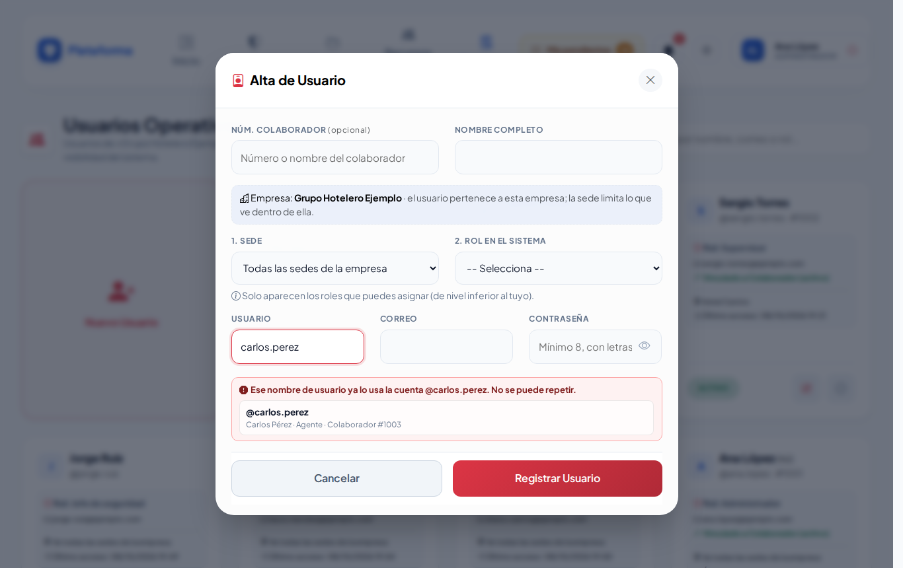
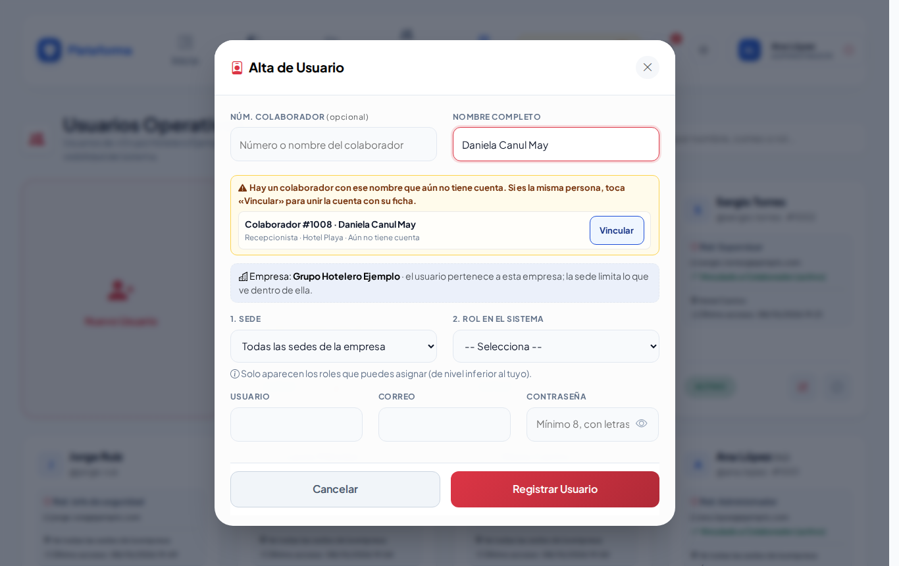
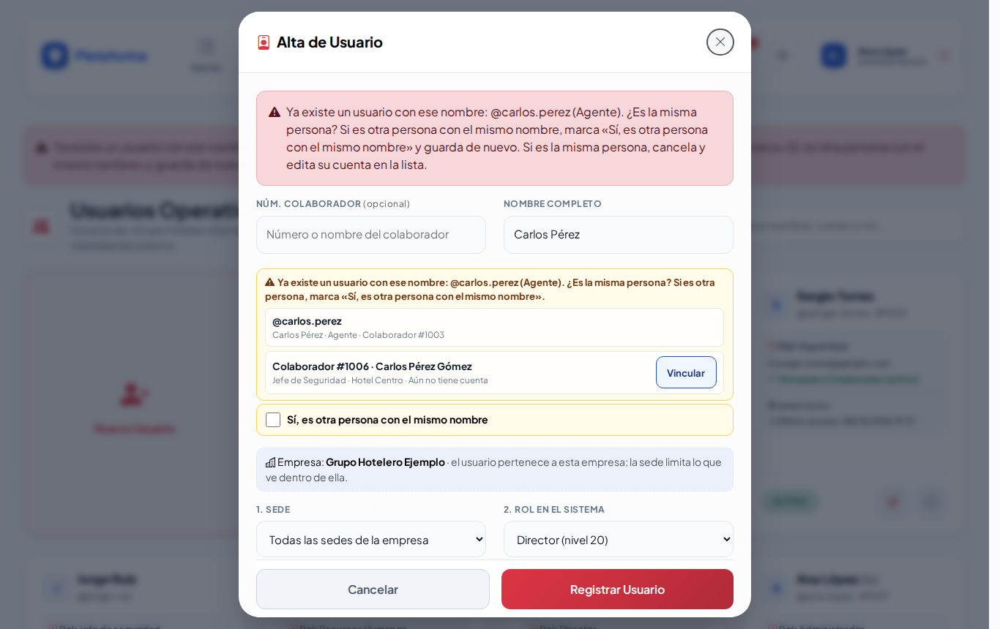
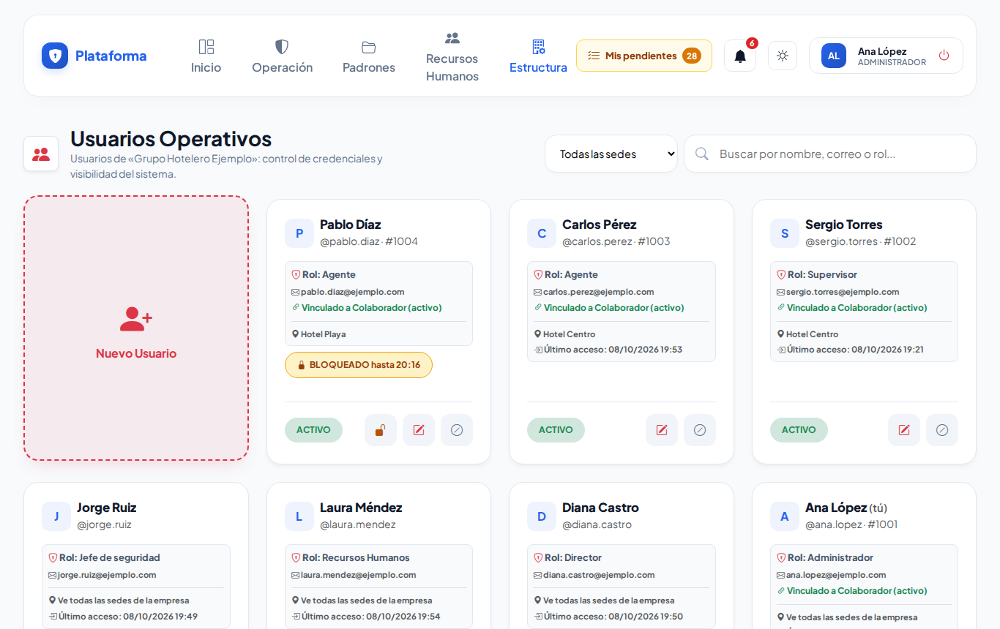
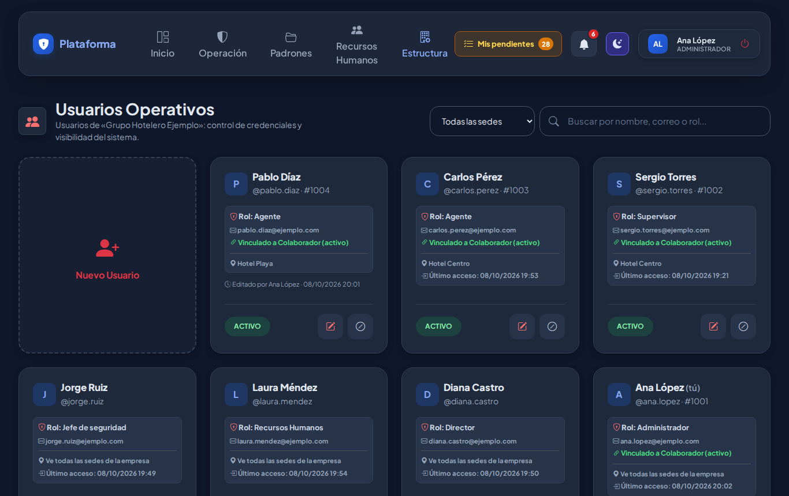
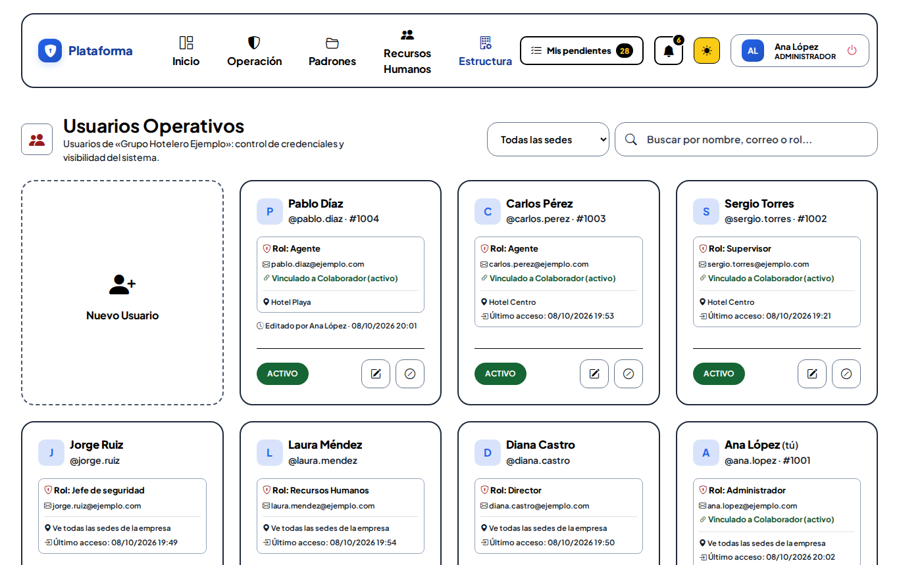

# Usuarios

**¿Para qué sirve?** Aquí se dan de alta las **cuentas** para entrar a la plataforma: quién es, en qué sede trabaja, qué **rol** tiene (lo que puede hacer), su usuario, su correo y su contraseña. También se desactivan cuentas y se desbloquean las que tuvieron demasiados intentos fallidos.

## Antes de empezar

- Para ver la pantalla tu rol debe poder consultar *Usuarios*. Si no aparece en el menú, pide el permiso a tu administrador.
- Solo puedes dar de alta o editar cuentas de **nivel inferior** al tuyo, y solo puedes asignar roles de nivel inferior al tuyo. No puedes editar tu propia cuenta ni la de alguien de tu mismo nivel o superior.
- Cada usuario pertenece a **una empresa** (debajo del título dice «Usuarios de «…»»). La **sede** solo limita lo que ve dentro de esa empresa. El Super Administrador cambia de empresa con el selector **Empresa de trabajo**.
- Antes de dar de alta, conviene que la persona ya esté en [Colaboradores](colaboradores.md) para vincular su cuenta.

## Cómo encontrar una cuenta

1. Entra a **Estructura → Usuarios**. Se abre **Usuarios Operativos**.
2. Escribe en **Buscar por nombre, correo o rol...**. Si hay varias sedes, usa **Todas las sedes**.

**Qué debes ver:** fichas con el nombre, el usuario (@…), el rol, el correo, si está vinculado a un colaborador, la sede y el último acceso.

## Cómo dar de alta una cuenta

1. Toca la tarjeta **Nuevo Usuario**. Se abre **Alta de Usuario**.
2. **Núm. Colaborador (opcional):** escribe el número o parte del nombre del colaborador y elígelo de la lista (ver «Cómo vincular la cuenta con su colaborador»).
3. Escribe el **Nombre Completo**.
4. **1. Sede:** la sede donde trabaja, o **Todas las sedes de la empresa** si debe ver todas.
5. **2. Rol en el Sistema:** solo aparecen los roles que tú puedes asignar.
6. Escribe el **Usuario** (letras, números, punto, guion y guion bajo; sin espacios), el **Correo** y la **Contraseña** (mínimo 8 caracteres, con letras y números). El ojo muestra lo que escribiste.
7. Toca **Registrar Usuario**.

**Qué debes ver:** «Usuario creado correctamente.» La persona ya puede entrar con su usuario o su correo.

> Si cierras la ventana (Cancelar, la X o la tecla Esc), al volver a abrirla aparece vacía. Si al registrar hubo un error, la ventana se vuelve a abrir con lo que capturaste para que lo corrijas.

### Avisos mientras escribes

- **Usuario** y **Correo:** si otra cuenta ya los usa, lo dice al instante («Ese nombre de usuario ya lo usa otra cuenta. Elige otro.»), aunque sea de otra empresa y sin mostrar sus datos. Si está libre: «Nombre de usuario disponible.» / «Correo disponible.»
- **Nombre Completo:** si ya hay una cuenta con ese nombre, te pide confirmar que es otra persona (ver abajo). Si hay un **colaborador con ese nombre que aún no tiene cuenta**, aparece **Vincular**.

## Cómo vincular la cuenta con su colaborador

**¿Qué es «vincular»?** Decirle a la plataforma «esta cuenta es de este colaborador». Así no capturas su nombre dos veces y, si Recursos Humanos lo da de baja, su cuenta muestra un aviso para que la revises. No es obligatorio: una cuenta de soporte o de un proveedor puede quedarse sin colaborador.

**Ejemplo:** la cuenta de **Daniela Canul May**, colaboradora número **1008**.

1. En **Núm. Colaborador** escribe su número (`1008`) o parte de su nombre (`dani`). Basta con 2 letras o números.
2. En la lista que aparece toca **Daniela Canul May · #1008**. Se llenan solos su número y su **Nombre Completo**, y aparece en verde **Vinculado a Colaboradores**.
3. Otra forma: escribe primero el **Nombre Completo**. Si hay un colaborador con ese nombre sin cuenta, toca **Vincular** en el aviso.
4. Completa lo demás y toca **Registrar Usuario**.

**Qué debes ver:** en la lista, su ficha dice **Vinculado a Colaborador (activo)**. Si un día dice **Vinculado a Colaborador (¡inactivo! revisar)**, Recursos Humanos lo dio de baja: revisa si su cuenta también debe desactivarse.

- Si cambias o borras el número a mano, el vínculo se quita. Vuelve a elegirlo de la lista.
- Solo aparecen colaboradores **activos** de tu empresa (y de tus sedes, si tu rol es de una sede).
- Para vincular una cuenta que ya existe: toca su **lápiz**, elige al colaborador en **Núm. Colaborador** y toca **Guardar Cambios**.

## Cómo registrar a dos personas con el mismo nombre

Si escribes un **Nombre Completo** que ya tiene otra cuenta (sin importar mayúsculas ni acentos), la ventana avisa: «Ya existe un usuario con ese nombre: @… (Agente). ¿Es la misma persona? …».

- **Si es la misma persona:** toca **Cancelar** y edita su cuenta en la lista. No hagas una segunda cuenta.
- **Si de verdad es otra persona:** marca **Sí, es otra persona con el mismo nombre** y registra. Sin esa marca no se guarda y el aviso se repite arriba, en rojo.

El **usuario** y el **correo** nunca se pueden repetir, aunque el nombre sí.

## Cómo editar una cuenta o cambiar la contraseña

1. Toca el **lápiz** (Editar). Se abre **Editar Usuario**.
2. Cambia lo necesario. Si dejas la **Contraseña** en blanco, no cambia; si la cambias, la persona tendrá que volver a entrar.
3. Toca **Guardar Cambios**.

**Qué debes ver:** «Usuario actualizado correctamente.»

## Cómo desactivar o reactivar una cuenta

1. Toca el **círculo con raya** (Desactivar) y confirma. La persona ya no puede entrar y, si estaba dentro, se le cierra la sesión.
2. Para regresarla, toca la **flecha circular** (Reactivar).

No se borra a nadie, para conservar el historial.

## Cómo desbloquear una cuenta

Tras **5 intentos fallidos** seguidos, la cuenta se bloquea 15 minutos. Su ficha muestra **BLOQUEADO hasta HH:MM**.

1. Si la persona ya recordó su contraseña y no puede esperar, toca el **candado** (Desbloquear) de su ficha.
2. Confirma con **Aceptar**.

**Qué debes ver:** ««Pablo Díaz» desbloqueado; ya puede entrar.» El desbloqueo queda en la [Bitácora de auditoría](auditoria.md). El candado solo aparece si tu rol tiene el permiso **Desbloquear** y la persona es de nivel inferior y está en tu alcance.

> Si la persona olvidó su contraseña, además de desbloquearla cámbiale la contraseña con el **lápiz**.

## En el celular y en los modos Noche y Sol

## Si algo sale mal

Los mensajes salen en rojo dentro de la ventana; lo que escribiste se conserva.

| Mensaje o síntoma | Qué significa | Qué hacer |
|---|---|---|
| Ya existe otro usuario registrado con ese nombre de usuario. | El usuario ya lo usa otra cuenta. | Elige otro (por ejemplo `juan.perez2`). |
| Ya existe otro usuario registrado con ese correo. | El correo ya está en otra cuenta. | Usa otro correo o edita la cuenta existente. |
| El nombre de usuario solo puede tener letras, números, punto, guion y guion bajo (sin espacios). | Escribiste espacios o acentos. | Por ejemplo `juan.perez`. |
| Ya existe un usuario con ese nombre: @… ¿Es la misma persona? | Hay otra cuenta con ese nombre. | Edita la existente o marca **Sí, es otra persona con el mismo nombre**. |
| Ese colaborador ya tiene una cuenta de usuario: búscala en la lista en vez de crear otra. | El colaborador ya tiene cuenta. | Edita su cuenta. |
| Ese colaborador está dado de baja. | El colaborador está inactivo. | Pide a Recursos Humanos que lo reingrese o no lo vincules. |
| Ya existe otro usuario registrado con ese número de colaborador. | Ese número ya está en otra cuenta. | Revisa el número. |
| Aparece un texto raro como «validation.password.numbers» o «validation.password.letters». | La contraseña no tiene números o letras. | Escribe una de 8 o más caracteres con letras y números. |
| «…» no está bloqueado; ya puede entrar. | La cuenta ya no estaba bloqueada. | No hace falta hacer nada. |
| No veo el lápiz en una cuenta. | Es tu cuenta o es de tu mismo nivel o superior. | Pídelo a alguien de nivel superior. |

## Preguntas frecuentes

**¿La persona puede entrar con su correo?** Sí, con su usuario o con su correo.

**¿Por qué no aparece un rol en la lista?** Solo puedes asignar roles de nivel inferior al tuyo.

**¿Qué pasa si desactivo una cuenta?** La persona ya no puede entrar, pero todo lo que registró se conserva.

**¿Cuánto dura el bloqueo?** 15 minutos, o hasta que alguien con permiso la desbloquee.

## Relacionado

- [Roles y permisos](roles-y-permisos.md)
- [Colaboradores](colaboradores.md)
- [Bitácora de auditoría](auditoria.md)
