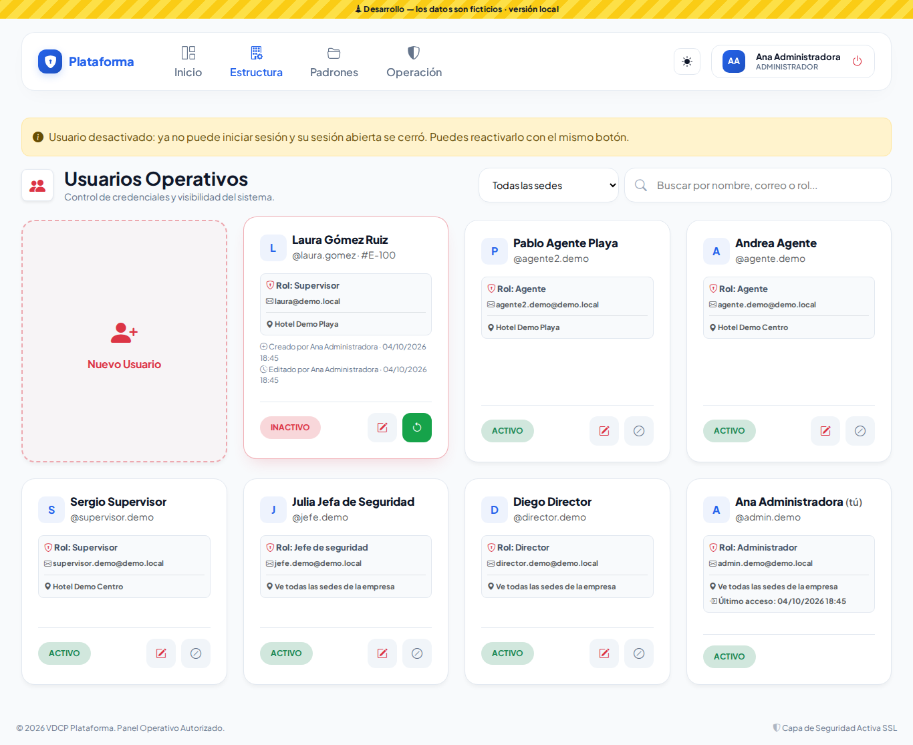
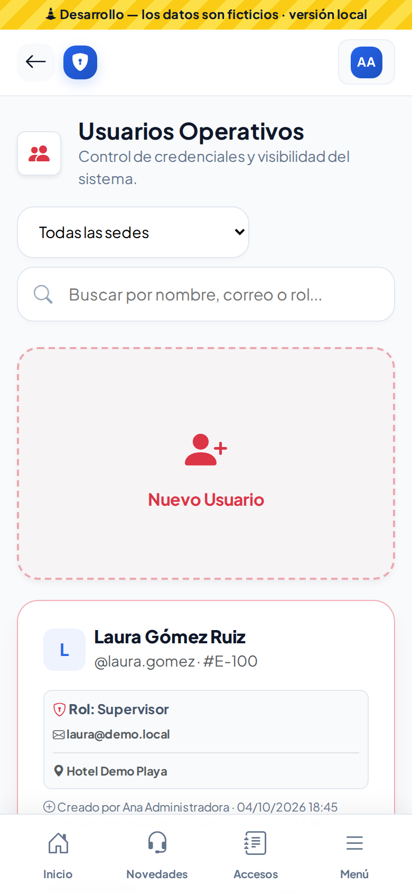

# Usuarios

Aquí se dan de alta las cuentas para entrar a la plataforma: **Estructura → Organización Interna → Usuarios**.

## Buscar

Escribe en el buscador un nombre, usuario, correo o rol. Si la empresa tiene varias sedes, filtra también por sede. El filtro se mantiene mientras trabajas.

## Dar de alta

1. Toca **Nuevo Usuario**.
2. Captura:
   - **Núm. Colaborador:** opcional.
   - **Nombre completo**.
   - **Sede:** la sede donde trabaja, o *Todas las sedes* si debe ver todas.
   - **Rol**.
   - **Usuario**, **correo** y **contraseña:** mínimo 8 caracteres, con letras y números.
3. Toca **Registrar Usuario**. La persona ya puede entrar con su usuario o su correo.

En la lista de roles solo aparecen los que tú puedes asignar, es decir, los de nivel inferior al tuyo.

## Editar

Toca el **lápiz**. Si dejas la contraseña en blanco, no cambia. Si la cambias, la persona tendrá que volver a entrar.

## Desactivar o reactivar

- El botón **⊘** desactiva la cuenta: la persona ya no puede entrar y, si estaba dentro, se le cierra la sesión.
- El botón verde **↺** la reactiva.

No se borra a nadie, para conservar el historial.

No puedes editar tu propia cuenta ni la de alguien de tu mismo nivel o superior.

