# Usuarios

Aquí se dan de alta las cuentas para entrar a la plataforma: **Estructura → Organización Interna → Usuarios**.

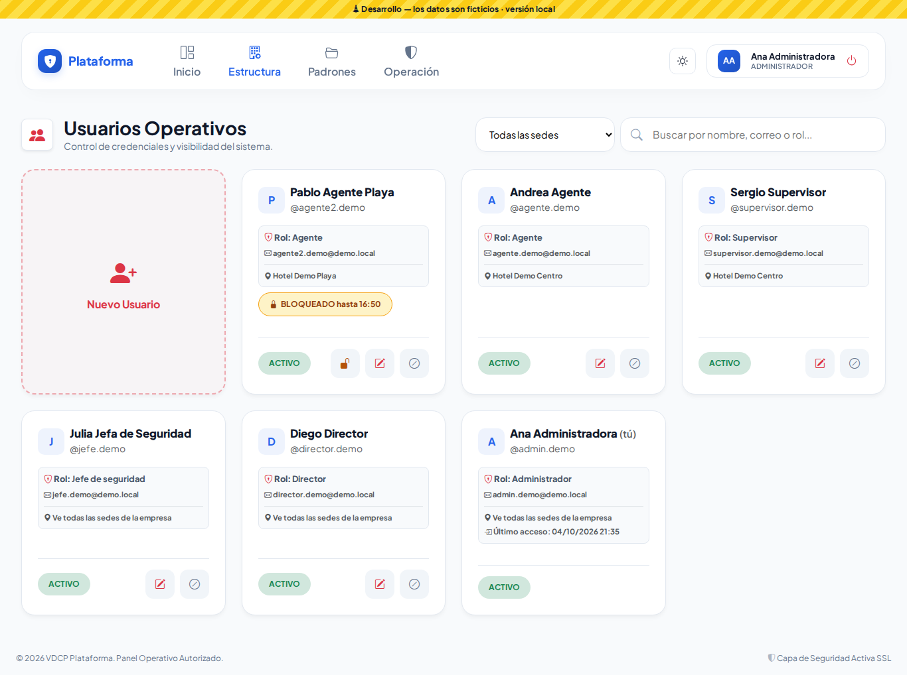

## ¿De qué empresa son?

La plataforma atiende a varias empresas, y cada usuario pertenece a **una**. Debajo del título se ve cuál: "Usuarios de «Hotel Demo»". En el alta y en la edición, arriba de la sede, aparece **Empresa: Hotel Demo**: el usuario se crea en esa empresa y la **sede** solo limita lo que ve dentro de ella.

El Super Administrador cambia de empresa con el selector **Empresa de trabajo** de arriba.

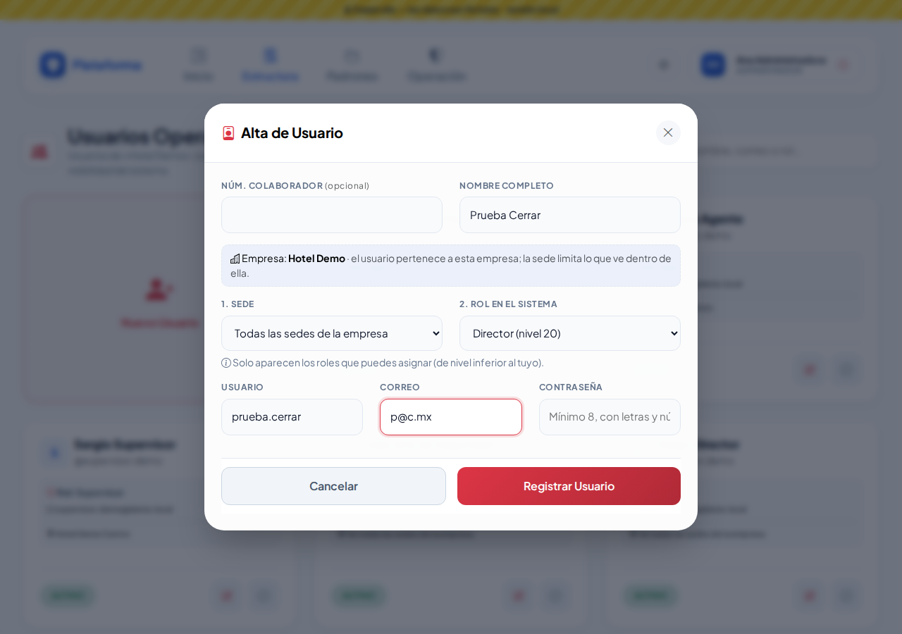

## Buscar

Escribe en el buscador un nombre, usuario, correo o rol. Si la empresa tiene varias sedes, filtra también por sede. El filtro se mantiene mientras trabajas.

## Dar de alta

1. Toca **Nuevo Usuario**.
2. Captura:
   - **Núm. Colaborador:** opcional. Escribe el número o el nombre del colaborador y elígelo de la lista (ver abajo).
   - **Nombre completo**.
   - **Sede:** la sede donde trabaja, o *Todas las sedes* si debe ver todas.
   - **Rol**.
   - **Usuario**, **correo** y **contraseña:** mínimo 8 caracteres, con letras y números.
3. Toca **Registrar Usuario**. La persona ya puede entrar con su usuario o su correo.

En la lista de roles solo aparecen los que tú puedes asignar, es decir, los de nivel inferior al tuyo.

Si cierras la ventana (Cancelar, la X o la tecla Esc), al volver a abrirla aparece **vacía**. Si al registrar hubo un error (por ejemplo, un usuario repetido), la ventana se vuelve a abrir con lo que capturaste para que lo corrijas; si en vez de corregir la cierras, la próxima vez abre vacía.

| Regresa con el error | Cerrada y vuelta a abrir |
|---|---|
| 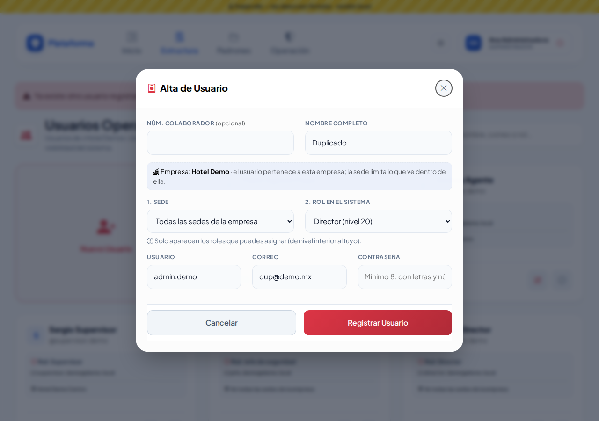 | 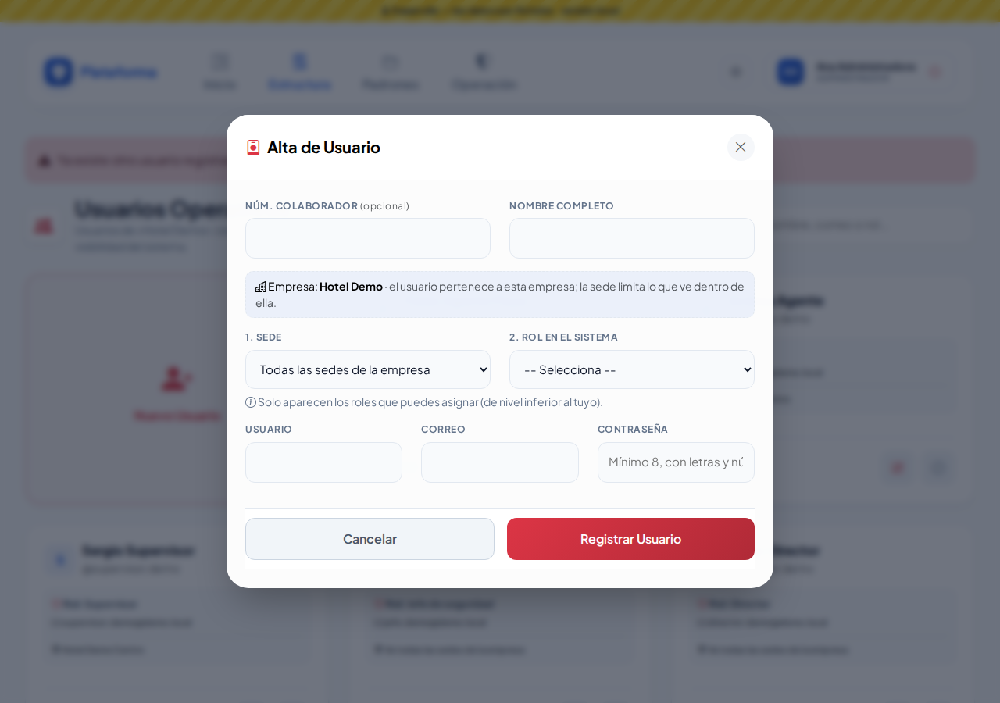 |

### Vincular la cuenta con su colaborador (paso a paso)

**¿Qué es "vincular"?** Muchas personas que usan la plataforma también están en **Recursos Humanos → Colaboradores** (el directorio del personal, con su número de empleado). *Vincular* es decirle a la plataforma: «esta cuenta de usuario es de este colaborador». Así no capturas su nombre dos veces, y si Recursos Humanos lo da de baja, en su cuenta aparece un aviso para que la revises.

No es obligatorio: una cuenta de soporte o de un proveedor puede quedarse sin colaborador.

**Ejemplo:** vas a crear la cuenta de **Daniela Canul May**, que ya está en Colaboradores con el número **1008**.

1. Toca **Nuevo Usuario**.
2. En el primer campo, **Núm. Colaborador**, escribe su número (`1008`) **o** parte de su nombre (`dani`). Basta con 2 letras o números.
3. Aparece una lista debajo. Toca **Daniela Canul May · #1008**.
   - Se llenan solos su **número** y su **Nombre Completo**.
   - Debajo aparece en verde **«Vinculado a Colaboradores»**: eso confirma el vínculo.

   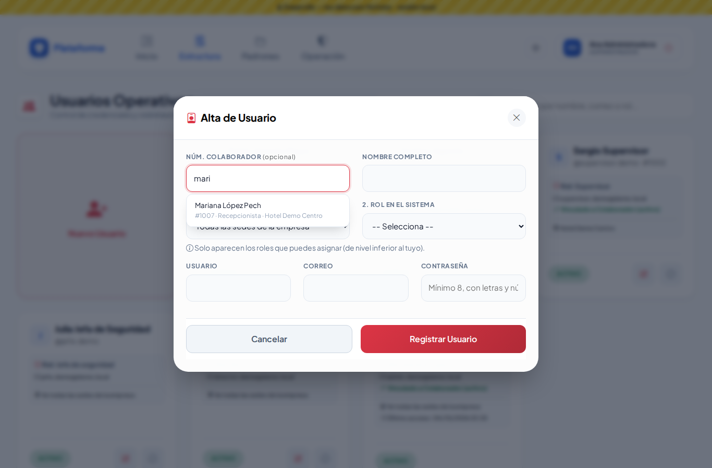

   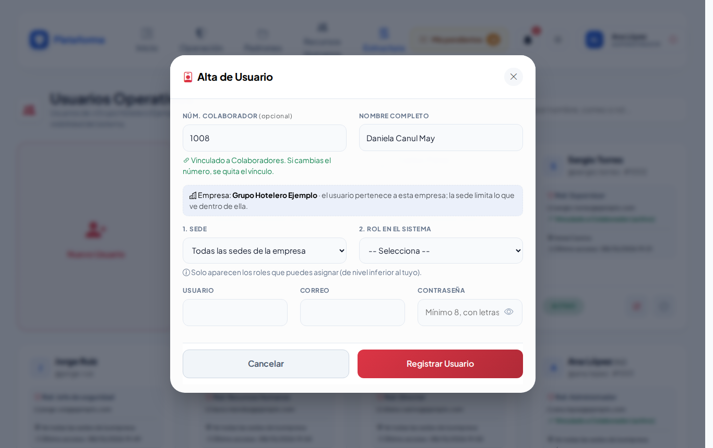

4. Otra forma: si empiezas por el **Nombre Completo** y escribes `Daniela Canul May`, la ventana te avisa que hay un colaborador con ese nombre que aún no tiene cuenta. Toca **Vincular con colaborador #1008 Daniela Canul May** y queda vinculado igual.

   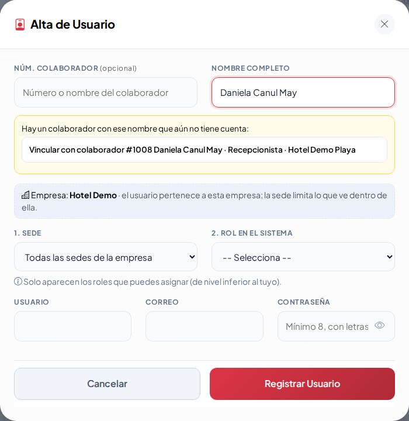

   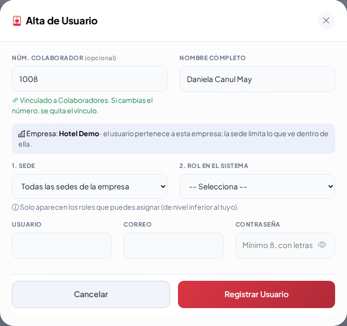

5. Completa **Sede**, **Rol**, **Usuario**, **Correo** y **Contraseña**, y toca **Registrar Usuario**.
6. En la lista, la ficha de Daniela dice **Vinculado a Colaborador (activo)**.

   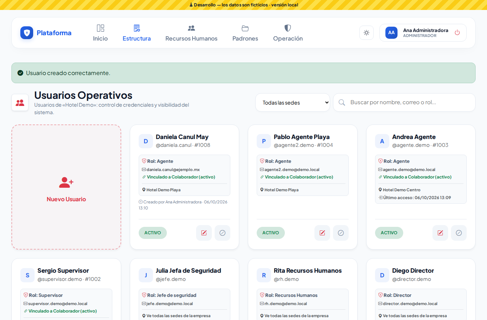

Cosas que conviene saber:

- **Si ya tiene cuenta**, no aparece en la lista: te avisa «Ese colaborador ya tiene una cuenta de usuario». Búscala en la lista principal y edítala; no hagas otra.
- **Si borras o cambias el número a mano**, el vínculo se quita (desaparece el texto verde). Vuelve a elegirlo de la lista para vincularlo otra vez.
- Solo aparecen colaboradores **activos** de tu empresa (y de tus sedes, si tu rol es de una sede).
- Si un día la ficha dice **Vinculado a Colaborador (¡inactivo! revisar)**, Recursos Humanos lo dio de baja: revisa si su cuenta también debe desactivarse.
- Para vincular una cuenta que ya existe: toca su **lápiz**, en **Núm. Colaborador** escribe el número o el nombre, elígelo y toca **Guardar Cambios**.

### Dos personas con el mismo nombre

Si escribes un **Nombre Completo** que ya tiene otra cuenta de tu empresa (sin importar mayúsculas ni acentos), la ventana te avisa en ese momento:

> Ya existe un usuario con ese nombre: @daniela.canul (Agente). ¿Es la misma persona?

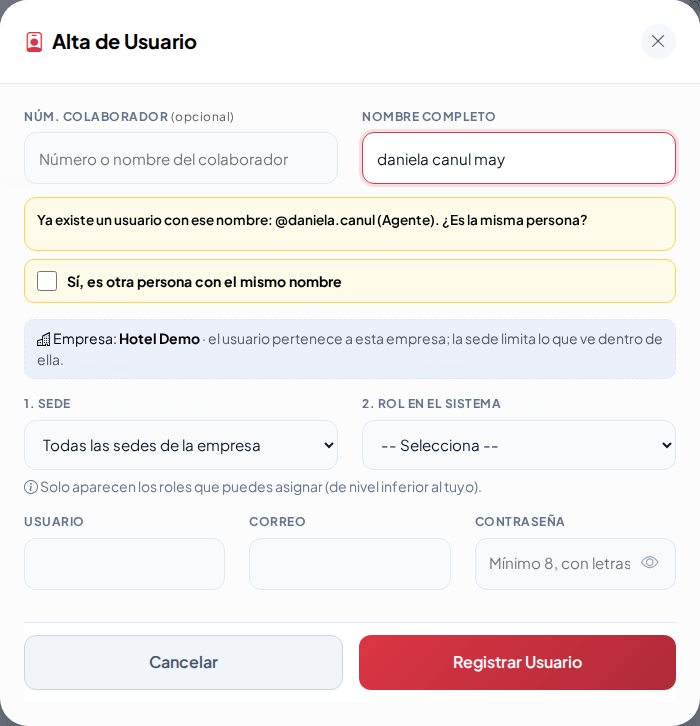

- **Si es la misma persona:** toca **Cancelar** y edita su cuenta en la lista. No hagas una segunda cuenta.
- **Si de verdad es otra persona con el mismo nombre** (pasa): marca **Sí, es otra persona con el mismo nombre** y registra. Sin esa marca la plataforma no la guarda y te lo vuelve a explicar dentro de la ventana:

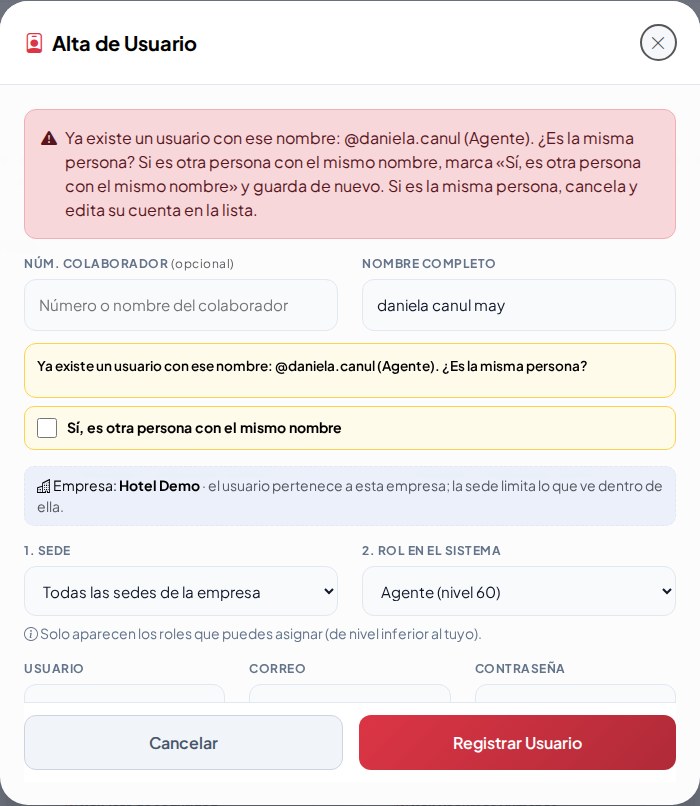

El **usuario** y el **correo** nunca se pueden repetir, aunque el nombre sí. Al editar, el aviso solo te pide confirmar si cambias el nombre por uno que ya tiene otra cuenta.

| En el celular | Noche | Sol |
|---|---|---|
| 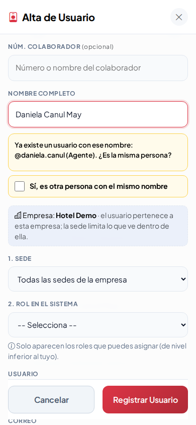 | 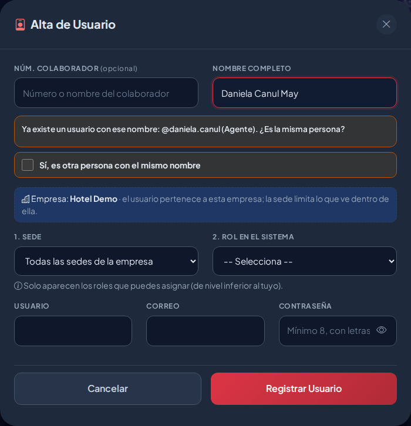 | 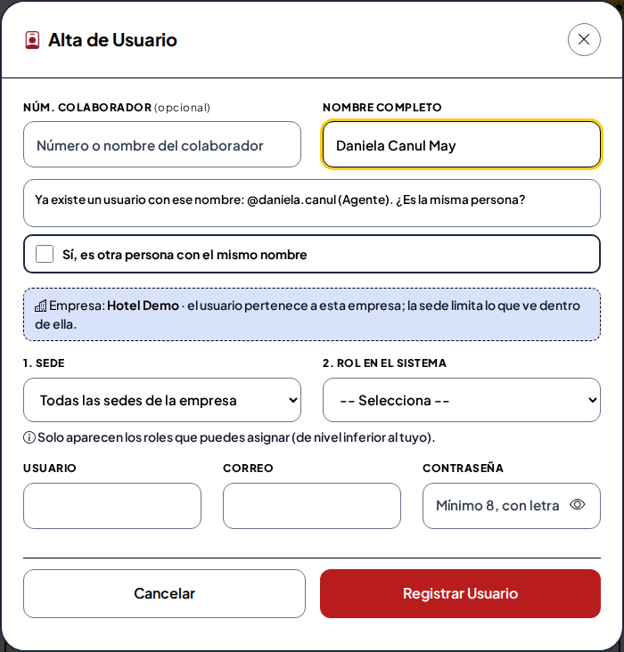 |

## Editar

Toca el **lápiz**. Si dejas la contraseña en blanco, no cambia. Si la cambias, la persona tendrá que volver a entrar.

## Desactivar o reactivar

- El botón **⊘** desactiva la cuenta: la persona ya no puede entrar y, si estaba dentro, se le cierra la sesión.
- El botón verde **↺** la reactiva.

No se borra a nadie, para conservar el historial.

## Desbloquear una cuenta

Tras **5 intentos fallidos** seguidos, la cuenta se bloquea 15 minutos. En su ficha aparece la etiqueta **BLOQUEADO hasta HH:MM** (hora de la empresa).

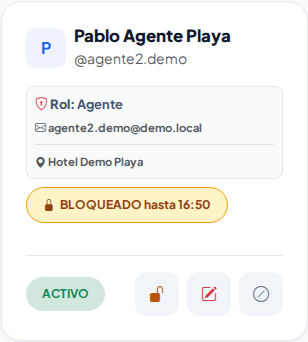

Si la persona ya recordó su contraseña y no puede esperar:

1. Toca el **candado** de su ficha.
2. Confirma. Verás «Nombre» desbloqueado; ya puede entrar.

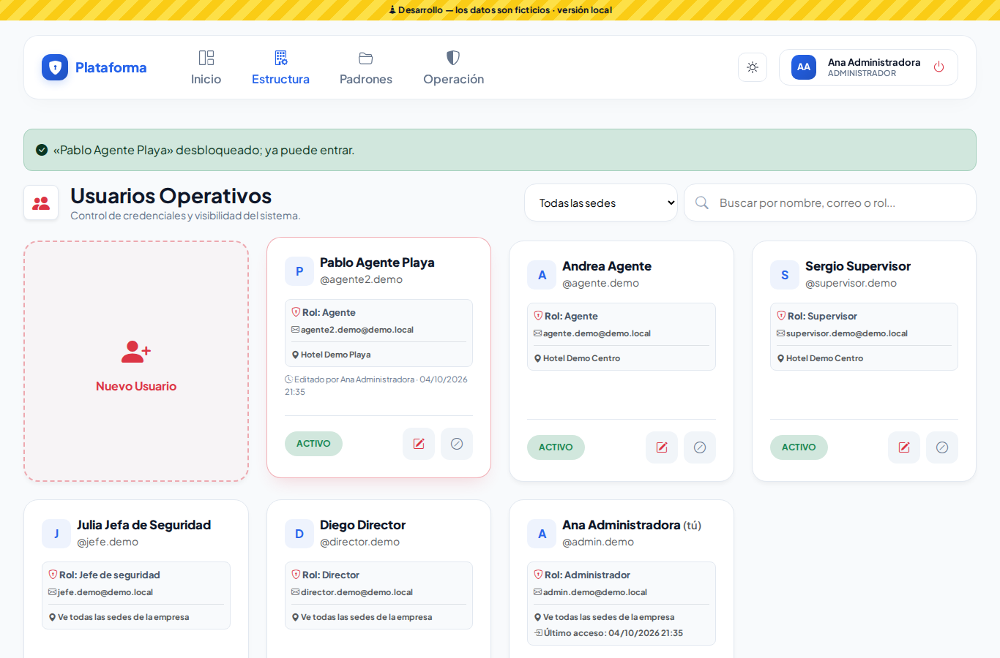

El candado solo aparece si tu rol tiene el permiso **Desbloquear** (por omisión: Administrador y Jefe de seguridad), la persona es de nivel inferior al tuyo y está dentro de tu alcance (por ejemplo, de tu sede). El desbloqueo queda registrado en la bitácora de auditoría.

> Si la persona olvidó su contraseña, además de desbloquearla cámbiale la contraseña con el **lápiz**.

No puedes editar tu propia cuenta ni la de alguien de tu mismo nivel o superior.

