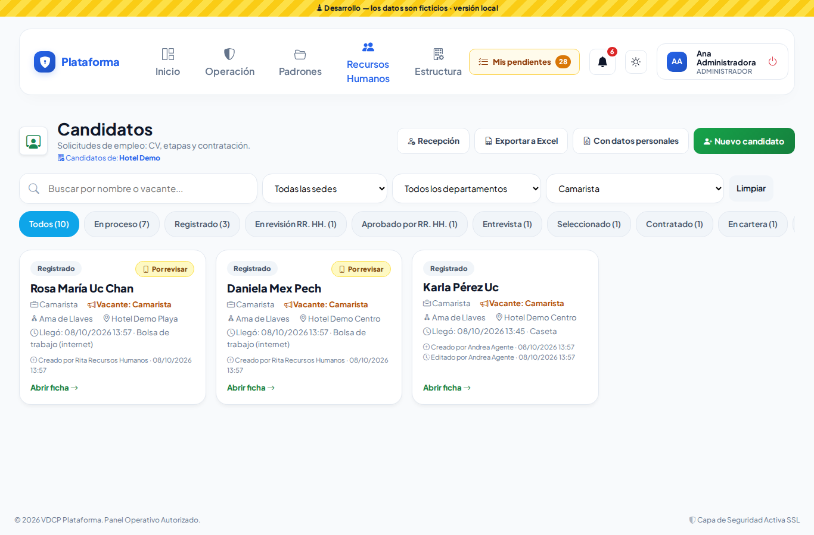
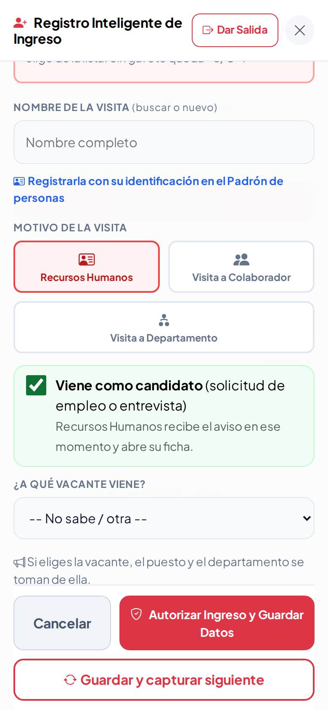

# Vacantes (bolsa de trabajo)

Publica una vacante **una sola vez** y aparece en tres lugares: en la **página de empleos** de la empresa (internet), en un **cartel con QR** para la entrada o la caseta, y en la **lista de la caseta** cuando llega alguien a pedir trabajo. Cada persona que se postula queda ligada a su vacante en Candidatos.

Lo encuentras en **Recursos Humanos → Recepción y candidatos → Vacantes**.

## 1. Crear una vacante

1. Toca **Nueva vacante**.
2. Escribe el **título** (ej. «Camarista»), el puesto, el departamento, cuántas **plazas** y en qué **sede(s)**. Si solo tienes una sede, ya viene marcada.
3. Abre las secciones que necesites: **Condiciones** (contrato, jornada, turno, sueldo o «a tratar»), **Descripción y requisitos** (un requisito por renglón) y **Fechas y contacto**.
4. **Guardar borrador** (para terminarla después) o **Guardar y publicar**.

> No puede haber dos vacantes abiertas con el mismo título: si necesitas más personas, edita la que ya existe y sube las plazas.

## 2. Estados

| Estado | Qué significa |
|---|---|
| **Borrador** | Solo la ve Recursos Humanos. |
| **Publicada** | Se ve en internet, en el cartel y en la caseta. |
| **En pausa** | Deja de verse un tiempo; **Reanudar** la vuelve a publicar. |
| **Cerrada** | Ya no se ve. Al cerrar eliges si se **cubrió** o se **canceló**. **Reabrir como borrador** la recupera. |

Si pasa la **fecha de cierre**, la vacante deja de verse sola y la ficha dice «Venció».

## 3. Compartir

- **Cartel**: hoja carta con «¡Estamos contratando!», sueldo, requisitos y un **QR**. Pégalo en la entrada o en la caseta: quien lo escanea se postula desde su celular.
- **Copiar enlace**: copia la dirección de la vacante para mandarla por correo o redes.
- **WhatsApp**: abre WhatsApp con el mensaje listo.

## 4. La página de empleos (internet)

En **Ajustes** (arriba, «Bolsa de trabajo en internet») la enciendes, escribes un texto de presentación y decides si Google la puede mostrar. La dirección incluye letras al azar para que nadie la adivine.

Así la ve el candidato en su celular:

 

Al tocar **Postularme** llena la misma **solicitud de empleo** del kiosco (con su firma) y puede subir su CV. Recursos Humanos recibe el aviso en la campana y por correo, y el candidato aparece en **Candidatos** como «Bolsa de trabajo (internet)» y «Por revisar».

## 5. Ver los candidatos de cada vacante

Cada ficha muestra **«N candidatos · M en proceso»**. Tócalo y se abre Candidatos filtrado por esa vacante. En Candidatos también hay un filtro **«Todas las vacantes»**.

## 6. En la caseta

Cuando alguien viene a pedir trabajo: **Nuevo Ingreso → Personal externo → Recursos Humanos → «Viene como candidato»** y elige **¿A qué vacante viene?** (solo salen las publicadas de esa sede). El puesto y el departamento se toman de la vacante.

El guardia también puede entrar a **Vacantes** para ver lo publicado e imprimir el cartel, pero no crea ni cambia vacantes.

## Preguntas frecuentes

- **¿Por qué no puedo eliminar una vacante?** Porque ya tiene candidatos: ciérrala para conservar su historia.
- **¿Puedo usarla en modo Sol o Noche?** Sí, como todas las pantallas.

