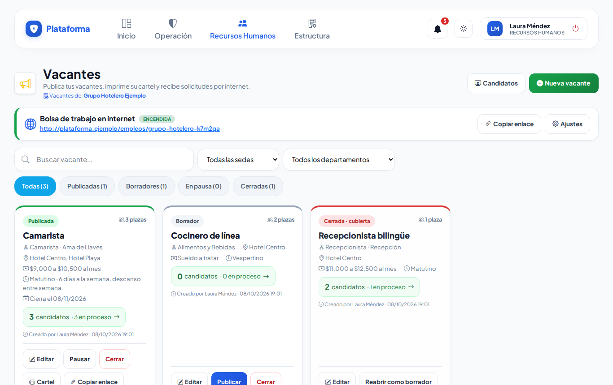
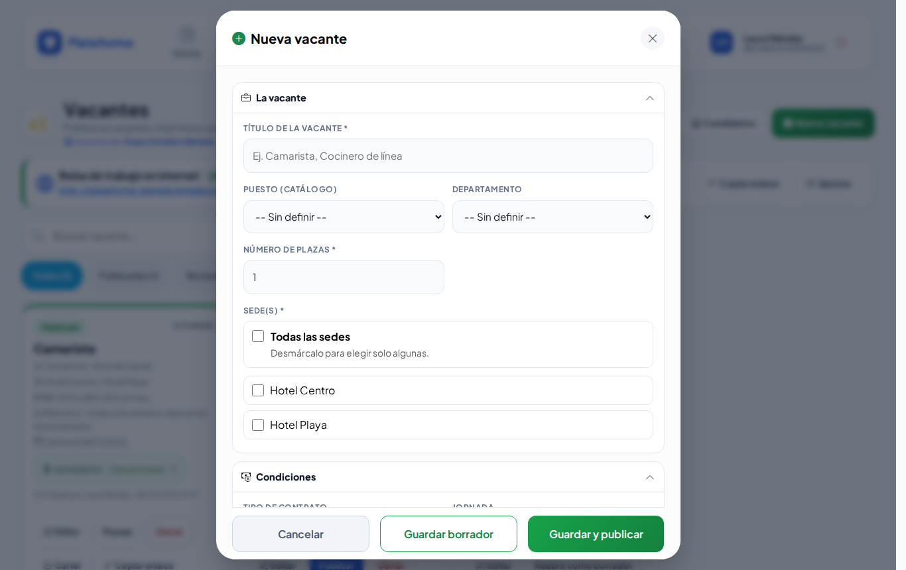
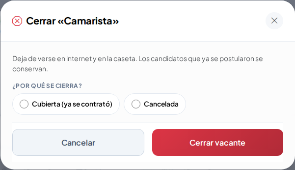
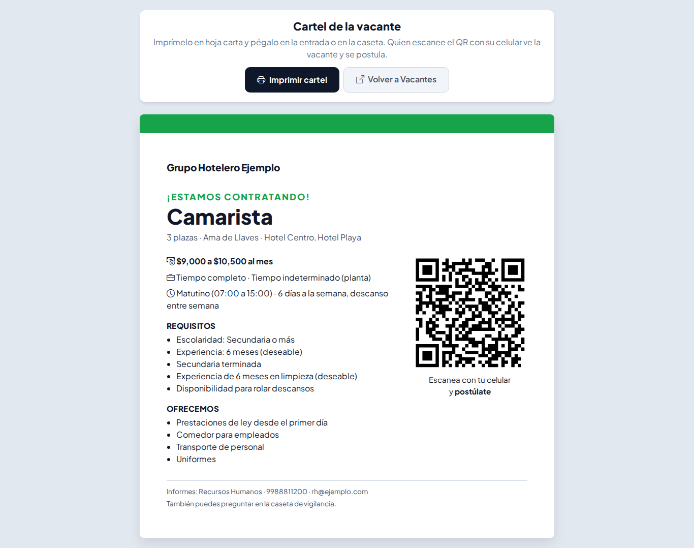
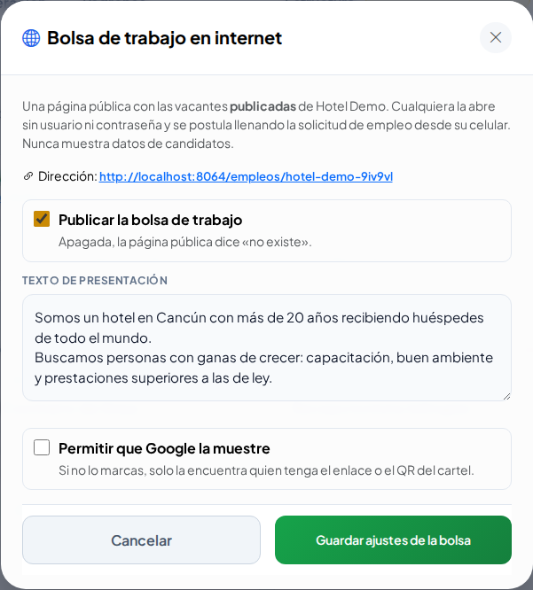
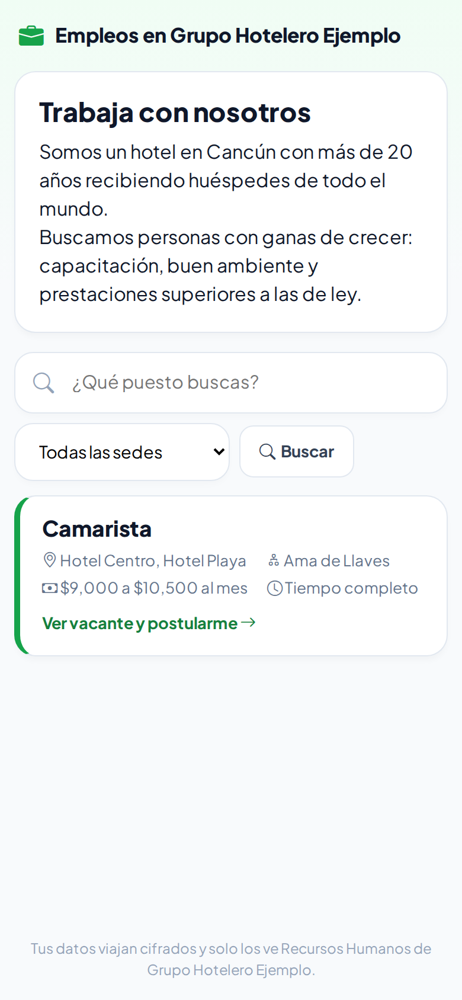
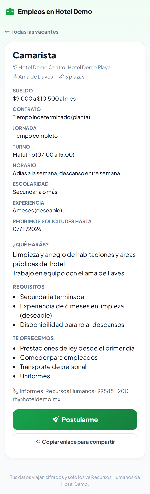
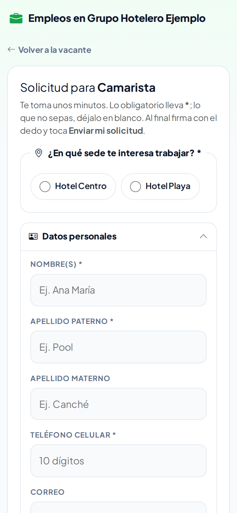
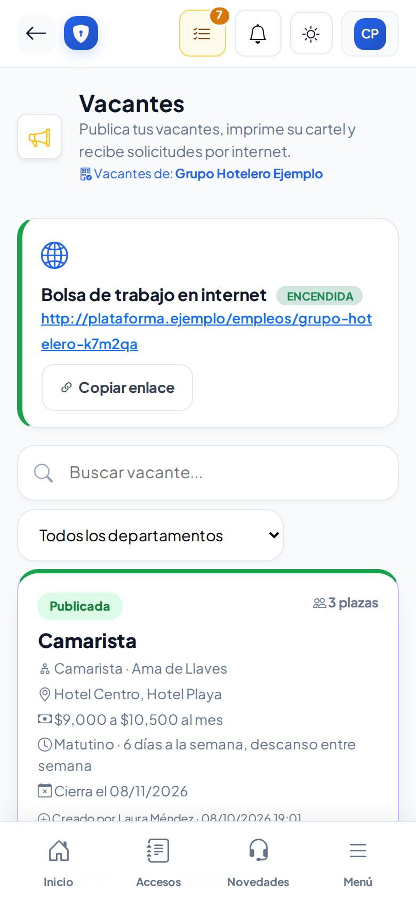
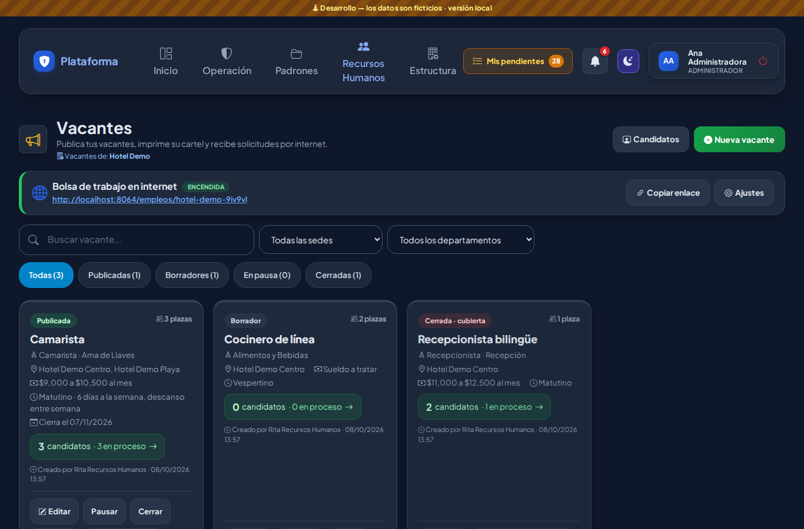

# Vacantes

**¿Para qué sirve?** Publicas una vacante **una sola vez** y aparece en tres lugares: en la **página de empleos** de la empresa (internet), en un **cartel con QR** para la entrada o la caseta, y en la **caseta** cuando llega alguien a pedir trabajo. Cada persona que se postula queda ligada a su vacante en [Candidatos](candidatos.md).

## Antes de empezar

- Para ver la pantalla tu rol debe poder consultar *Vacantes*. El agente de caseta puede verlas e imprimir el cartel, pero no crearlas.
- Para crear, editar, publicar o cerrar necesitas esos permisos (normalmente Recursos Humanos).
- Para encender la bolsa de trabajo por internet necesitas el permiso **Configurar** de Vacantes.
- Conviene tener listos los [Departamentos y puestos](departamentos-y-puestos.md) y los [Turnos](turnos.md).

## Cómo crear una vacante

1. Entra a **Recursos Humanos → Vacantes** y toca **Nueva vacante**.
2. En **La vacante** escribe el **Título de la vacante** (por ejemplo «Camarista»), elige el **Puesto (catálogo)** y el **Departamento**, el **Número de plazas** y la **Sede(s)** (si solo tienes una, ya viene marcada; **Todas las sedes** es solo para quien tiene alcance de empresa).
   - **Número de plazas:** cuántas personas se van a contratar. Cuando el jefe elige a tantas personas como plazas, los demás candidatos de la vacante que seguían con el departamento pasan solos a **Considerar**.
   - **El jefe puede ver el CV:** márcalo si quien entrevista debe ver el CV en PDF del candidato. Apagado (así viene), solo ve un resumen: escolaridad, experiencia, disponibilidad y sueldo que espera.
3. Abre las secciones que necesites:
   - **Condiciones:** contrato, jornada, turno, horario y sueldo (o «a tratar»).
   - **Descripción y requisitos:** un requisito o prestación por renglón.
   - **Fechas y contacto:** fecha de publicación y de cierre, teléfono y correo de contacto.
4. Toca **Guardar borrador** (para terminarla después) o **Guardar y publicar**.

**Qué debes ver:** «Vacante «Camarista» publicada. Ya aparece en la bolsa de trabajo y puedes imprimir su cartel.» o «Vacante «…» guardada como borrador. Publícala cuando esté lista.»

> No puede haber dos vacantes abiertas con el mismo título: si necesitas más personas, edita la que ya existe y sube las plazas.

## Cómo cambiar el estado de una vacante

| Estado | Qué significa | Botón |
|---|---|---|
| **Borrador** | Solo la ve Recursos Humanos. | **Publicar** |
| **Publicada** | Se ve en internet, en el cartel y en la caseta. | **Pausar** o **Cerrar** |
| **Pausada** | Deja de verse un tiempo. | **Reanudar** o **Cerrar** |
| **Cerrada** | Ya no se ve. | **Reabrir como borrador** |

1. Toca el botón del estado que quieres en la tarjeta de la vacante.
2. Para **Cerrar** se abre **Cerrar «…»**: en **¿Por qué se cierra?** elige **Cubierta (ya se contrató)** o **Cancelada** y toca **Cerrar vacante**.

**Qué debes ver:** por ejemplo ««Camarista» está en pausa: ya no aparece en la bolsa de trabajo.» Si pasa la **fecha de cierre**, la vacante deja de verse sola y la tarjeta dice «Venció».

## Cómo compartir una vacante

- **Cartel:** abre una hoja carta con «¡Estamos contratando!», sueldo, requisitos y un **QR**. Toca **Imprimir cartel** y pégalo en la entrada o en la caseta: quien escanea el QR se postula desde su celular. **Volver a Vacantes** te regresa.
- **Copiar enlace:** copia la dirección de la vacante para mandarla por correo o redes.
- **WhatsApp:** abre WhatsApp con el mensaje listo.

## Cómo encender la bolsa de trabajo por internet

1. En la parte de arriba, en **Bolsa de trabajo en internet**, toca **Ajustes**.
2. Marca **Publicar la bolsa de trabajo**.
3. Escribe el **Texto de presentación** de la empresa.
4. Marca **Permitir que Google la muestre** solo si quieres que aparezca en buscadores; si no, solo la encuentra quien tenga el enlace o el QR del cartel.
5. Toca **Guardar ajustes de la bolsa**.

**Qué debes ver:** «Bolsa de trabajo encendida. Su dirección: …». La dirección incluye letras al azar para que nadie la adivine. **Copiar enlace** la copia.

Así la ve el candidato en su celular:

 

Al tocar **Postularme** llena la misma [solicitud de empleo](solicitud-empleo.md) del kiosco (con su firma) y puede subir su CV. Recursos Humanos recibe el aviso en la campana y por correo, y el candidato aparece en **Candidatos** como «Bolsa de trabajo (internet)» y «Por revisar».

## Cómo comparar a los candidatos de una vacante

1. En la tarjeta de la vacante toca **«N candidatos · M en proceso · P plazas»** (si entrevistas candidatos, dice **Candidatos de esta vacante**).
2. Se abre la tabla **Candidatos de esta vacante** con el nombre, la etapa, el **Promedio RR. HH.**, el **Promedio departamento**, el **Resultado** de su última entrevista y quién lo entrevista. Arriba ves las **Plazas** y cuántos ya están **Elegidos o contratados**.
3. Toca un nombre para abrir su ficha (o, si eres quien entrevista, su pantalla **Entrevistar**).

**Qué debes ver:** Recursos Humanos ve a todos los candidatos de la vacante en sus sedes. Quien entrevista ve solo a los que le canalizaron. La caseta no ve esta tabla. En **Candidatos** también hay un filtro **Todas las vacantes**.

## En la caseta

Cuando alguien viene a pedir trabajo, la caseta registra en **Nuevo Ingreso** el motivo **Recursos Humanos**, elige **¿A qué viene?** → **Busca empleo** y, en **¿A qué vacante?**, la vacante (solo salen las publicadas de esa sede) o **-- No sabe / otra --**. El puesto y el departamento se toman de la vacante. Si solo pregunta qué hay, la caseta elige **Informes / ver vacantes** y puede enseñarle la lista.

El agente también puede entrar a **Vacantes** para ver lo publicado e imprimir el cartel, pero no crea ni cambia vacantes.

## En modo Noche

## Si algo sale mal

Los mensajes salen en rojo dentro de la ventana o arriba de la lista.

| Mensaje o síntoma | Qué significa | Qué hacer |
|---|---|---|
| Escribe el título de la vacante (ej. «Camarista»). | Falta el título. | Escribe el título. |
| Ya hay una vacante abierta con ese título. Edítala (por ejemplo, sube las plazas) o cierra la anterior. | Ya existe una abierta igual. | Edita la existente. |
| Marca al menos una sede o «Todas las sedes». | No elegiste sede. | Marca la sede. |
| «Todas las sedes» es solo para quien tiene alcance de empresa: marca tus sedes. | Tu rol es de una sede. | Marca tus sedes. |
| Antes de publicar, elige en qué sede(s) es la vacante. | La vacante no tiene sede. | Edítala y elige la sede. |
| La fecha de cierre ya pasó: cámbiala en «Editar» antes de publicar. | La vacante venció. | Cambia la fecha de cierre. |
| El sueldo máximo no puede ser menor que el mínimo. | Los sueldos están al revés. | Corrígelos. |
| La fecha de cierre no puede ser antes de la de publicación. | Las fechas están al revés. | Corrígelas. |
| Indica si la vacante se cubrió o se canceló. | Al cerrar no elegiste el motivo. | Elige **Cubierta** o **Cancelada**. |
| Tiene … candidato(s): ciérrala en lugar de eliminarla (así se conserva su historia). | Intentaste eliminar una vacante con candidatos. | Ciérrala. |
| Esta vacante también es de otras sedes: solo la elimina quien tiene alcance de empresa. | Tu rol es de una sede. | Pídelo a tu administrador. |

## Preguntas frecuentes

**¿Por qué no puedo eliminar una vacante?** Porque ya tiene candidatos: ciérrala para conservar su historia. Una vacante sin candidatos se puede eliminar con el bote de basura.

**¿Qué ve el candidato en internet?** Solo las vacantes publicadas, sin datos de otros candidatos.

**¿La bolsa aparece en Google?** Solo si marcas **Permitir que Google la muestre**.

**¿Puedo reutilizar una vacante cerrada?** Sí, con **Reabrir como borrador**; edítala y publícala de nuevo.

**¿Qué pasa cuando se cubren las plazas?** Al elegir el jefe a tantas personas como plazas, los demás candidatos que seguían con el departamento pasan a «Considerar» y Recursos Humanos recibe el aviso «Vacante cubierta». La vacante sigue publicada hasta que la cierres (como **Cubierta**).

## Relacionado

- [Candidatos](candidatos.md)
- [Entrevistar y elegir](entrevistar-y-elegir.md)
- [Solicitud de empleo](solicitud-empleo.md)
- [Bitácora de accesos](accesos.md)
