# Padrón vehicular

**¿Para qué sirve?** Aquí están todos los vehículos que entran a la empresa: autos de huéspedes, visitantes, familiares y colaboradores, flotillas de proveedores, autos rentados, taxis y transporte de personal. Cada vehículo tiene una **calcomanía con código QR** que la caseta puede leer con el lector.

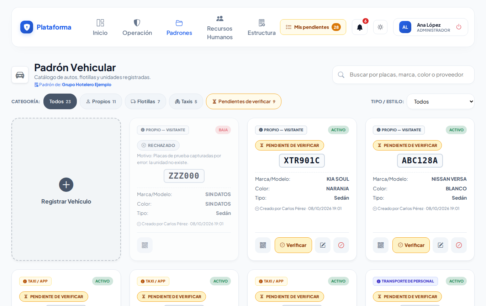

## Antes de empezar

- Para ver la pantalla tu rol debe poder consultar el *Padrón vehicular*. Si no aparece en el menú, pide el permiso a tu administrador.
- Para registrar, editar, dar de baja o imprimir calcomanías necesitas esos permisos. Si no ves **Registrar Vehículo** ni el lápiz, tu rol solo consulta (como el agente de caseta).
- Si tu rol solo puede editar «lo propio», solo podrás editar o dar de baja los vehículos que tú registraste.

## Cómo encontrar un vehículo

1. Entra a **Padrones → Padrón vehicular**.
2. Escribe en **Buscar por placas, marca, color o proveedor...** las placas (con o sin guiones: `ABC-123-A` o `abc123a`), la marca, el color, el número económico, la empresa o el colaborador.
3. Usa los botones de **Categoría**: **Todos**, **Propios**, **Flotillas** o **Taxis**. El número junto a cada uno dice cuántos hay.
   - **Propios:** de huésped, visitante, familiar o colaborador.
   - **Flotillas:** autos rentados, flotillas de empresas y transporte de personal.
4. Si quieres, elige también un **Tipo / Estilo** (Sedán, SUV, Pick-up…).

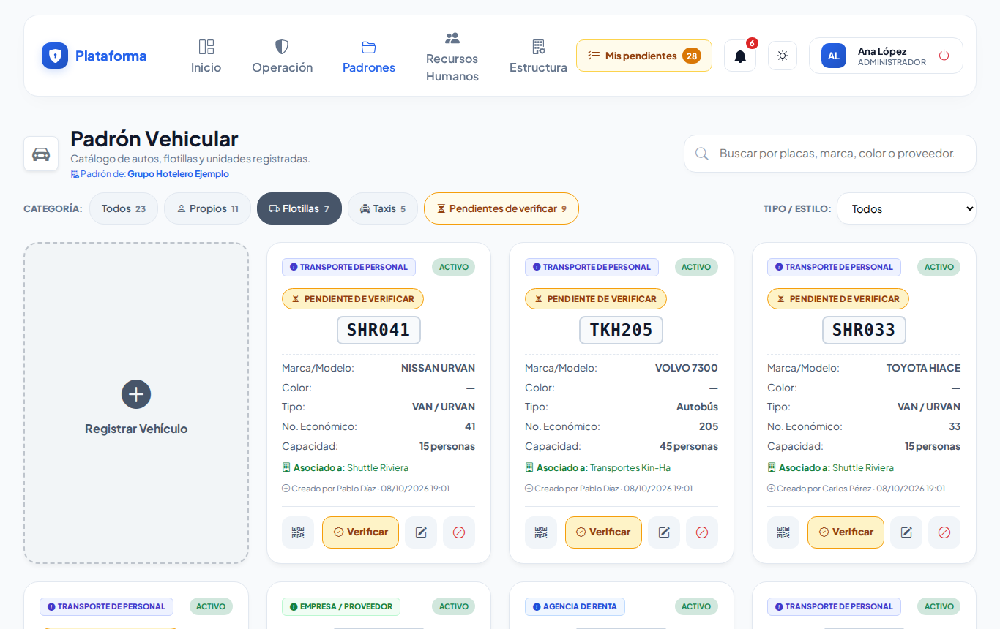

**Qué debes ver:** solo los vehículos que coinciden. La búsqueda y el filtro se recuerdan mientras la pestaña siga abierta.

## Cómo registrar un vehículo

1. Toca la tarjeta **Registrar Vehículo**. Se abre **Alta de Vehículo**.
2. Escribe las **Placas (Únicas)** como vengan. Se guardan en mayúsculas y sin espacios ni guiones; debajo verás cómo quedarán («Se guardarán como UVW482B.»).
3. Elige la **Categoría** (*¿de quién es?*): Propio Huésped, Propio Visitante, Propio Familiar, Propio Colaborador, Agencia (Rentado), Flotilla (Empresa/Proveedor), Taxi / Plataforma (Uber/Didi) o Transporte de Personal.
4. Según la categoría aparecen otros campos:
   - **Agencia o Empresa Propietaria:** para agencia, flotilla, taxi y transporte de personal. En *Flotilla (Empresa/Proveedor)* es obligatoria.
   - **Número Económico:** el número pintado en la unidad (por ejemplo `T-045`).
   - **Colaborador (dueño del vehículo):** solo en *Propio Colaborador*.
5. Elige el **Tipo / Estilo** (*su forma*): Sedán, SUV / Camioneta, Pick-up, Autobús, Camión ligero, Motocicleta u Otro.
   - Con **Otro** escribe en **Describe el Tipo de Vehículo** qué es (por ejemplo «Carrito de golf»).
   - En autobús, camión ligero o transporte de personal aparece **Capacidad Máxima** (de 1 a 99 personas).
6. Escribe la **Marca** y el **Color Físico** (obligatorios) y, si lo sabes, el **Modelo**.
7. Toca **Guardar Vehículo**.

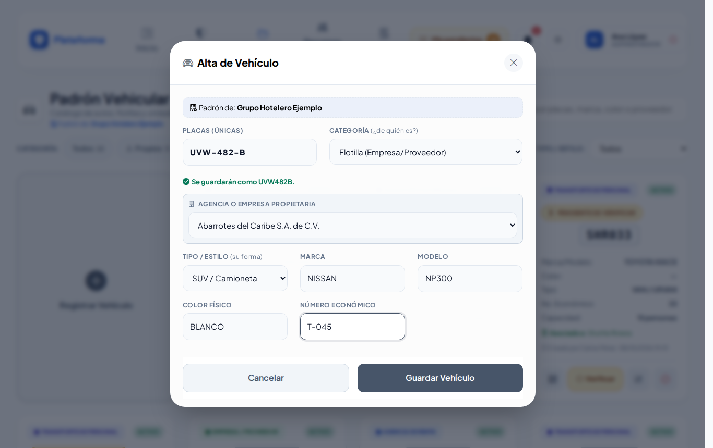

**Qué debes ver:** «Vehículo UVW482B registrado correctamente. Ya puedes imprimir su calcomanía.»

> **Categoría y Tipo / Estilo no son lo mismo.** La *Categoría* dice **de quién es** (un huésped, una empresa, un taxi). El *Tipo / Estilo* dice **qué forma tiene** (sedán, pick-up…). Por eso «Otro» está en Tipo: un carrito de golf del hotel es Tipo «Otro».

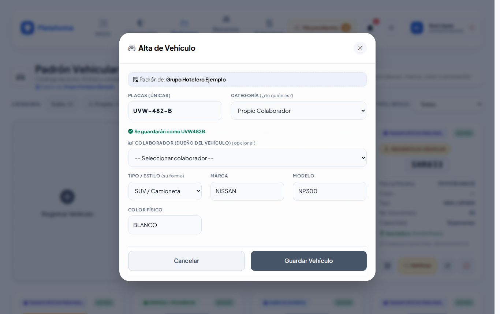

### Avisos mientras escribes las placas

- **Verde:** «Se guardarán como …». Puedes seguir.
- **Rojo:** «Las placas … ya están registradas en el padrón. No se pueden repetir.» Busca ese vehículo en la lista.
- **Rojo con botón Reactivar:** las placas son de un vehículo dado de baja. Toca **Reactivar** en lugar de registrarlo otra vez.
- **Amarillo:** «Se parecen a placas ya registradas (la O y el 0, o la I y el 1, se confunden). Revisa que no sea el mismo vehículo:».

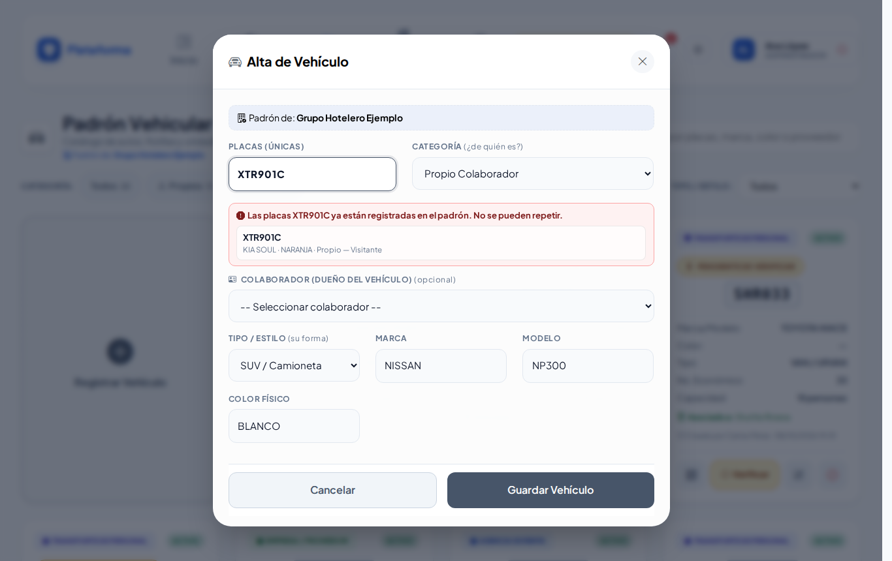

### Registrar un vehículo de una empresa externa

En **Padrones → Empresas externas → Ficha → Flotilla** toca **Agregar vehículo**. La ventana dice «Registrando unidad de …» y la empresa ya viene puesta, con candado. Al guardar o al cerrar regresas a la ficha de la empresa.

## Cómo editar un vehículo

1. En la tarjeta toca el **lápiz** (Editar).
2. Corrige los datos en **Actualizar Vehículo**.
3. Toca **Actualizar Datos**.

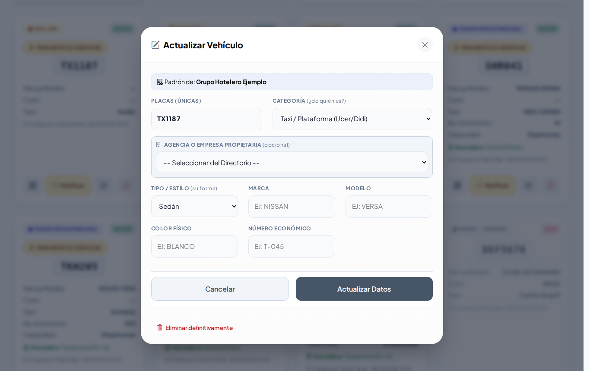

**Qué debes ver:** «Vehículo … actualizado correctamente.» Si cambias la categoría, los datos que ya no aplican (número económico, empresa, colaborador, capacidad) se borran al guardar.

## Cómo imprimir la calcomanía y asignar una etiqueta NFC

1. En la tarjeta toca el botón del **código QR**. Se abre **Código e identificación** con el QR y la dirección del vehículo (con botón **Copiar**).
2. Para imprimir toca **Imprimir calcomanía**: se abre en otra pestaña. Ahí toca **Imprimir Calcomanía** (los botones no salen en la hoja). **Volver al Padrón Vehicular** te regresa.
3. Para ligar un tag NFC o RFID: en **Asignar etiqueta NFC / RFID** acerca el tag al lector (o escribe su número) y toca **Guardar etiqueta**. Para quitarlo, toca **Quitar etiqueta**.

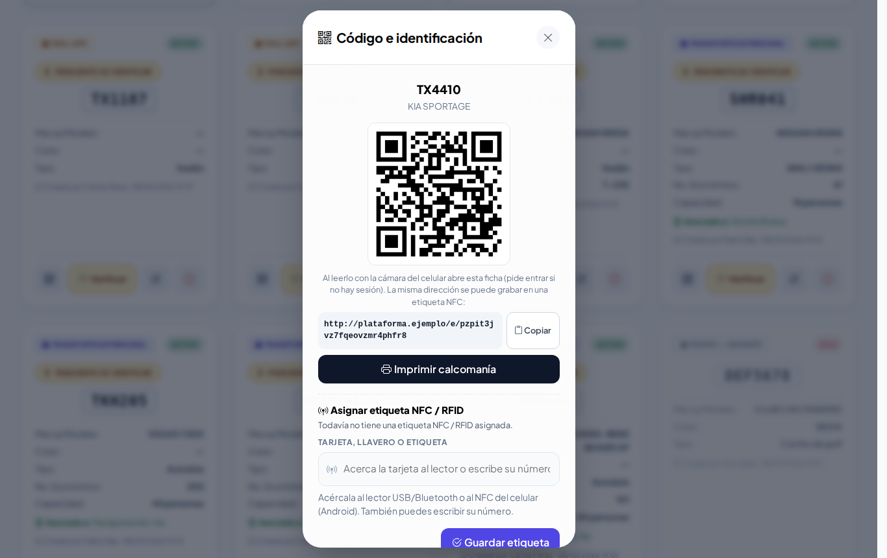

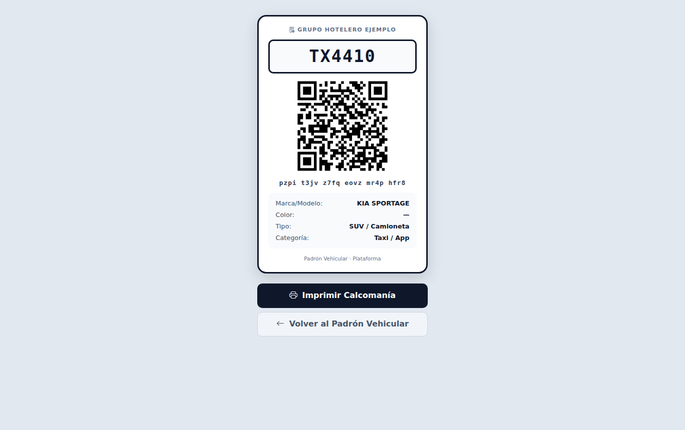

**Qué debes ver:** «Etiqueta … asignada. Ya se puede leer con el lector.» Al leer el QR con un celular con sesión iniciada se abre la ficha del vehículo. El QR no contiene datos personales.

## Cómo dar de baja o reactivar un vehículo

1. Toca el botón rojo **Dar de baja** (círculo con raya) y confirma con **Aceptar** («¿Dar de baja este vehículo? Podrás reactivarlo con un clic.»).
2. Para regresarlo toca **Reactivar** (flecha circular) y confirma.

**Qué debes ver:** la tarjeta marcada **BAJA**. Nunca se borra: las bitácoras dependen del vehículo.

## Lo que ve el agente de caseta

El agente consulta y busca vehículos, pero no ve **Registrar Vehículo** ni los botones de editar o dar de baja.

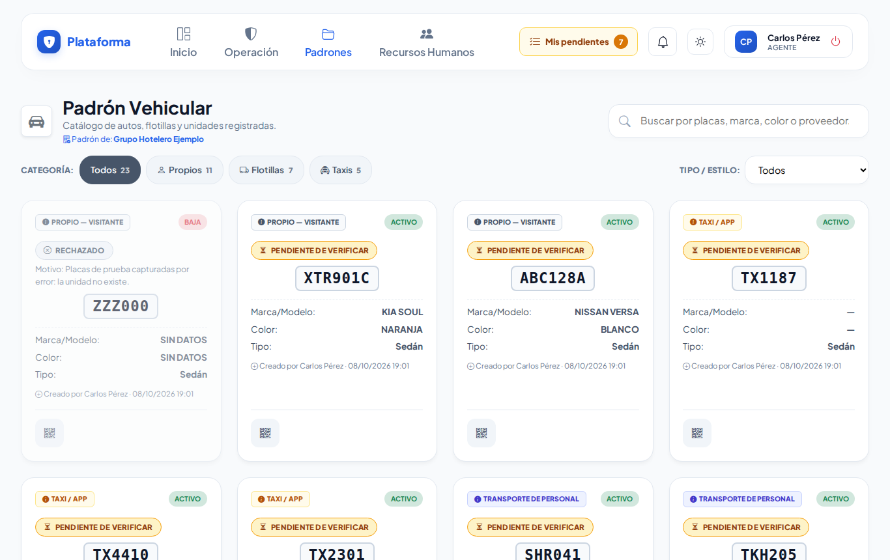

## En el celular y en modo Noche

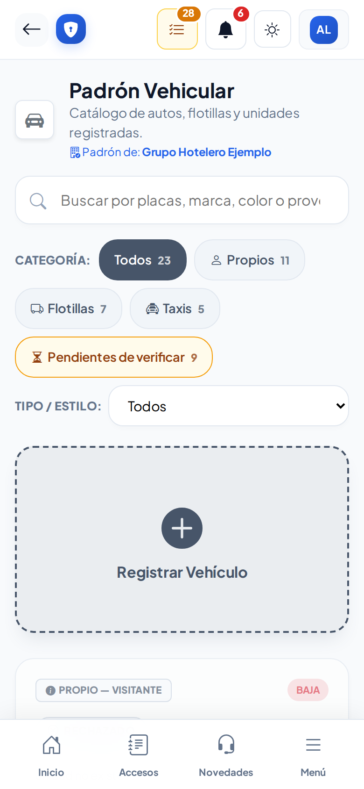 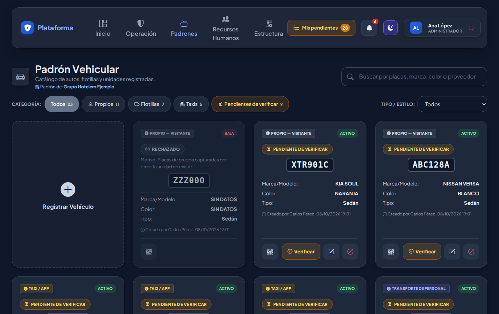

## Si algo sale mal

Los mensajes salen en rojo dentro de la ventana; lo que escribiste se conserva.

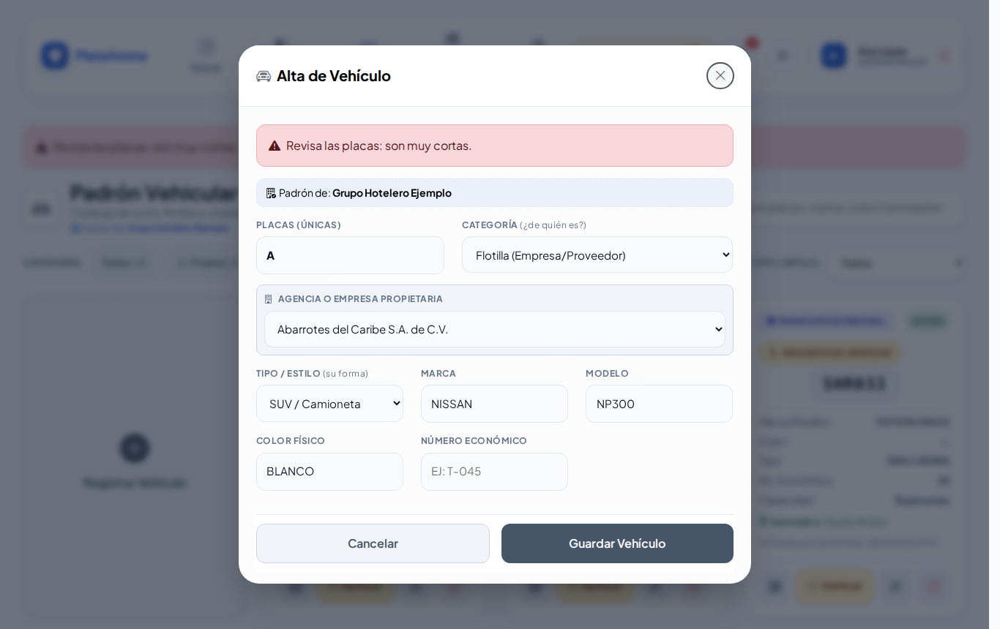

| Mensaje o síntoma | Qué significa | Qué hacer |
|---|---|---|
| Las placas son obligatorias. | El campo está vacío. | Escribe las placas. |
| Revisa las placas: son muy cortas. / son muy largas (máximo 20 caracteres). | Faltan o sobran letras. | Revisa la placa física. |
| Las placas solo llevan letras y números (los espacios y guiones se quitan solos). | Escribiste signos como `#` o `/`. | Escribe solo letras y números. |
| Las placas «…» ya están registradas en esta empresa. | Ese vehículo ya existe. | Búscalo; si está dado de baja, reactívalo. |
| Elige la empresa propietaria de la flotilla. | En *Flotilla* falta la empresa. | Elige la empresa en la lista. |
| Describe el tipo de vehículo (por ejemplo: montacargas, carrito de golf). | Elegiste «Otro» sin describirlo. | Escribe qué vehículo es. |
| La capacidad debe ser de 1 a 99 personas. | Número fuera de rango. | Corrige la capacidad. |
| La empresa propietaria no existe en esta empresa o está desactivada. | La empresa se dio de baja. | Elige otra o pide que la reactiven. |
| El colaborador no existe en esta empresa o está dado de baja. | El colaborador ya no está activo. | Elige otro colaborador. |
| No veo el botón **Registrar Vehículo**. | Tu rol solo consulta. | Pide el permiso a tu administrador. |

## Preguntas frecuentes

**¿Tengo que escribir los guiones de las placas?** No. Escríbelas como quieras; se guardan sin espacios ni guiones.

**¿Por qué no puedo registrar unas placas?** Porque ya existen. Si están dadas de baja, usa **Reactivar**.

**¿Qué significa «Pendiente de verificar» en una tarjeta?** Que la caseta registró el vehículo al momento y falta que alguien lo revise. Ver [Altas por verificar](altas-por-verificar.md).

**¿Puedo reimprimir una calcomanía?** Sí, cuantas veces quieras desde **Código e identificación**. Para imprimir muchas a la vez usa [Etiquetas QR](etiquetas-qr.md).

## Relacionado

- [Empresas externas](proveedores.md)
- [Estacionamientos](estacionamientos.md)
- [Etiquetas QR](etiquetas-qr.md)
- [Altas por verificar](altas-por-verificar.md)
