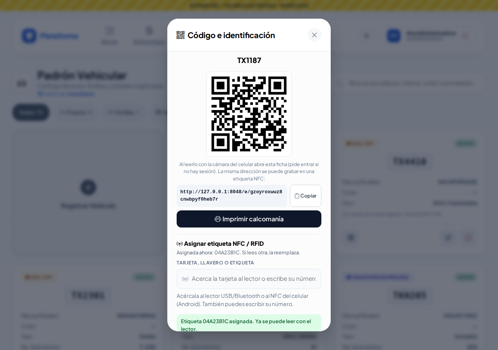
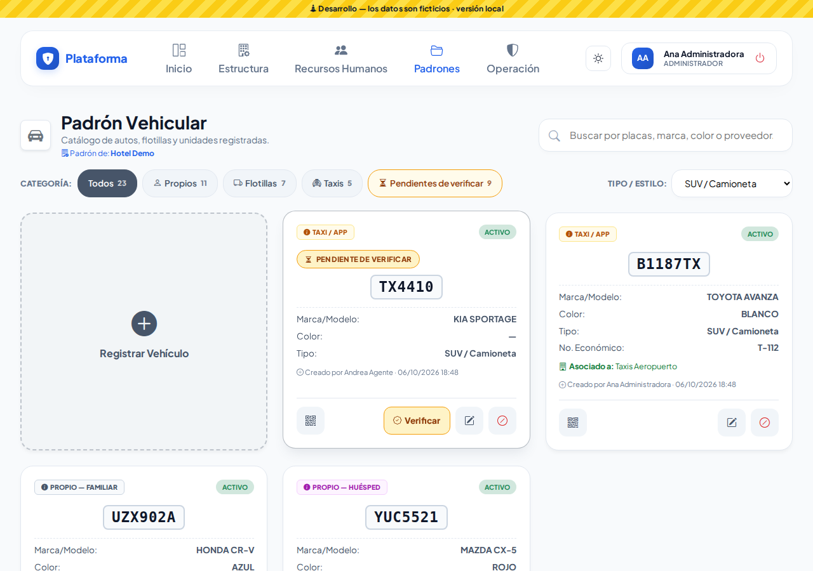
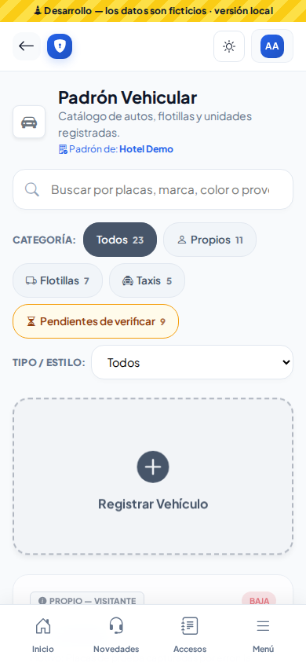
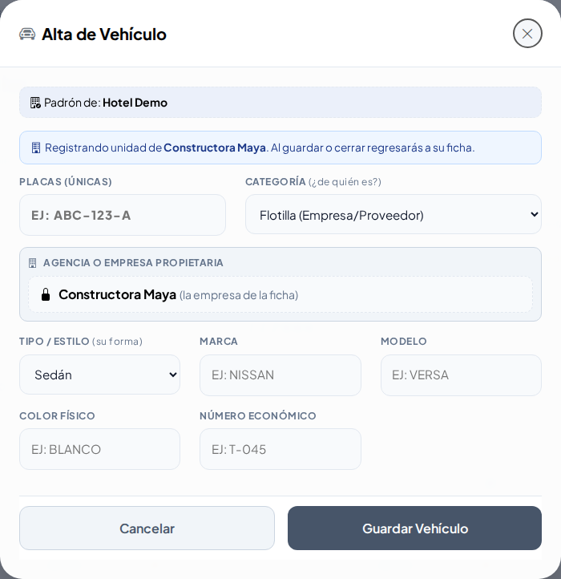

# Padrón Vehicular

Seguridad → Padrones → **Padrón vehicular**. Aquí están todos los vehículos que entran a la empresa: autos de huéspedes, visitantes, familiares y colaboradores, flotillas de proveedores, unidades rentadas, taxis y transporte de personal. Cada uno tiene una **calcomanía con código QR**.

## Buscar y filtrar

- Escribe en **Buscar** las placas (con o sin guiones: `ABC-123-A` o `abc123a`), la marca, el color, el número económico, el proveedor o el colaborador.
- Usa las píldoras **Todos / Propios / Flotillas / Taxis**; el número junto a cada una dice cuántos hay.
  - **Propios**: de huésped, visitante, familiar o colaborador.
  - **Flotillas**: agencia de renta, flotilla de un proveedor y transporte de personal.
- La búsqueda y la píldora se recuerdan mientras la pestaña siga abierta.

## Registrar un vehículo

1. Toca **Registrar Vehículo**.
2. Captura las **Placas** como vengan: se guardan en mayúsculas y sin espacios ni guiones. Si ya existen, lo verás de inmediato debajo del campo.
3. Elige la **Categoría**. Según la que elijas aparecen los campos que aplican:
   - **Agencia o Empresa Propietaria**: en agencia, flotilla, taxi y transporte de personal. En **Flotilla (Empresa/Proveedor)** es obligatoria.
   - **Número Económico**: en agencia, flotilla, taxi y transporte de personal.
   - **Colaborador (dueño del vehículo)**: en Propio Colaborador.
4. Elige **Tipo / Estilo**. Si es **Otro**, describe cuál (por ejemplo: montacargas, carrito de golf). En autobús, camión ligero o transporte de personal aparece **Capacidad Máxima** (1 a 99 personas).
5. **Marca** y **Color Físico** son obligatorios; Modelo es opcional.
6. Toca **Guardar Vehículo**. Ya puedes imprimir su calcomanía.

Si llegaste desde la ficha de un proveedor (botón para agregar un vehículo a su flotilla), la ventana se abre sola con el proveedor y la categoría ya elegidos. La empresa queda **fija** (con un candado) y al guardar **o al cerrar** regresas a la ficha del proveedor.

## Editar

Toca el lápiz de la ficha. Si cambias la categoría, los datos que ya no aplican (número económico, proveedor, colaborador, capacidad) se borran al guardar.

## Calcomanía

Toca el botón del **código QR** en la ficha: se abre la ventana **Código e identificación** (sin salir del padrón) con el QR, la dirección para copiar y, si puedes editar, **Asignar etiqueta NFC / RFID** (acerca el tag del vehículo al lector y se guarda solo).

Para imprimir, toca **Imprimir calcomanía** dentro de esa ventana: se abre la calcomanía en otra pestaña con placas, QR, marca/modelo, color, tipo y categoría. Toca **Imprimir Calcomanía**; los botones no salen en la impresión.

La misma ventana está en las fichas de **Llaves, Gafetes, Equipos de seguridad, Equipos de Protección Civil, Colaboradores y Lost & Found**.

Al escanear el QR con un celular que tenga la sesión iniciada, se abre la ficha del vehículo en el padrón. El QR no contiene datos personales y solo funciona dentro de tu empresa.

## Dar de baja o reactivar

Toca el círculo rojo para **dar de baja** (la ficha queda marcada **BAJA**); con la flecha verde lo **reactivas**. Nunca se borra: las bitácoras dependen del vehículo. Si intentas registrar unas placas que están dadas de baja, el sistema te pide reactivarlas.

## Quién puede qué

- **Agente**: consulta el padrón y busca vehículos.
- **Administrador, Jefe de seguridad** y los roles que tengan el permiso: registran, editan, dan de baja e imprimen calcomanías.
- Con alcance **"Solo los propios"** solo se editan o dan de baja los vehículos que uno mismo registró.

## En el celular y de noche

La lista se acomoda en una columna y las ventanas ocupan toda la pantalla. El modo **Noche** (botón del sol/luna) oscurece todo, incluidas las etiquetas de categoría.

## Categoría y Tipo / Estilo: ¿cuál es cuál? (Ronda 5)

Son dos preguntas distintas:

- **Categoría** = **¿de quién es o a qué viene?** Propio (huésped, visitante, familiar, colaborador), Agencia, Flotilla de una empresa, **Taxi** / plataforma o Transporte de personal. Según la categoría se piden la empresa propietaria y el número económico.
- **Tipo / Estilo** = **¿qué forma tiene?** Sedán, SUV, Pick-up, Autobús, Camión ligero, Motocicleta u **Otro**. Con «Otro» se pide que describas el vehículo (por ejemplo, «Carrito de golf»).

Por eso **«Otro» está en Tipo / Estilo y no en Categoría**: un carrito de golf del hotel es Tipo «Otro»; un auto que no es de nadie conocido es Categoría «Propio Visitante».

En la lista, los dos filtros van **en la misma línea**: las píldoras de **Categoría** y la lista **Tipo / Estilo**. Puedes combinarlos con el buscador.

En el celular los filtros bajan uno debajo de otro:

## Agregar un vehículo desde la ficha de una empresa (Ronda 5)

En Padrones → Empresas Externas → Ficha → **Flotilla** → **Agregar vehículo**, la ventana dice «Registrando unidad de …» y la **Agencia o Empresa Propietaria** ya viene puesta, con un candado. Si tocas **Cerrar** o **Cancelar**, regresas a la ficha de la empresa.

## Ronda 6: placas repetidas o parecidas

Al escribir las **Placas** te avisa si ya están registradas (aunque las escribas con guiones o espacios) o si se parecen a otras (la letra O y el cero, o la I y el uno, se confunden). Si el vehículo está de baja, toca **Reactivar**.

