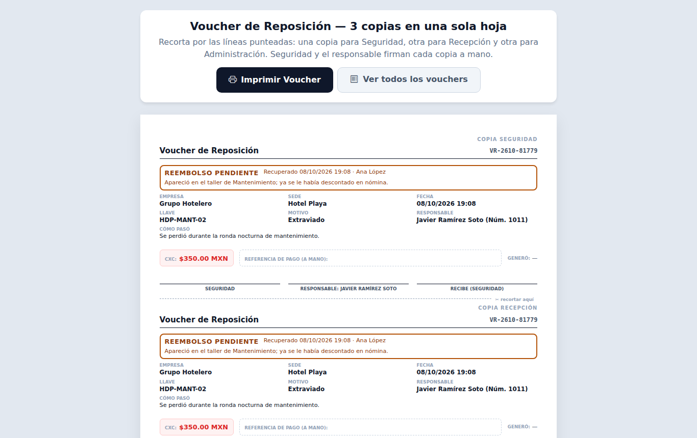
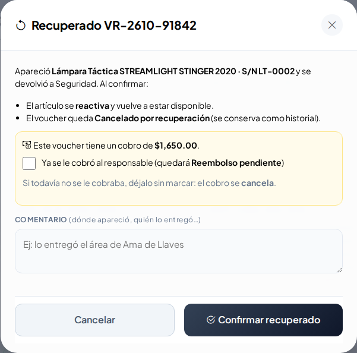
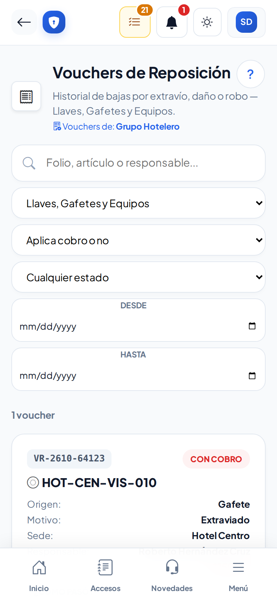

# Vouchers de reposición

**¿Para qué sirve?** Un voucher es el comprobante que se genera **solo** cuando se da de baja una llave, un gafete o un equipo que se perdió, se dañó o lo robaron. Aquí se consultan, se vuelven a imprimir, se registra la firma en papel y se marca si el artículo apareció. No se crean ni se borran a mano.

**Antes de empezar:** necesitas que tu rol pueda **ver** Vouchers de reposición; para imprimir, **imprimir**; para registrar firmas en papel o recuperados, **editar**. Solo ves los vouchers de los módulos que puedes consultar (por ejemplo, si no ves Llaves, no ves los de llaves) y de tus sedes.

## Cómo leer la lista

1. Entra a **Operación → Activos → Vouchers de reposición**.
2. Cada tarjeta tiene el **folio** (por ejemplo `VR-2610-48213`) y si es **CON COBRO** (rojo) o **SIN COBRO** (verde).
3. Debajo: el artículo dado de baja, su **Origen** (Llave, Gafete o Equipo), **Motivo**, **Sede**, **Responsable**, el **Monto** (si hay cobro), **¿Cómo pasó?**, quién lo generó y cuándo.

**Qué debes ver:** también el estado de la firma: **Firmado digitalmente**, **Firma en papel pendiente** o **Firmado en papel**.

## Cómo buscar y filtrar

1. En **Buscar** escribe el folio, el artículo, el responsable o parte de «¿Cómo pasó?». Se aplica solo al dejar de escribir.
2. Elige **Sede**, **Origen**, si **aplica cobro** o el estado (**Cualquier estado**, vigentes, recuperados, reembolsos…).
3. Usa **Desde / Hasta** para un rango de fechas.
4. **Quitar filtros** vuelve a mostrar todo.

**Qué debes ver:** solo los vouchers que coinciden.

## Cómo imprimir o reimprimir un voucher

1. En la tarjeta toca **Ver / Reimprimir**.
2. Se abre la hoja con **3 copias**: Seguridad, Recepción y Administración.
3. Toca **Imprimir Voucher** y recorta por las líneas punteadas. Si hay cobro, anota a mano la referencia de pago.

**Qué debes ver:** las firmas digitales ya salen impresas; si faltan, quedan las líneas para firmar a mano. El colaborador responsable firma, pero **no recibe copia**.

## Cómo registrar la firma en papel

1. Imprime el voucher y pide que firmen a mano.
2. En la tarjeta toca **Registrar firma en papel**.
3. Si quieres, sube una foto de la hoja firmada (JPG, PNG o WEBP).
4. Guarda.

**Qué debes ver:** la tarjeta dice **Firmado en papel**, con quién lo registró y cuándo. Si subiste la foto, aparece **Ver hoja** (y **Cambiar hoja firmada** para subir otra).

## Cómo marcar que el artículo apareció (Recuperado)

1. En la tarjeta toca **Recuperado**.
2. Lee lo que va a pasar: el artículo se **reactiva** y el voucher queda **Cancelado por recuperación** (no se borra).
3. Si el voucher tenía cobro:
   - Si **todavía no** se le cobraba al responsable, deja la casilla sin marcar: el cobro se cancela.
   - Si **ya** se le cobró, marca **Ya se le cobró al responsable** y escribe cómo se le devolverá el dinero.
4. Escribe un comentario (dónde apareció, quién lo entregó) y toca **Confirmar recuperado**.
5. Cuando ya le devolviste el dinero, toca **Reembolso entregado**.

**Qué debes ver:** el voucher cambia a **Cancelado por recuperación**, **Reembolso pendiente** o **Reembolsado**. La hoja impresa también muestra el estado.

## En el celular

## Si algo sale mal

| Mensaje o síntoma | Qué significa | Qué hacer |
|---|---|---|
| «Escribe cómo se va a devolver el dinero (por ejemplo: «se reembolsa en nómina»).» | Marcaste que ya se cobró y falta cómo se devuelve. | Escribe cómo se reembolsará. |
| «Sube la hoja como foto o imagen (JPG, PNG o WEBP).» | El archivo no es una imagen. | Toma una foto de la hoja y súbela. |
| «La foto de la hoja pesa demasiado (máximo 6 MB).» | La foto es muy pesada. | Toma la foto con menor calidad. |
| No veo **Ver / Reimprimir** | Tu rol no puede imprimir (por ejemplo, el Agente). | Pide a tu supervisor que lo imprima. |
| No veo **Recuperado** | Tu rol no puede reactivar ese artículo. | Pide al jefe de seguridad o al administrador. |
| No sale **Registrar firma en papel** | El voucher está cancelado o reembolsado, o ya se firmó. | No hace falta firmar. |

## Preguntas frecuentes

- **¿Cómo se crea un voucher?** Al dar de baja una llave, gafete o equipo como perdido, dañado o robado, desde su propia pantalla.
- **¿Quién recibe las copias por correo?** Si el voucher es con cobro, las listas que el administrador puso en **Estructura → Configuración → Avisos por correo**. El colaborador no recibe correo.
- **¿Puedo borrar un voucher?** No. Si el artículo aparece, márcalo como **Recuperado**.
- **¿Qué pasa con el cobro si el artículo aparece?** Se cancela; si ya se cobró, queda **Reembolso pendiente** hasta que marques **Reembolso entregado**.

## Relacionado

- [Responsivas](responsivas.md)
- [Catálogo de llaves](llaves.md)
- [Gafetes](gafetes.md)
- [Equipos de seguridad](equipos.md)
