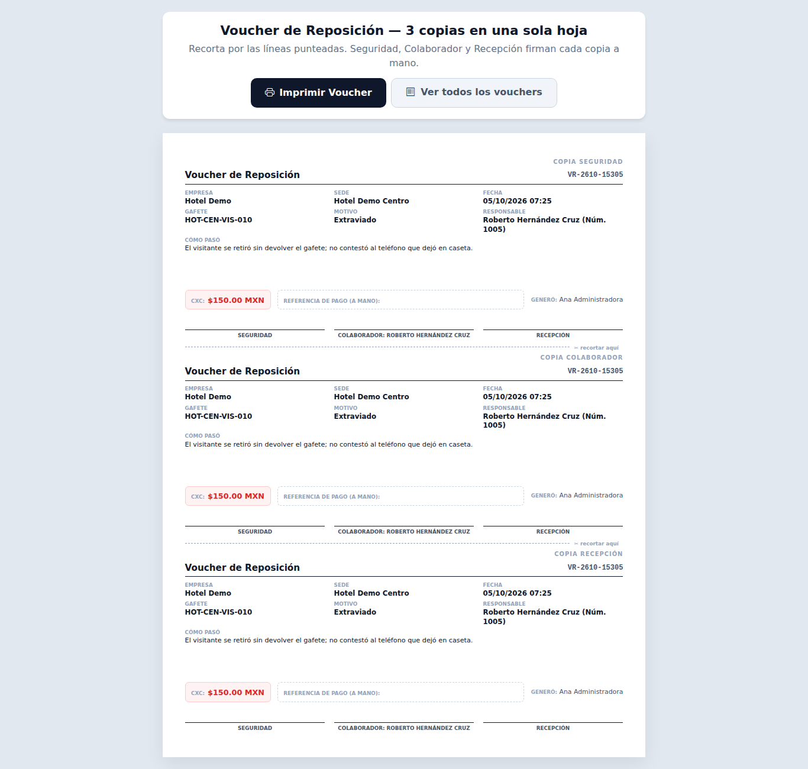

# Vouchers de reposición

Padrones → Inventarios de Seguridad → **Vouchers de reposición**. Un voucher es el comprobante que se genera **solo** cuando se da de baja una llave, un gafete o un equipo que se perdió, se dañó o lo robaron. Aquí se consultan y se vuelven a imprimir; no se crean ni se borran a mano.

## Qué ves en cada tarjeta

- El **folio** (por ejemplo `VR-2610-48213`) y si es **CON COBRO** (rojo) o **SIN COBRO** (verde).
- El **artículo** que se dio de baja (nomenclatura del gafete o de la llave, o el equipo).
- **Origen** (Llave, Gafete o Equipo), **Motivo**, **Sede**, **Responsable** y, si hay cobro, el **Monto**.
- **¿Cómo pasó?**, quién lo generó y cuándo.

Solo ves los vouchers de los módulos que puedes consultar (por ejemplo, si no tienes Llaves, no ves los de llaves) y de tus sedes.

## Buscar y filtrar

- **Buscar**: folio, artículo, responsable (nombre o número de empleado) o lo que se escribió en "¿Cómo pasó?". Presiona Enter o **Buscar**.
- **Sede**, **Origen** y **Aplica cobro o no** se aplican al elegirlos.
- **Desde / Hasta**: un rango de fechas.
- **Quitar filtros** vuelve a mostrar todo.

## Imprimir o reimprimir

Toca **Ver / Reimprimir**: se abre una hoja con **3 copias** (Seguridad, Colaborador y Recepción). Toca **Imprimir Voucher**, recorta por las líneas punteadas y que cada quien firme su copia. Si hay cobro, anota a mano la **referencia de pago**.

## Quién puede qué

- **Agente**: consulta los vouchers de su sede, pero no los imprime.
- **Asistente, Supervisor, Jefe de seguridad, Director y Administrador**: consultan e imprimen (en sus sedes, o en todas si su alcance es de empresa).

## En el celular y de noche

Los filtros se acomodan uno debajo de otro y las tarjetas en una columna. El modo **Noche** oscurece todo.

