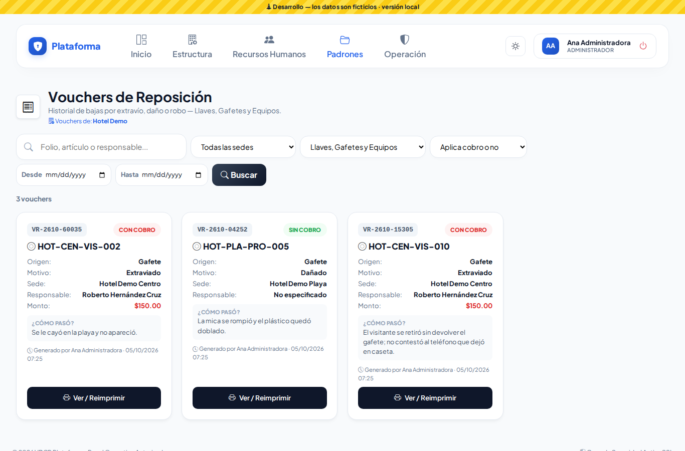
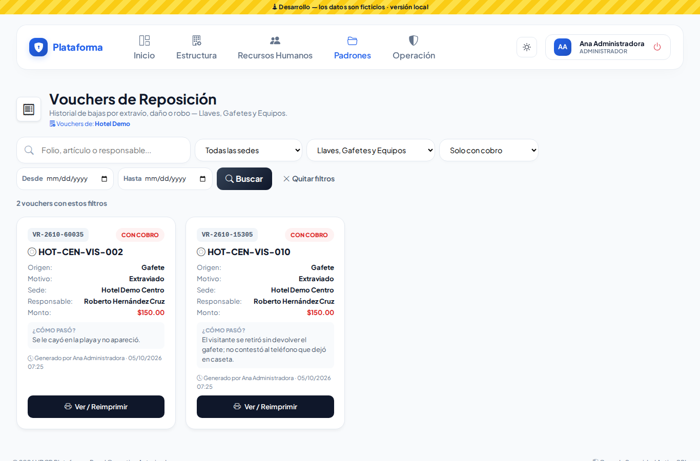
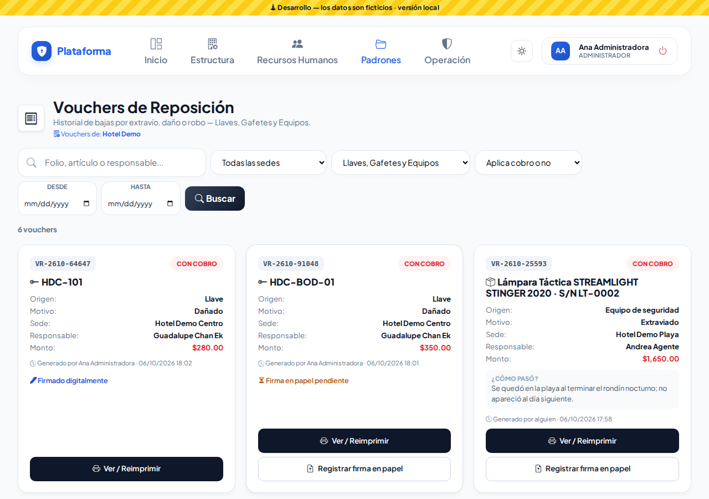
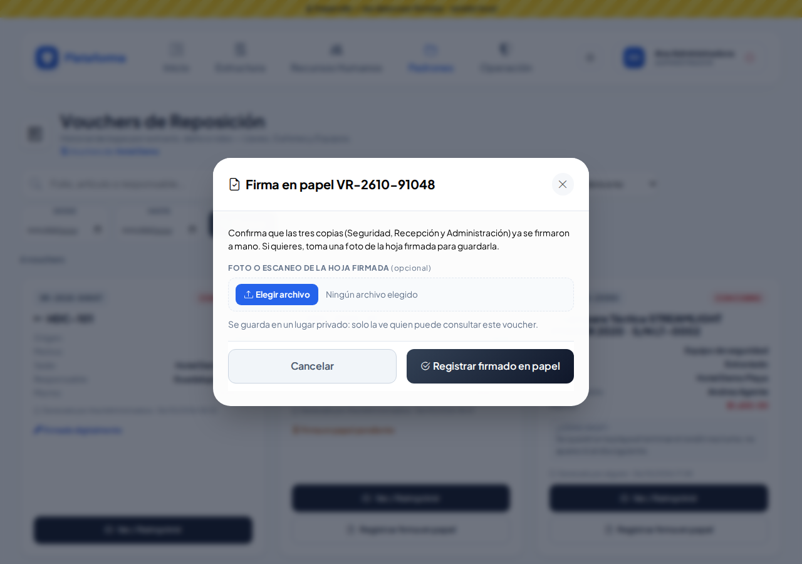
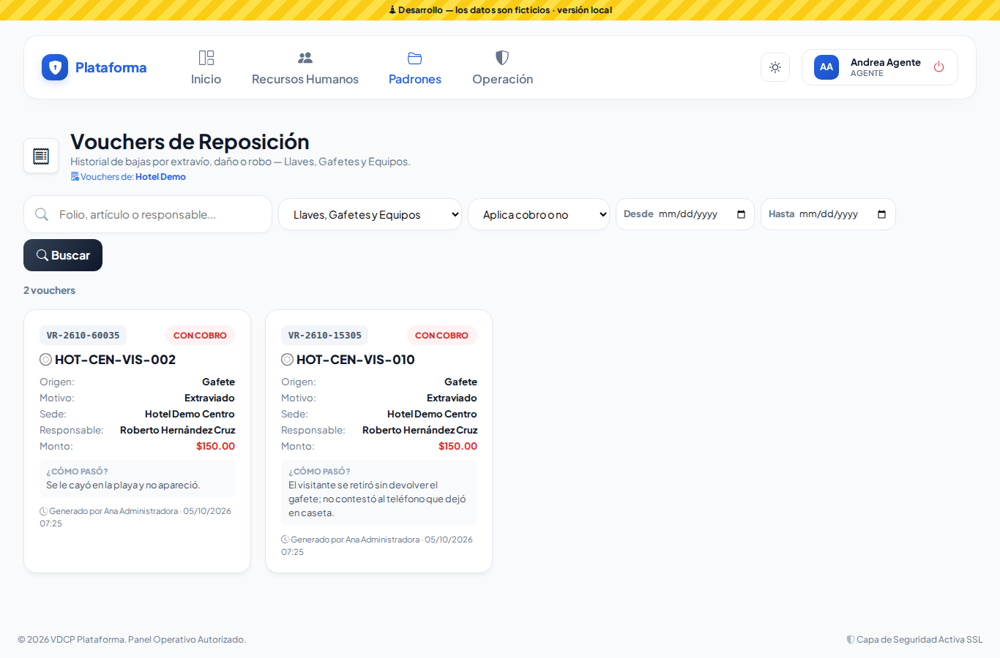
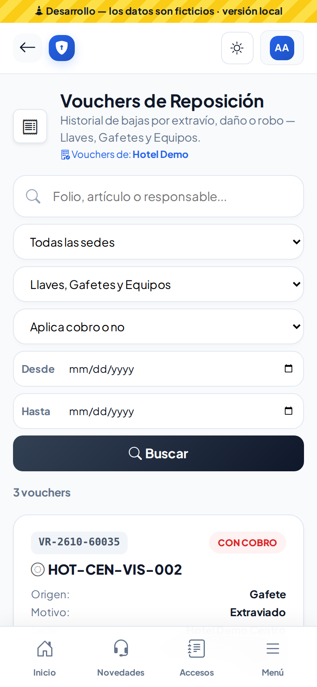
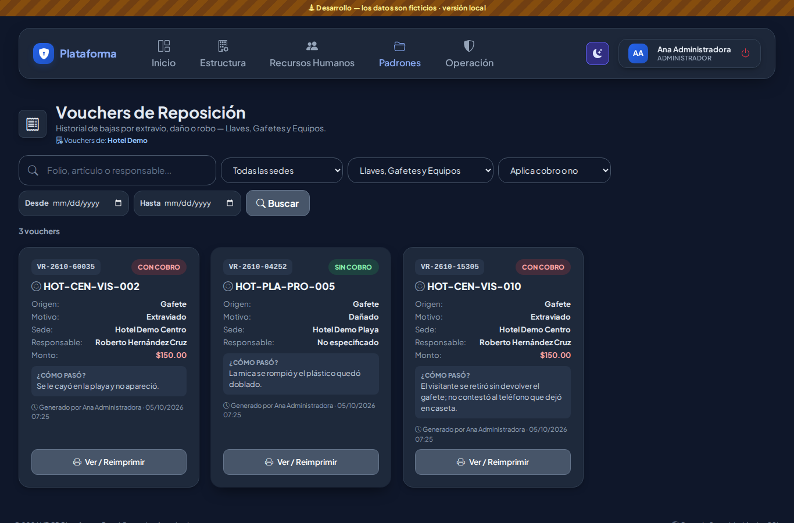

# Vouchers de reposición

Padrones → Inventarios de Seguridad → **Vouchers de reposición**. Un voucher es el comprobante que se genera **solo** cuando se da de baja una llave, un gafete o un equipo que se perdió, se dañó o lo robaron. Aquí se consultan y se vuelven a imprimir; no se crean ni se borran a mano.

## Qué ves en cada tarjeta

- El **folio** (por ejemplo `VR-2610-48213`) y si es **CON COBRO** (rojo) o **SIN COBRO** (verde).
- El **artículo** que se dio de baja (nomenclatura del gafete o de la llave, o el equipo).
- **Origen** (Llave, Gafete o Equipo), **Motivo**, **Sede**, **Responsable** y, si hay cobro, el **Monto**.
- **¿Cómo pasó?**, quién lo generó y cuándo.

Solo ves los vouchers de los módulos que puedes consultar (por ejemplo, si no tienes Llaves, no ves los de llaves) y de tus sedes.

## Buscar y filtrar

- **Buscar**: folio, artículo, responsable (nombre o número de empleado) o lo que se escribió en "¿Cómo pasó?". Presiona Enter o **Buscar**.
- **Sede**, **Origen** y **Aplica cobro o no** se aplican al elegirlos.
- **Desde / Hasta**: un rango de fechas.
- **Quitar filtros** vuelve a mostrar todo.

## Imprimir o reimprimir

Toca **Ver / Reimprimir**: se abre una hoja con **3 copias**: **Seguridad, Recepción y Administración**. El colaborador responsable firma, pero **no recibe copia**. Toca **Imprimir Voucher** y recorta por las líneas punteadas. Si hay cobro, anota a mano la **referencia de pago**.

## Firmas: digital o en papel

Al dar de baja se elige cómo se firma:

- **Firmado digitalmente**: Seguridad y el responsable firmaron en la pantalla. Las firmas ya salen impresas en las tres copias.
- **Firma en papel pendiente**: se eligió firma física. Imprime el voucher, que firmen a mano y toca **Registrar firma en papel**. Puedes tomar una foto de la hoja firmada (opcional); se guarda en un lugar privado y aparece **Ver hoja**.
- **Firmado en papel**: ya se registró, con quién lo registró y cuándo. Con **Cambiar hoja firmada** puedes subir otra foto.

## Copias por correo (cuando hay cobro)

Si el voucher es **CON COBRO**, la plataforma envía cada copia por correo: la de Seguridad, la de Recepción y la de Administración, a las listas que el Administrador captura en **Estructura → Configuración → Avisos por correo**. El correo trae un botón para ver e imprimir el voucher (pide entrar). El colaborador no recibe correo.

## Quién puede qué

- **Agente**: consulta los vouchers de su sede, pero no los imprime ni registra la firma en papel.
- **Asistente, Supervisor, Jefe de seguridad, Director y Administrador**: consultan e imprimen (en sus sedes, o en todas si su alcance es de empresa).

## En el celular y de noche

Los filtros se acomodan uno debajo de otro y las tarjetas en una columna. El modo **Noche** oscurece todo.

