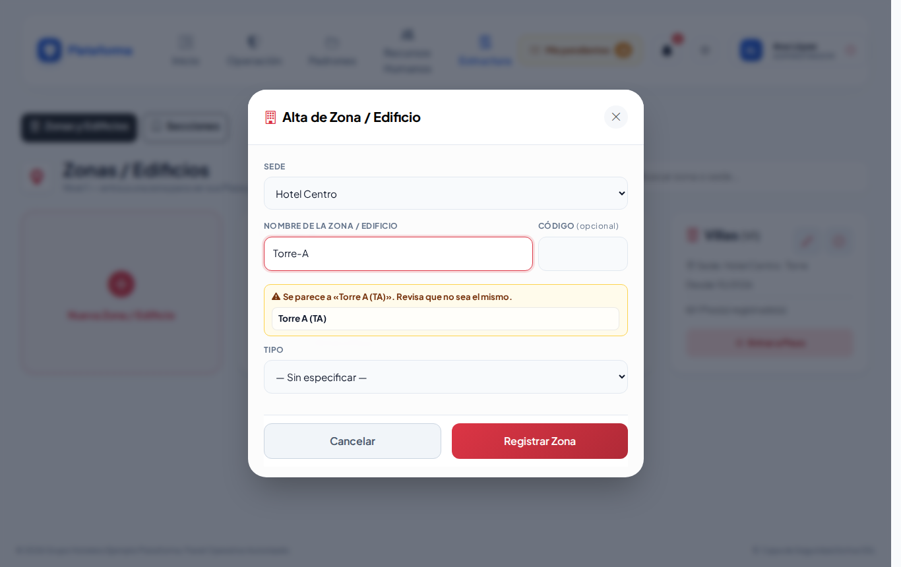
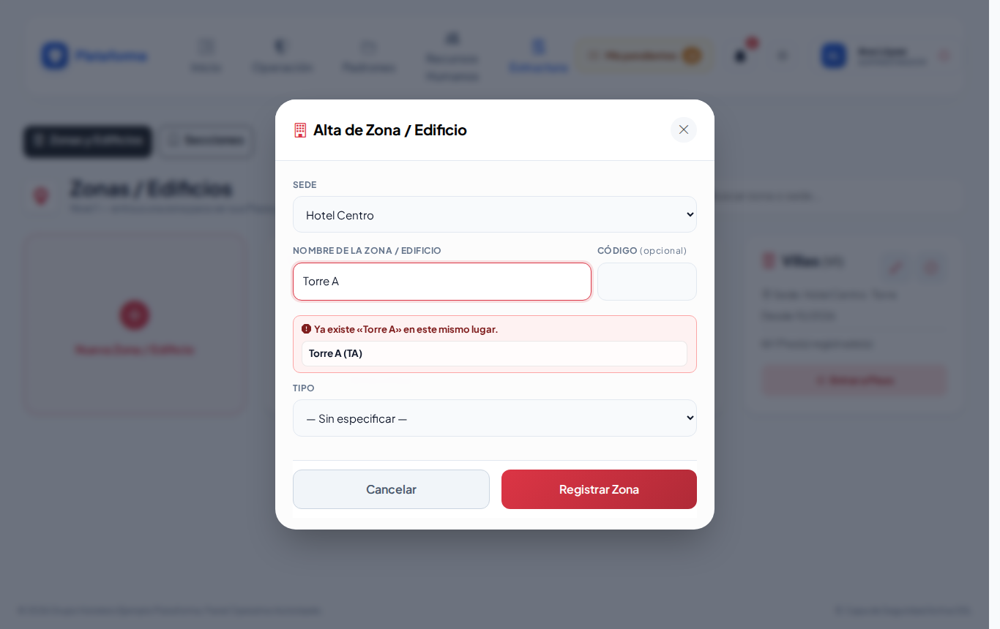
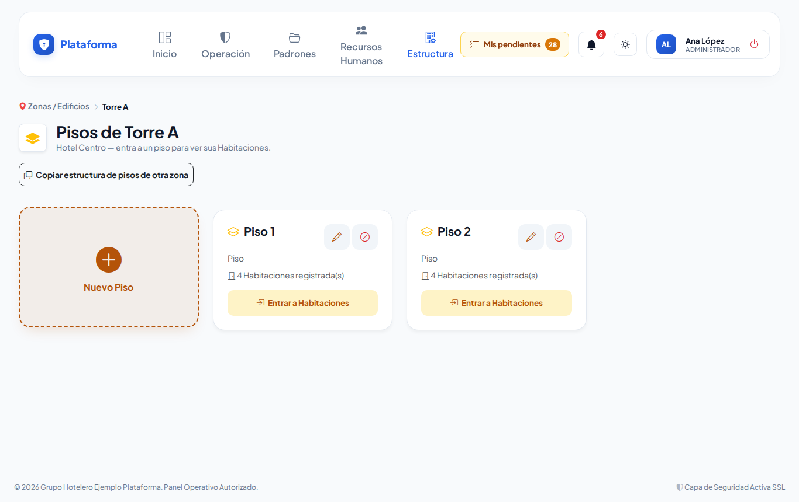
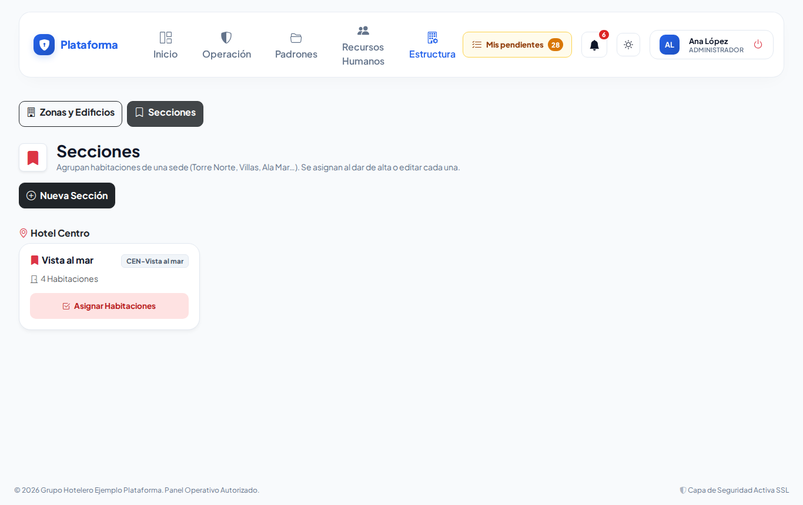

# Zonas y áreas

**¿Para qué sirve?** Aquí registras la estructura física de cada sede, de lo general a lo particular:

**Zona / Edificio → Piso → Habitación → Áreas de la habitación → Elementos**

Si tu empresa no es hotel, en lugar de «Habitación» verás Oficina, Departamento o Casa. Estos lugares se usan en otras pantallas: lo que abre cada [llave](llaves.md), la ubicación de los [equipos de Protección Civil](equipos-pc.md) y los recorridos.

## Antes de empezar

- Para ver la pantalla tu rol debe poder consultar *Zonas y áreas*. Si no aparece en el menú, pide el permiso a tu administrador.
- Para crear, editar o desactivar necesitas esos permisos.
- La sede debe existir en [Empresas y sedes](empresas-y-sedes.md).

## Cómo crear una zona o edificio

1. Entra a **Estructura → Zonas y áreas**. Se abre **Zonas / Edificios**.
2. Toca la tarjeta **Nueva Zona / Edificio**. Se abre **Alta de Zona / Edificio**.
3. Elige la **Sede** y escribe el **Nombre de la Zona / Edificio**. El **Código** es opcional (por ejemplo `TA`).
4. Si quieres, elige el **Tipo**.
5. Toca **Registrar Zona**.

**Qué debes ver:** ««Torre B» agregado correctamente.» Para seguir bajando toca **Entrar a Pisos**.

### Avisos mientras escribes

- **Rojo:** «Ya existe «Torre A» en este mismo lugar.» No se podrá guardar. Si está desactivada, aparece **Reactivar**: tócalo para recuperarla con todo lo que tenía.
- **Amarillo:** «Se parece a «Torre A (TA)». Revisa que no sea el mismo.» Por ejemplo «Torre-A» y «Torre A».
- **Código parecido:** los espacios y guiones no cuentan: **TB**, **T-B** y **T B** se toman como el mismo código.

## Cómo agregar pisos

1. En la zona toca **Entrar a Pisos**. Se abre **Pisos de …**.
2. Toca **Nuevo Piso**, escribe el **Nombre del Piso** y toca **Agregar Piso**.
3. Si otro edificio ya tiene los mismos pisos, toca **Copiar estructura de pisos de otra zona**, elige el edificio en **Copiar desde** y toca **Copiar Pisos**. Solo se copian los que faltan.

## Cómo agregar habitaciones

1. En el piso toca **Entrar a Habitaciones**.
2. **Nueva Habitación:** una por una; escribe el **Nombre o número (ej. 101)** y, si quieres, su sección y tipo.
3. **Crear por Lote:** muchas de una vez.
   - **Rango numérico:** escribe el **Prefijo** (opcional), **Desde** y **Hasta**. Por ejemplo prefijo `1`, desde 5 hasta 8 → 105, 106, 107, 108. Con **Rellenar con ceros (01, 02…)** quedan 1001, 1002…
   - **Lista de nombres:** un nombre por renglón (o separados por coma), por ejemplo «Suite A, Suite B».
   - Toca **Crear Habitaciones**. Las que ya existen se saltan y te dice cuántas fueron. Máximo 500 por lote.

## Cómo detallar una habitación (áreas y elementos)

1. En la habitación toca **Ver detalle**.
2. Toca **Agregar Área** y elige qué **Es un** (Baño, Recámara, Terraza…). La **Etiqueta** es opcional: si la dejas vacía se usa el tipo y, si se repite, se numera (Baño, Baño 2).
3. Dentro de cada área toca **Agregar Elemento** (Cama, Lavabo, Caja fuerte…).
4. ¿Falta un tipo? Abre **¿No encuentras el tipo…?** al final, escríbelo y toca **Agregar tipo**. Solo lo verá tu empresa.

**Qué debes ver:** «Tipo «…» disponible para tu empresa.» Si ese tipo ya estaba: «El tipo «…» ya existía en la lista: no se duplicó y ya puedes elegirlo.»

## Cómo agrupar habitaciones en secciones

Las secciones agrupan habitaciones de una sede, por ejemplo «Vista al mar» o «Torre Norte». Las llaves pueden abrir una sección completa.

1. Arriba toca **Secciones**.
2. Toca **Nueva Sección**, elige la **Sede**, escribe el **Nombre de la Sección** y toca **Crear Sección**.
3. En la sección toca **Asignar Habitaciones**, marca las que le pertenecen (puedes buscar por número o piso) y guarda.
4. También puedes elegir la sección al dar de alta o editar cada habitación.

**Qué debes ver:** «Sección «Vista al mar»: 4 asignada(s).»

## Cómo desactivar o reactivar un espacio

1. Toca el **círculo rojo** (Desactivar). Se desactiva el espacio **y todo lo que tiene dentro**: si desactivas un piso, se desactivan sus habitaciones. El historial se conserva.
2. Para reactivar usa la **flecha circular**. Primero reactiva lo de arriba: no puedes reactivar una habitación si su piso sigue inactivo.

## En el celular

## Si algo sale mal

| Mensaje o síntoma | Qué significa | Qué hacer |
|---|---|---|
| Ya existe «…» en este mismo lugar. | Ese nombre ya está en ese nivel. | Usa otro nombre o edita el existente. |
| Escribe un nombre o elige un tipo. | El nombre está vacío. | Escribe el nombre. |
| El código solo puede tener letras, números y guiones (sin espacios ni acentos). | El código tiene espacios o acentos. | Corrige el código. |
| Primero reactiva «…», del que depende. | El espacio de arriba está desactivado. | Reactiva primero el de arriba. |
| «…» está desactivado: reactívalo antes de agregarle espacios. | Intentas agregar dentro de algo inactivo. | Reactívalo primero. |
| La sección elegida no pertenece a esta sede. | La sección es de otra sede. | Elige una sección de la misma sede. |
| Escribe al menos un nombre. / Indica desde qué número. / Indica hasta qué número. | Falta información en **Crear por Lote**. | Completa el rango o la lista. |
| Solo se pueden copiar pisos entre edificios de la misma empresa. | El edificio de origen no es válido. | Elige un edificio de tu empresa. |
| Ya existe la sección «…» en …. | Esa sección ya existe en la sede. | Usa la existente. |

## Preguntas frecuentes

**¿Tengo que capturar todas las habitaciones?** Solo las que necesites para llaves, recorridos o equipos. Con **Crear por Lote** es rápido.

**¿Puedo borrar un espacio?** No; se desactiva para conservar el historial.

**¿Por qué «TB» y «T-B» se consideran iguales?** Porque los espacios y guiones no cuentan en el código, para evitar duplicados.

**¿Los tipos que agrego los ven otras empresas?** No, solo tu empresa.

## Relacionado

- [Empresas y sedes](empresas-y-sedes.md)
- [Catálogo de llaves](llaves.md)
- [Equipos de Protección Civil](equipos-pc.md)
