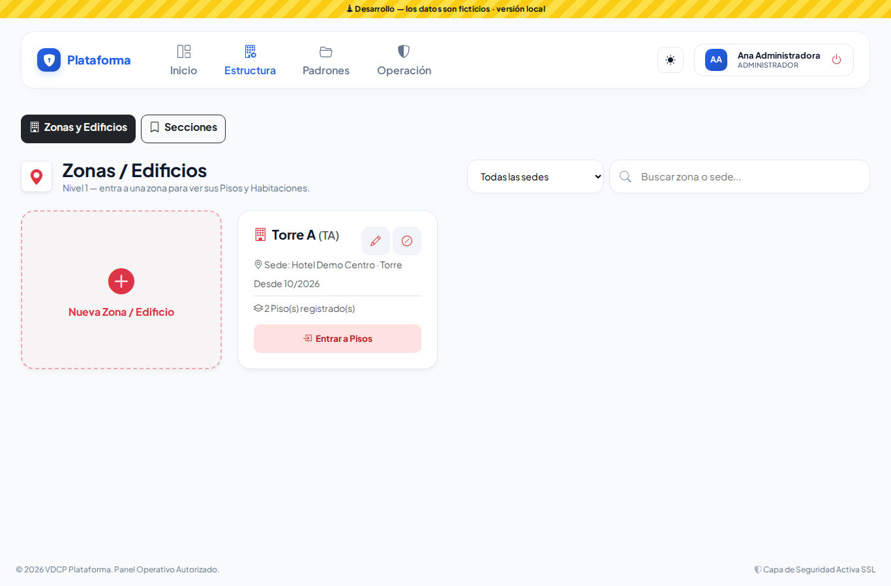
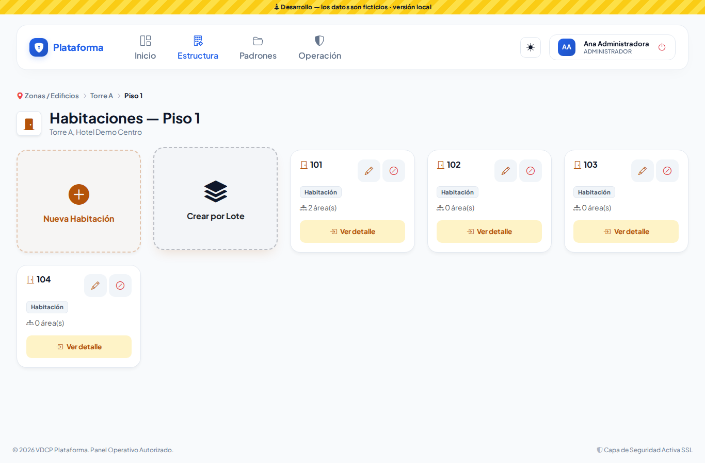
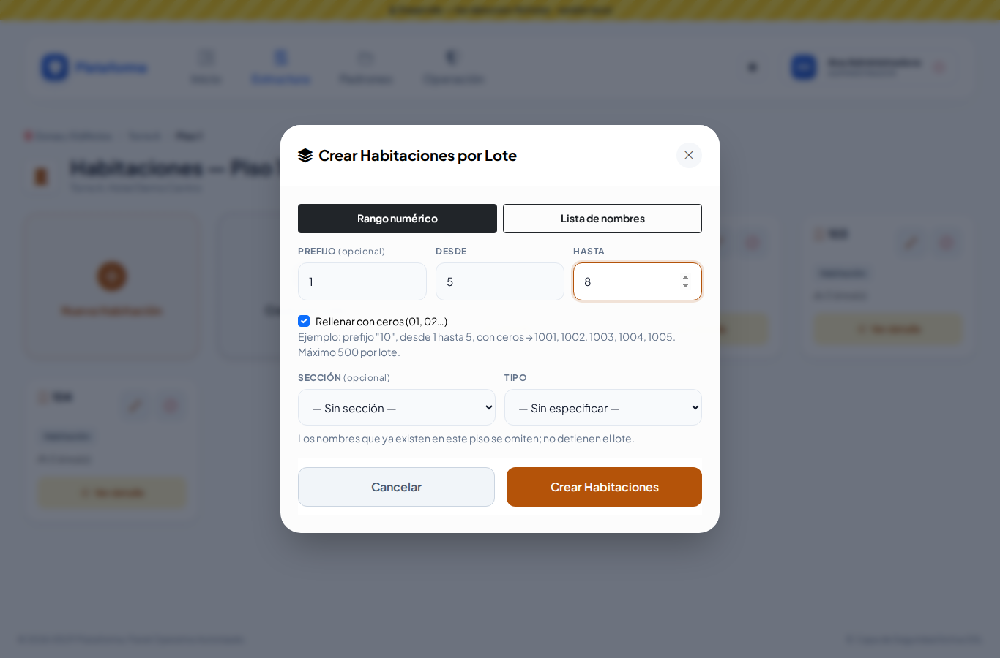
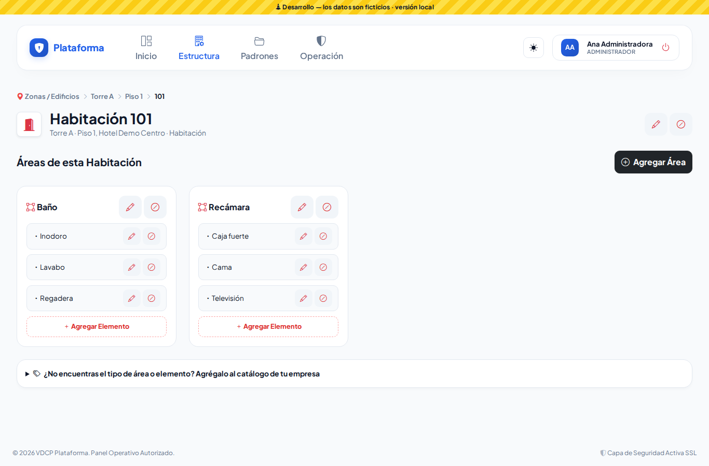
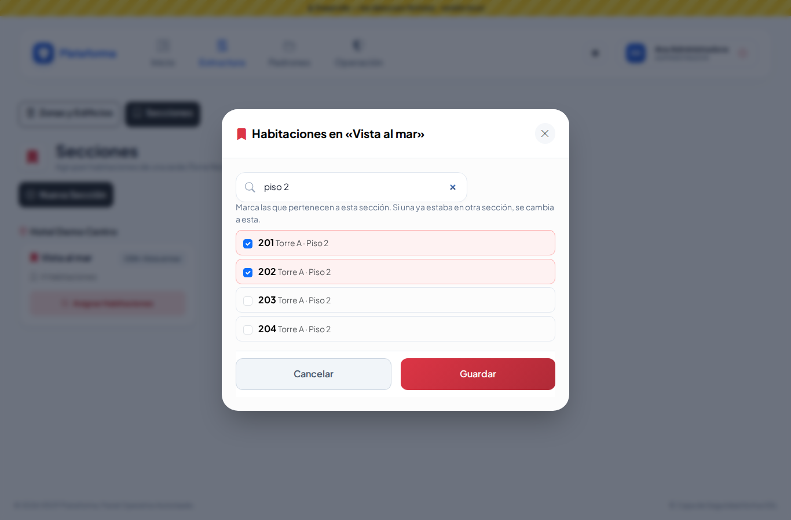
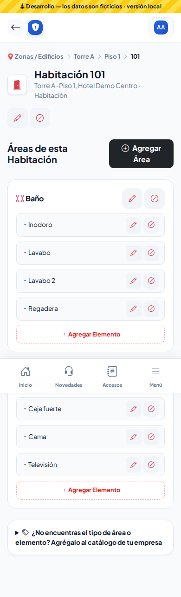

# Zonas y áreas (Estructura → Zonas y áreas)

Aquí registras la estructura física de cada sede, de lo general a lo particular:

**Zona / Edificio → Piso → Habitación → Áreas de la habitación → Elementos**

Si tu empresa no es hotel, en lugar de "Habitación" verás Oficina, Departamento o Casa.

## 1. Zonas / Edificios

1. Toca **Nueva Zona / Edificio**.
2. Elige la sede y escribe el nombre. El código corto es opcional (por ejemplo `TA`).
3. Toca **Entrar a Pisos** para seguir bajando.

## 2. Pisos

- Toca **Nuevo Piso**.
- Si otro edificio ya tiene los mismos pisos, usa **Copiar pisos** y elige el edificio de origen. Solo se copian los que faltan.

## 3. Habitaciones

- **Nueva Habitación:** una por una.
- **Crear por Lote:** muchas de una vez.
  - **Rango numérico:** por ejemplo, prefijo `1`, desde 5 hasta 8 → 105, 106, 107, 108.
  - **Lista de nombres:** uno por renglón (Suite A, Suite B…).
  - Las que ya existen se saltan y te avisamos cuántas fueron.

## 4. Detalle de la habitación

1. **Agregar Área:** elige el tipo (Baño, Recámara, Terraza…). La etiqueta es opcional: si la dejas vacía se usa el tipo y, si se repite, se numera (Baño, Baño 2).
2. Dentro de cada área toca **+ Agregar Elemento** (Cama, Lavabo, Caja fuerte…).
3. ¿Falta un tipo? Abre **"¿No encuentras el tipo…?"** al final y agrégalo. Solo lo verá tu empresa.

## Secciones

Las secciones agrupan habitaciones de una sede, por ejemplo "Vista al mar" o "Torre Norte".

1. En la pestaña **Secciones** toca **Nueva Sección**.
2. Toca **Asignar Habitaciones** y marca las que pertenecen a esa sección. Puedes buscar por número o por piso.
3. También puedes elegir la sección al dar de alta o al editar cada habitación.

## Desactivar

El botón **⊘** desactiva un espacio **y todo lo que tiene dentro**: si desactivas un piso, se desactivan sus habitaciones. El historial se conserva. Para reactivar usa el mismo botón; primero reactiva lo de arriba (no puedes reactivar una habitación si su piso sigue inactivo).

En el celular la pantalla se adapta:

